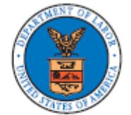
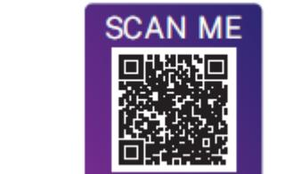

Effective 07/01/2025

# Table of Contents

| Interaction with the Handbook | 2  | New Jersey           | 52 |
|-------------------------------|----|----------------------|----|
| Alabama                       | 3  | North Carolina       | 56 |
| Arizona                       | 6  | Ohio                 | 57 |
| California                    | 8  | Oklahoma             | 58 |
| Colorado                      | 12 | Oregon               | 59 |
| Florida                       | 17 | Pennsylvania         | 63 |
| Georgia                       | 20 | Rhode Island         | 64 |
| Illinois                      | 21 | South Carolina       | 68 |
| Indiana                       | 28 | Tennessee            | 70 |
| Iowa                          | 30 | Texas                | 73 |
| Kansas                        | 32 | Utah                 | 75 |
| Kentucky                      | 33 | Virginia             | 77 |
| Louisiana                     | 35 | Washington           | 79 |
| Maryland                      | 38 | West Virginia        | 84 |
| Michigan                      | 41 | Wisconsin            | 86 |
| Minnesota                     | 43 | FMLA Employee Rights | 89 |
| Mississippi                   | 51 |                      |    |

# State Supplements

Effective Date: 01/01/2025

#### **Interaction with the Handbook**

Gresham Smith's workforce is spread across several states, and state laws differ in many respects. The State Supplements contained in the Employee Handbook are meant to supplement the handbook by providing additional information regarding state-specific requirements, if any, for various policies. As with the Employee Handbook, the contents of the State Supplements are guidelines only, and do not create an employment contract. Employment with Gresham Smith is at-will and may be terminated at any time with or without cause or notice by either the employee or the firm.

Generally, employees may be eligible to receive the benefits under Gresham Smith's core policies in the handbook or the policies in these State Supplements, whichever provides greater benefits to employees. In other words, the policies in the State Supplements do not supplement Gresham Smith's core Employee Handbook policies where those core policies provide greater benefits.

You can view our general Equal Employment Opportunity policy on page 9 of the Employee Handbook.

If you have any questions about policy content or which policies apply to you, please contact Human Resources.

## State Supplement: Alabama

Effective Date: 11/15/2022

#### **Weapons in the Workplace**

Pursuant to Alabama Act 2013-283, an Alabama employee may store lawfully possessed firearms in the employee's privately owned vehicle, while the vehicle is in Gresham Smith designated parking areas, if and only if all of the following requirements are satisfied:

- The employee's vehicle is operated or parked where it is permitted to be; and
- The firearm is either:
	- o Kept inside the vehicle and out of sight, while the employee is attending the vehicle; or
	- o Kept out of sight, locked in a compartment, container, or in the interior of the vehicle or in a compartment or container securely affixed to the vehicle, when the vehicle is unattended; and
- The employee has a valid Concealed Weapons Permit; or
- If the employee does not have a valid Concealed Weapons Permit, they may have in their vehicle a firearm that is not a pistol and is legal for hunting in Alabama if:
	- o The employee has a valid Alabama hunting license; and
	- o The firearm is unloaded at all times; and
	- o It is during a season in which hunting is permitted by Alabama law; and
	- o The employee has not been convicted of any crime of violence, nor is subject to a Domestic Violence Order, as those terms are defined by law; and
	- o The employee has no prior documented incidents of workplace threats or violence; and
	- o The employee has not been committed to a psychiatric hospital or similar treatment facility for inpatient or outpatient treatment.

If an employee does not meet requirements of both #1 and #2 bullet points (above) and one of either #3 or #4 bullet points (above), they are prohibited from having a firearm in a vehicle on Gresham Smith property.

If it is found that an employee is not in compliance with the law and Gresham Smith policy, the employee may be subject to disciplinary action, up to and including termination.

## **Attendance and Time Off: Voting**

For employees in Alabama, if a period of time beyond 30 minutes to vote is necessary, those employees are entitled to an additional 30 minutes of paid absence in order to vote in a general or special election if the polls:

- Open less than two (2) hours before your regular work shift, or
- Close less than one hour (1) hour after the end of your regular work shift.

You must request voting absence prior to Election Day. Your supervisor may specify the time of day when you may be absent.

If you are appointed as a precinct election officer under Section 17-8-1 of the Alabama Code, you will be excused from employment without penalty of loss of time for Election Day to perform the duties to which you have been appointed. This leave time will be uncompensated. You must provide proper documentation of the appointment and the dates of the required service to your immediate supervisor at least seven days before the leave is required.

For more information, view the Voting policy in the handbook.

#### **Military Leave**

 

Alabama employees who are members of state or federal military services (including National and State Guard) shall be entitled to military leave of absence for defense, training, or other service. Employees utilizing this leave will not lose pay, time, efficiency rating, annual vacation, or sick leave. Nonetheless, employees will not be paid more than 168 working hours per calendar year or 168 working hours at any one service. Employees must submit duty papers to their immediate supervisor as early as practicable to facilitate this leave.

#### **Crime Victim Leave**

Gresham Smith does not discriminate against any employee in Alabama who is the victim of a crime. If you or your spouse, sibling, parent, or child/ward are the victim of a crime, you will be permitted time off work to:

- Respond to a subpoena to testify in criminal proceedings; or
- Participate in reasonable preparations for these proceedings.

You must notify the firm immediately when you are called for a court appearance as a victim of a crime, and you must provide a copy of the summons to your supervisor. Gresham Smith will maintain records of your leave in a confidential manner.

As with other personal court appearances, you will not be paid. You can use your accrued, unused PTO. You will retain all seniority rights and other standing.

For more information, view the Jury Duty/Other Court Appearances policy in the handbook.

#### **Volunteer Fire or Emergency Medical Member Leave**

Gresham Smith will allow eligible Alabama employees to take leave to respond to an emergency call before they are due to report to work. This leave is unpaid. You can use your accrued, unused PTO. You will retain all seniority rights and other standing, and you will not be retaliated against for taking emergency response leave as permitted.

"Emergency" means going to, attending to, or coming from a fire call, a hazardous or toxic materials spill and cleanup, any other situation to which a volunteer fire department is dispatched, or a medical emergency to prevent the imminent loss of life.

Before taking emergency response leave, employees must try to contact their immediate supervisor to give notice that they have been dispatched to an emergency.

Gresham Smith may require employees who take emergency response leave to provide a statement regarding their response to an emergency call and the time of the call. Employees who are volunteer firefighters must obtain this statement from the chief of their volunteer fire department. Employees who are members of an emergency medical service must obtain the statement from their fire department or emergency medical service.

## State Supplement: Arizona

Effective Date: 11/15/2022

#### **Attendance and Time Off: Voting**

For employees in Arizona, if a period of time beyond 30 minutes to vote is necessary, those employees are entitled to an additional reasonable paid absence in order to vote in a general or special election if the polls:

- Open less than three (3) hours before your regular work shift, or
- Close less than three (3) hours after the end of your regular work shift.

You must request voting absence prior to Election Day. Your supervisor may specify the time of day when you may be absent.

For more information, view the Voting policy in the handbook.

#### **National Guard or Armed Forces Reserves Leave**

All employees in Arizona who are members of the National Guard of any state or the U.S. Armed Forces Reserves are eligible for leave to comply with orders for active duty or to attend camps, maneuvers, formations, or armory drills. As with other leaves of absence, you will not be paid. You can use your accrued, unused PTO.

Upon your return, you will be reinstated to your same position or a higher position commensurate with your ability, experience, and seniority, or rank. National Guard or Armed Forces Reserves Leave will not affect your accrued, unused PTO, but you will not accrue new PTO hours while on leave.

#### **Paid Sick Leave**

In accordance with Arizona's Fair Wages and Healthy Families Act, all Arizona employees are eligible to accrue paid sick time at a rate of one hour of earned sick time for every 30 hours worked. For employees who work in Arizona who are eligible for sick leave under the general paid PTO policy and/or any other applicable sick time/leave law or ordinance, this policy applies solely to the extent it provides greater benefits/rights on any specific issue or issues than the general paid sick days policy and/or any other applicable sick time/leave law or ordinance. Paid sick time is capped at 24 hours per year.

Paid sick time can be used for the following reasons:

- To care for your mental or physical illness, injury or health condition, need for medical diagnosis, care, or treatment of a mental or physical illness, injury or health condition; or for their preventative care.
- To care for a family member's mental or physical illness, injury or health condition, need for medical diagnosis, care, or treatment of a mental or physical illness, injury or health condition; or for their preventative care.
- When you or your family member needs treatment or counseling because they are victims of domestic violence, abuse, sexual violence, or stalking.
- When businesses or schools are closed because of a public health emergency.
- When care is required for you or a family member who has been exposed to a communicable disease.

"Family member" includes spouses, registered domestic partners, children (regardless of age, including biological, adopted or foster child, stepchild or legal ward, a child of a domestic partner, child to whom the employee stands in loco parentis, or an individual to whom the employee stood in loco parentis when the individual was a minor), parents (including stepparents, foster parents, adopted parents, legal guardians, and parents-in-law), grandparents, siblings, or any other individual whose relationship with the employee is equal to a familial relationship.

Paid sick leave accruals will be tracked on all employees' paystubs. Paid sick leave benefits will begin accruing on your hire date. You can request use of paid sick time after 90 days of employment.

Unused paid sick time benefits will carry over from one calendar year to the next (January 1 through December 31). Paid sick leave taken that exceeds the amount of any paid sick time accrual will not be paid. Paid sick time must be taken in at least 1/4-hour increments.

Whenever possible, paid sick time should be scheduled in advance. When the need for paid sick leave is foreseeable, the employee must make a good faith effort to request the time off in advance and must make every effort to schedule the time off in a manner that does not unduly disrupt Gresham Smith's business.

If the need for paid sick leave is not foreseeable, the employee must contact their supervisor as soon as possible, which, absent exigent circumstances, generally means within hours of when the need for leave arose, but in any event, prior to the start of an employee's shift.

If you take earned paid sick time for three or more consecutive workdays, your supervisor may request reasonable documentation to verify that this leave was used for a permitted reason. Paid sick leave will not count as hours worked toward the calculation of overtime pay. Accrued but unused paid sick leave, no matter the amount, will not be paid out at the conclusion of employment.

Gresham Smith prohibits employees from being retaliated or discriminated against for exercising their rights to paid sick leave.

#### **Smoking/Tobacco/e-Cigarettes**

In compliance with the Smoke-Free Arizona Act, Gresham Smith prohibits smoking within 20 feet of any company property's entrances, open windows, or ventilation systems.

## State Supplement: California

Effective Date: 01/01/2024

#### **Witness and Crime Victim Leave**

California employees who are victims of qualifying acts of violence (including domestic violence, sexual assault, stalking, threats of or acts causing bodily injury or death, or brandishing a firearm or other dangerous weapon) will be permitted to take leave to attend judicial proceedings related to the crime. Employees may also take leave to attend proceedings involving an immediate family member, a registered domestic partner, or a child of a registered domestic partner who is the victim of a felony. "Immediate family member" includes a spouse, children, stepchildren, sisters, brothers, stepsisters, stepbrothers, parents, and stepparents.

This policy also applies to California employees who have an obligation to participate in a judicial proceeding as a witness.

As with other personal court appearances, you will not be paid. You can use your accrued, unused PTO. You will retain all seniority rights and other standing.

For more information, view the Jury Duty/Other Court Appearances policy in the handbook.

#### **Paid Sick Leave**

Under California law, all employees who complete 30 days of employment in California are eligible to accrue paid sick leave starting with their first day of employment. For employees who work in California who are eligible for sick leave under the general paid PTO policy and/or any other applicable sick time/leave law or ordinance, this policy applies solely to the extent it provides greater benefits/rights on any specific issue or issues than the general paid sick days policy and/or any other applicable sick time/leave law or ordinance.

Employees accrue paid sick leave at the rate of one hour for every 30 hours of work, up to the maximum of at least 80 hours or ten days, whichever is greater, per 12-month period. The 12-month period begins each year on January 1 and ends on December 31. Exempt employees are treated as working 40 hours per workweek, unless their usual workweek is less than 40 hours in which case they would accrue paid sick leave based on the number of hours worked in their usual workweek. Employees may use up to 40 hours or five days (whichever is greater) of paid sick leave per year per 12-month period.

Paid sick leave may be used for the following reasons:

- For diagnosis, care or treatment of an existing health condition of or preventive care for, the employee or employee's family member (meaning a child, including biological, adopted or foster child, stepchild, legal ward or a child to whom the employee stands in loco parentis, all regardless of age or dependency status); spouse; registered domestic partner; designated person (a person identified by the employee at the time the employee requests paid sick days) parent (including biological, adoptive or foster parent, stepparent or legal guardian of the employee or employee's spouse or registered domestic partner or a person who stood in loco parentis when the employee was a minor child); grandparent; grandchild; or a sibling; or
- For the employee who is a victim of domestic violence, sexual assault or stalking:
	- o To obtain or attempt to obtain a temporary restraining order, restraining order or other injunctive relief;
	- o To help ensure the health, safety or welfare of the victim or the victim's child;
	- o To seek medical attention for injuries caused by domestic violence, sexual assault or stalking;
	- o To obtain services from a domestic violence shelter, program or rape crisis center as a result of domestic violence, sexual assault or stalking;
	- o To obtain psychological counseling related to an experience of domestic violence, sexual assault or stalking; or
	- o To participate in safety planning and take other actions to increase safety from future domestic violence, sexual assault or stalking, including temporary or permanent relocation.

Unless advised otherwise, Gresham Smith will assume, subject to applicable law, that employees want to use available paid sick leave for reasons set forth above. Employees will be paid for such absences to the extent they have paid sick leave available.

Paid sick leave may be requested orally, in writing, electronically or by any other means acceptable to Gresham Smith. When possible, employees should include the expected duration of the absence. If the need is foreseeable employees must provide reasonable advance notice to their immediate supervisor of the need to use accrued paid sick leave, and also make a reasonable effort to schedule the paid sick leave in a manner that does not unduly disrupt operations. Where the need is not foreseeable, employees should provide notice as early as practicable.

Unused accrued sick leave will carry over from one year to the next up to a maximum of 40 hours or five days, whichever is greater. However, the total amount of paid sick leave that can be accrued at any time is 80 hours or ten days, whichever is greater. Accrued but unused paid sick leave under this policy will not be paid at separation.

Gresham Smith prohibits employees from being retaliated or discriminated against for exercising their rights to paid sick leave.

#### **Attendance and Time Off: Voting**

For employees in California, if a period of time beyond 30 minutes to vote is necessary, those employees are entitled to an additional 1.5 hours of paid leave in order to vote in a general or special election.

An employee's request for time off to vote may be denied if the polls are open for more than two consecutive hours before or after his/her scheduled work hours on Election Day.

You must request voting absence at least three days prior to Election Day. Your supervisor may specify the time of day when you may be absent.

For more information, view the Voting policy in the handbook.

#### **Bereavement Leave**

California employees who have been employed for at least 30 days may take unpaid bereavement leave of up to five (5) days upon the death of a family member.

For purposes of this policy, "family member" includes a spouse or a child, parent, sibling, grandparent, grandchild, domestic partner, or parent-in-law. Bereavement leave need not be consecutive but must be completed within three (3) months of the family member's death.

If you wish to take bereavement leave, please contact Human Resources.

#### **Reproductive Loss Leave**

California employees who have been employed for at least 30 days may take unpaid leave of up to five (5) days following a reproductive loss event.

For purposes of this policy, a "reproductive loss event" is defined as the day of (or, for a multiple-day event, the final day of) a failed adoption, failed surrogacy, miscarriage, stillbirth, or an unsuccessful assisted reproduction. Leave taken under this policy is limited to a maximum of 20 days within a 12-month period.

If you wish to take reproductive loss leave, please contact Human Resources.

#### **Workplace Reasonable Accommodation of Religion**

Pursuant to the California Workplace Religious Freedom Act ("WRFA"), unless the accommodation imposes an undue hardship on it, Gresham Smith will provide religious accommodations to California employees' for sincerely held religious beliefs including:

- Observances of a Sabbath or other religious holy days.
- Reasonable time necessary for travel before and after a religious observance.
- Religious dress and grooming practices, including the wearing of religious clothing, head or face coverings, any other item that is part of an individual observing a religion or religious creed.

To request a religious accommodation, please contact Human Resources.

#### **Nursing Mothers Leave**

Any employee who is a nursing mother is eligible to take a reasonable amount of break time to express breast milk for the employee's infant child each time the employee has a need to express breast milk. There is no length of service requirement to be eligible.

To request lactation accommodation, please contact Human Resources.

#### **State Disability Insurance**

The State of California offers a disability insurance program designed to partially replace wages lost due to a non-work-related illness, disability, injury, or pregnancy. Disability insurance is funded by employees' contributions. Subject to eligibility requirements, disability insurance is available to California employees unable to work for eight or more consecutive calendar days. For information or to apply for coverage, please contact Human Resources.

#### **Volunteer Firefighters' Leave**

Eligible California employees will be granted unpaid time off to serve as volunteer firefighters, reserve peace officers, or emergency rescue personnel. Employees may substitute PTO for any unpaid portion of leave to perform such emergency duties or training.

If you wish to take leave under this policy, please contact Human Resources.

## **Compensation and Performance: Compensation**

It is Gresham Smith's policy and practice to accurately compensate California employees and to do so in compliance with all applicable state and federal laws. To ensure employees are paid properly and no improper deductions are made, employees must review their pay stubs promptly to identify and to report all errors.

If the employee believes a mistake has occurred or if the employee has any questions, the employee should contact Human Resources.

#### **Paid Family Leave**

Under California state law, Gresham Smith is required to deduct a certain amount from employee pay to fund California's Paid Family Leave (PFL) program, which is administered by the California Employment Development Department (EDD). PFL is not a "leave" program, and it does not provide employees with leave beyond what is provided in Gresham Smith's policies. Instead, PFL is a disability benefits program that provides eligible employees with compensation for lost wages, for up to eight weeks in a 12-month period when employees need to take time off work to care for a seriously ill spouse, domestic partner, designated person (any individual related by blood or whose association with the employee is equivalent to a family relationship), child, parent, parent-in-law, grandparent, grandchild or sibling, or to bond with a new child. Benefits are also available to participate in a qualifying event resulting from a spouse, registered domestic partner, parent, or child's military deployment to a foreign country.

If you wish to take leave under this policy, please contact Human Resources.

## **Employment Practices: Pre-employment Screening**

Gresham Smith will not exclude a California applicant from an initial interview solely because of a past arrest, criminal conviction, or participation in a diversion program by requiring an applicant to disclose such information:

- On an employment application;
- Before an interview; or
- If no interview is conducted before a conditional offer of employment.

However, Gresham Smith may, before extending an offer to an applicant, inquire into the applicant's criminal background.

For more information, view the Pre-employment Screening Policy in the handbook.

## State Supplement: Colorado

Effective Date: 06/23/2025 – Supersedes Date: 1/1/2024

#### **Accommodating the Disabled**

In compliance with Colorado law, Gresham Smith will not discriminate against Colorado employees because of pregnancy, childbirth, or related conditions. In addition to accommodating individuals with a disability as defined in the handbook, if employees request reasonable accommodation due to health conditions related to pregnancy or the physical recovery from childbirth, we will endeavor to provide a reasonable accommodation to enable applicants and employees to perform the essential functions of the job, unless the accommodation would impose an undue hardship on the operation of the business. Gresham Smith will engage in a timely, good faith, and interactive process with the employee to determine effective, reasonable accommodations for conditions related to pregnancy, physical recovery from childbirth, or a related condition.

Reasonable accommodations may include, but are not limited to: more frequent or longer break periods; more frequent restroom, food and water breaks; acquisition or modification of equipment or seating; limitations on lifting; temporary transfer to a less strenuous or hazardous position if available, with return to the current position after pregnancy; job restructuring; light duty, if available; assistance with manual labor; or modified work schedules.

Gresham Smith will not require employees affected by pregnancy, physical recovery from childbirth, or a related condition to accept an accommodation that they choose not to accept if they did not request an accommodation or if the accommodation is not necessary for the employee to perform the essential functions of the job, nor will we require a pregnant employee to take leave if another reasonable accommodation is available which will permit the employee to continue working.

Gresham Smith reserves the right to require employees to provide a note stating the necessity of a reasonable accommodation from a licensed healthcare provider before providing a reasonable accommodation.

Gresham Smith will not take adverse action against pregnant employees who request or use a reasonable accommodation related to pregnancy, physical recovery from childbirth, or a related condition. Gresham Smith will not deny employment opportunities to employees based on the need to make a reasonable accommodation related to pregnancy, physical recovery from childbirth or a related condition.

Gresham Smith will provide the following to nursing mothers:

- Reasonable break time to allow an employee to express breast milk for their nursing child up to two years after the child's birth.
- A private location in close proximity to the work area (other than a toilet stall) where an employee can express breast milk.

If you would like to request a reasonable accommodation, please contact your immediate supervisor or Human Resources.

#### **Employment Practices: Pre-employment Screening**

The Colorado Chance to Compete Act is intended to provide people with criminal records with a more meaningful chance to compete for a job in the workforce and grow Colorado's economy, while protecting an employer's ability to make whatever hiring decision the employer deems appropriate. Gresham Smith will not inquire into a Colorado applicant's criminal history during the initial application and/or interview process. However, Gresham Smith may, before extending an offer to an applicant, inquire into the applicant's criminal history.

#### **Paid Sick Leave**

Gresham Smith provides paid sick leave to all Colorado employees. For employees who work in Colorado who are eligible for sick leave under the general paid PTO policy and/or any other applicable sick time/leave law or ordinance, this policy applies solely to the extent it provides greater benefits/rights on any specific issue or issues than the general paid sick days policy and/or any other applicable sick time/leave law or ordinance.

Exempt employees are assumed to work 40 hours in each workweek unless their normal workweek is less than 40 hours, in which case paid sick leave accrues based on that normal workweek.

For purposes of this policy, the year is the consecutive 12-month period beginning January 1 and ending on December 31.

Employees may begin using accrued paid sick leave immediately. Paid sick leave may be used in hourly increments. Employees may not use more than 48 hours of accrued paid sick leave in any year.

Employees may use accrued paid sick leave for the following reasons:

- For mental or physical illness, injury or health condition that prevents the employee from working; the need to obtain a medical diagnosis, care or treatment of a mental or physical illness, injury or health condition; or the need to obtain preventive medical care;
- To care for a family member who has a mental or physical illness, injury or health condition; needs to obtain a medical diagnosis, care or treatment of a mental or physical illness, injury or health condition; or needs to obtain preventive medical care;
- When the employee or a family member has been the victim of domestic abuse, sexual assault or harassment and the use of leave is to:
	- o Seek medical attention to recover from a mental or physical illness, injury or health condition caused by the domestic abuse, sexual assault or harassment;
	- o Obtain services from a victim services organization;
	- o Obtain mental health or other counseling;
	- o Seek relocation due to the domestic abuse, sexual assault or harassment; or
	- o Seek legal services, including preparation for or participation in a civil or criminal proceeding relating to or resulting from the domestic abuse, sexual assault or harassment;
- When, due to a public health emergency, a public official has ordered closure of the employee's place of business or the school or place of care of the employee's child and the employee needs to be absent from work to care for the child;
- When, due to inclement weather, power/heat/water loss, or other unexpected event, the employee must evacuate their residence or care for a family member whose school or place of care is closed; and

- For bereavement or financial/legal needs after a death of a family member.
For purposes of this policy, "family member" means a person who is related to the employee by blood, marriage, civil union or adoption; a child to whom the employee stands in loco parentis or a person who stood in loco parentis when the employee was a minor; or a person for whom the employee is responsible for providing or arranging health- or safety-related care.

Use of paid sick leave will not be conditioned upon the employee searching for or finding a replacement worker.

Unless advised otherwise, Gresham Smith will assume, subject to applicable law, that employees want to use available paid sick leave for reasons set forth above. Employees will be paid for such absences to the extent they have paid sick leave available.

Paid sick leave may be requested orally, in writing, electronically or by any other means acceptable to Gresham Smith. When possible, employees should include the expected duration of the absence. If the need is foreseeable employees must provide reasonable advance notice to their immediate supervisor of the need to use accrued paid sick leave, and also make a reasonable effort to schedule the paid sick leave in a manner that does not unduly disrupt operations. Where the need is not foreseeable, employees should provide notice as early as practicable.

For paid sick leave of four (4) or more consecutive workdays, Gresham Smith may require reasonable documentation that the paid sick leave was used for an authorized purpose. Gresham Smith will not require the disclosure of details relating to domestic violence, sexual assault or stalking, or the details of the employee's or family member's health information as a condition of providing paid sick leave.

Paid sick leave will be paid at the same hourly rate or salary and with the same benefits, including healthcare benefits, as the employee normally earns during hours worked. Use of paid sick leave is not considered hours worked for purposes of calculating overtime.

Employees may carry over up to 48 hours of accrued, unused paid sick leave to the following calendar year. Accrued but unused paid sick leave will not be paid at separation.

In addition to accrued paid sick leave explained above, on the date a public health emergency is declared, Gresham Smith will supplement each employee's accrued paid sick leave as necessary to ensure that the employee may take paid sick leave as follows:

- Employees who normally work 40 or more hours in a week may take at least 80 hours of paid sick leave in a public health emergency;
- Employees who normally work fewer than 40 hours in a week may take at least the greater of either the amount of time the employee is scheduled to work in a 14-day period or the amount of time the employee actually works on average in a 14-day period.

Gresham Smith may count unused accrued paid sick leave, as explained above, toward the supplemental paid sick leave required for a public health emergency. Employees may use public health emergency paid sick leave until four (4) weeks after the official termination or suspension of the public health emergency. Employees may use public health emergency paid sick leave for the following absences related to a public health emergency:

- To self-isolate and care for oneself when diagnosed with a communicable illness that is the cause of a public health emergency; self-isolate and care for oneself when experiencing symptoms of a communicable illness that is the cause of a public health emergency; seek or obtain medical diagnosis, care or treatment if experiencing symptoms of a communicable illness that is the cause of a public health emergency; seek preventive care concerning a communicable illness that is the cause of a public health emergency;
- To care for a family member who is self-isolating after being diagnosed with a communicable illness that is the cause of a public health emergency; is experiencing symptoms of a communicable illness that is the cause of a public health emergency; needs medical diagnosis, care or treatment if experiencing symptoms of a communicable illness that is the cause of a public health emergency; or is seeking preventive care concerning a communicable illness that is the cause of a public health emergency;
- With respect to a communicable illness that is the cause of a public health emergency:
	- o A local, state or federal public official or health authority having jurisdiction over the location in which Gresham Smith is located or Gresham Smith determines that the employee's presence on the job or in the community would jeopardize the health of others because of the employee's exposure to the communicable illness or because the employee is exhibiting symptoms of the communicable illness, regardless of whether the employee has been diagnosed with the communicable illness; or
	- o Care of a family member after a local, state or federal public official or health authority, having jurisdiction over the location in which the family member's place of employment is located, or the family member's employer determines that the family member's presence on the job or in the community would jeopardize the health of others because of the family member's exposure to the communicable illness, or because the family member is exhibiting symptoms of the communicable illness, regardless of whether the family member has been diagnosed with the communicable illness;
- Care of a child or other family member when the individual's child care provider is unavailable due to a public health emergency, or if the child's or family member's school or place of care has been closed by a local, state or federal public official or at the discretion of the school or place of care due to a public health emergency, including if a school or place of care is physically closed but providing instruction remotely;
- Inability to work because the employee has a health condition that may increase susceptibility to or risk of a communicable illness that is the cause of the public health emergency.

Employees must notify Gresham Smith of the need for public health emergency paid sick leave as soon as practicable when the need for paid sick leave is foreseeable and Gresham Smith's place of business has not been closed. Documentation is not required to take public health emergency paid sick leave. Public health emergency paid sick leave in the amount described above may be taken once during the entirety of a public health emergency even if such public health emergency is amended, extended, restated or prolonged.

Gresham Smith cannot retaliate against employees for requesting or using paid sick leave and employees have the right to file a complaint with the Division of Labor Standards and Statistics in the Colorado Department of Labor and Employment or bring a civil action if paid sick leave is denied by Gresham Smith or Gresham Smith retaliates against employees for exercising their rights under applicable law.

If employees have any questions regarding this policy, they should contact their immediate supervisor or Human Resources.

#### **Military Leave**

Gresham Smith provides up to 15 days of unpaid leave per year to employees who are members of the Colorado National Guard, the reserve forces of the United States, and the Colorado Wing of the Civil Air Patrol. Members of the Colorado Wing of the Civil Air Patrol may only take leave to serve on authorized missions.

Employees needing to take leave under this policy must give advance notice to their supervisor wherever possible so that arrangements can be made to accommodate the absence. Employees must also submit a copy of their official orders or instructions to their supervisor.

#### **Attendance and Time Off: Voting**

For employees in Colorado, if a period of time beyond 30 minutes to vote is necessary, those employees are entitled to an additional two hours of paid absence in order to vote in a general or special election if the polls:

- Open less than three (3) hours before your regular work shift, or
- Close less than three (3) hours after the end of your regular work shift.

You must request voting absence prior to Election Day. Your supervisor may specify the time of day when you may be absent.

For more information, view the Voting policy in the handbook.

#### **Qualified Volunteer Service in a Disaster Leave**

Colorado employees who are qualified volunteers under the meaning specified in Section 24-33.5-824 of the Colorado Revised Statutes may take a leave of absence to serve a volunteer organization in a disaster. Leave under this section is unpaid and is limited to 15 workdays in any calendar year.

Gresham Smith reserves the right to restrict leave granted under this policy to no more than 20% of its employees on any given workday. Gresham Smith also reserves the right to refuse leave under this section to any employees deemed essential.

## **Volunteer Firefighter Leave**

Employees serving as volunteer firefighters under Section 31-30-1131 of the Colorado Revised Statutes may take a leave of absence to respond to an emergency summons within the response area of their volunteer fire department, if the summons requires all firefighters to respond. Leave under this section is unpaid and is limited to the duration of the summons. Gresham Smith may deduct time lost from employment due to a response to an emergency summons from the wages of an employee who takes volunteer firefighter leave. Employees whose service is essential to daily operations are not permitted to take a leave of absence under this policy.

## **Organ Donation**

Gresham Smith will not intimidate, threaten, coerce, discriminate or retaliate against, or take adverse action against an employee who is or becomes a living organ donor.

## State Supplement: Florida

Effective Date: 11/15/2022

#### **Domestic Abuse Victim Leave**

Gresham Smith provides up to three days of unpaid leave for a qualifying reason in any 12-month period if the employee or a family or household member is a victim of domestic or sexual violence. Employees must have been employed by Gresham Smith for at least three months to be eligible for this leave.

Eligible Florida employees may take domestic violence leave to:

- Seek an injunction for protection against domestic violence or an injunction for protection in cases of repeat, dating, or sexual violence.
- Obtain medical care or mental health counseling for yourself or your family or household member to address physical or psychological injuries resulting from the domestic violence.
- Obtain services from a victim services organization for yourself or your family or household member.
- Make your home secure from the perpetrator of domestic violence or seek new housing to escape the perpetrator.
- Seek legal assistance in addressing issues arising from the domestic violence or prepare for and attend court-related proceedings arising from the domestic violence.

You must notify your immediate supervisor in advance of the need for leave, except in the case of imminent danger to your health and safety or that of your family or household member.

"Family or household member" means spouses, former spouses, persons related by blood or marriage, persons who are presently residing together as if a family or who have resided together in the past as if a family, and persons who are parents of a child in common regardless of whether they have been married. With the exception of persons who have a child in common, the family or household members must be currently residing or have in the past resided together in the same single dwelling unit.

Gresham Smith may request documents supporting your need for leave. Any information supporting your need for leave will be kept confidential.

Gresham Smith will not discipline, discriminate, or retaliate against employees for requesting or taking domestic violence leave. Gresham Smith will not interfere with your attempt to exercise any rights under the Florida Domestic Violence Leave Law.

#### **Civil Air Patrol Leave**

Florida Employees in the Civil Air Patrol are eligible for up to 15 days of unpaid Civil Air Patrol leave annually. "Civil Air Patrol member" means a senior member of the Florida Wing of the Civil Air Patrol with at least an emergency services qualification.

To be eligible for this leave, an employee must have been employed by Gresham Smith for at least 90 days immediately preceding the commencement of the leave.

An employee may elect, but may not be required, to use vacation, annual, compensatory, or similar leave for the period during which the employee takes Civil Air Patrol leave.

Employees will generally be reinstated at the conclusion of Civil Air Patrol leave. The employee must promptly notify Gresham Smith of his or her intent to return to work. However, Gresham Smith may not allow a Civil Air Patrol member to return to work if any of the following circumstances apply:

- The employer's circumstances have so changed as to make employment impossible or unreasonable;
- Employment would impose an undue hardship on the employer;
- The employment from which the member takes such leave is for a brief, nonrecurring period and there is no reasonable expectation that such employment will continue indefinitely or for a significant period; or
- The employer had legally sufficient cause to terminate the member at the time he or she commenced such leave.

An employee who returns to work following Civil Air Patrol leave may not be discharged from such employment for a period of one year after the date the employee returns to work, except for cause.

#### **Military Leave**

Florida employees can take military leave if they are National Guard members ordered into state active duty. Gresham Smith will reinstate employees who return to work after state active-duty service, unless any of the following circumstances apply:

- The employer's circumstances have so changed as to make employment impossible or unreasonable;
- Employment would impose an undue hardship on the employer;
- The employment from which the member takes such leave is for a brief, nonrecurring period and there is no reasonable expectation that such employment will continue indefinitely or for a significant period; or
- The employer had legally sufficient cause to terminate the member at the time he or she commenced such leave.

Florida employees utilizing military leave will not be required to use PTO or similar accrued leave to cover their period of state active-duty service. Gresham Smith will allow an employee taking military leave to use PTO or similar accrued leave upon their request when they return to work if the leave is paid and was accrued before such service began.

Upon completing state active-duty service, eligible employees must promptly notify Gresham Smith of their intent to return to work.

#### **Witness, Juvenile Court, and Crime Victim Leave**

Gresham Smith does not discriminate against any employee in Florida who has an obligation to participate in a judicial proceeding as a witness, because the employee or a close family member was victimized by a criminal act, or because the employee is summoned to appear before a court that is holding a proceeding regarding their children or wards.

You must notify the firm immediately when you are called for a court appearance under this policy, and you must provide a copy of the summons or comparable documentation to your supervisor. Gresham Smith will maintain records of your leave in a confidential manner.

As with other personal court appearances, you will not be paid. You can use your accrued, unused PTO. You will retain all seniority rights and other standing.

For more information, view the Jury Duty/Other Court Appearances policy in the handbook.

## State Supplement: Georgia

Effective Date: 01/01/2024

#### **Attendance and Time Off: Voting**

For employees in Georgia, if a period of time beyond 30 minutes to vote is necessary, those employees are permitted to use at least an additional 1.5 hours of unpaid leave in order to vote in a general or special election if the polls. Voting leave may be taken on election day or on a day designated for in person early voting.

You must request voting absence prior to the day you intend to take voting leave. Your supervisor may specify the time of day when you may be absent.

For more information, view the Voting policy in the handbook.

#### **Jury Duty/Other Court Appearances**

Gresham Smith does not discriminate against any employee in Georgia who has an obligation to participate in a judicial proceeding as a witness, because the employee or a close family member was victimized by a criminal act, or because the employee is summoned to appear before a court that is holding a proceeding regarding their children or wards.

You must notify the firm immediately when you are called for a court appearance under this policy, and you must provide a copy of the summons or comparable documentation to your supervisor. Gresham Smith will maintain records of your leave in a confidential manner.

Employees who must attend court proceedings because of a subpoena or other court order are entitled to paid leave. In the absence of a subpoena or other court order or process requiring court attendance, your leave will be unpaid, but you can use your accrued, unused PTO.

This policy does not extend leave to employees seeking leave because they have committed or are alleged to have committed a criminal act.

For any leave taken under this policy, you will retain all seniority rights and other standing. For more information, view the Jury Duty/Other Court Appearances policy in the handbook.

## State Supplement: Illinois

Effective Date: 9/1/2024

#### **Accommodating the Disabled**

In compliance with Illinois law, Gresham Smith will not discriminate against Illinois employees because of pregnancy; will engage in a timely, good faith, and meaningful exchange with employees affected by pregnancy, childbirth, or related conditions; and, as it will for those with a disability as defined the handbook, will endeavor to provide a reasonable accommodation unless doing so will impose an undue hardship on the ordinary operation of Gresham Smith's business.

Such accommodations available to Illinois employees include modifications or adjustments to the work environment or circumstances under which the employee's position is customarily performed, including but not limited to more frequent or longer bathroom, water intake, or rest breaks; private non-bathroom space for expressing breast milk and breastfeeding; seating accommodations or acquisition or modification of equipment; assistance with manual labor, light duty, or a temporary transfer to a less strenuous or nonhazardous position; job restructuring or a part-time or modified work schedule; appropriate adjustment or modifications of examinations or training materials; assignment to a vacant position; or providing leave to recover from childbirth or pregnancy.

Employees will not be required to accept an accommodation that they did not request or to which they did not agree, nor will they be forced to take leave if another reasonable accommodation is available.

The employee may be required to provide certification from a healthcare provider concerning the need for a reasonable accommodation to the same extent such a certification is required for other conditions related to a disability. A certification should include:

- Medical justification for the requested accommodation(s);
- A description of the reasonable accommodation(s) medically advisable;
- The date the accommodation(s) became advisable; and
- The probable duration of the reasonable accommodation(s).

Gresham Smith will not deny employment opportunities or take adverse employment action against employees if such a decision is based on Gresham Smith's need to make a reasonable accommodation, and Gresham Smith will not retaliate against employees who request an accommodation or otherwise exercise their rights under the Illinois Human Rights Act.

The Illinois Human Rights Act is enforced by the Illinois Department of Human Rights ("IDHR"). The charge process for violations of the law can be initiated by contacting the IDHR at any of the offices shown below or by completing the form at https://www2.illinois.gov/DHR/Pages/default.aspx.

# 10th Floor 1st Floor Intake Unit Intake Unit

Chicago Office Springfield Office 100 W. Randolph St. 535 West Jefferson Chicago, IL 60601 Springfield, IL 62704 (312) 814-6200 (217) 785-5100

If you would like to request a reasonable accommodation, please contact your immediate supervisor or Human Resources.

#### **Attendance and Time Off: Paid Time Off (PTO)**

In accordance with Illinois' Paid Leave for All Workers Act, Illinois employees not otherwise eligible for PTO under Gresham Smith's Paid Time Off Policy will accrue paid time off at a rate of one hour for every 40 hours worked, up to a maximum of 40 hours 12-month period. Employees are entitled to begin using paid leave under this policy 90 days following the commencement of employment and may carry up to 40 hours of accrued but unused PTO from one 12-month period to the next. All other non-conflicting portions of Gresham Smith's Paid Time Off (PTO) policy will apply to Illinois employees taking leave under this policy.

Illinois employees may also use up to half of their paid time off for absences due to an illness, injury, or medical appointment of their child, spouse, domestic partner, sibling, parent, mother-in-law, father-in-law, grandchild, grandparent, or stepparent, for reasonable periods of time as their attendance may be necessary, on the same terms upon which they are able to use paid time off for their own illness or injury.

#### **Chicago/Cook County Paid Leave and Paid Sick Leave**

Gresham Smith provides paid leave and paid sick leave to covered employees in Cook County (including but not limited to the City of Chicago) who work for Gresham Smith at least 80 hours within a 120-day period. This policy does not apply to employees working in areas of Cook County that have "opted-out" of complying with the Cook County Earned Sick Leave Ordinance. To the extent such employees are eligible for paid leave or paid sick leave under the general PTO policy and/or any other applicable sick time/leave law or ordinance, this policy applies solely to the extent it provides greater benefits/rights on any specific issue or issues than the general PTO policy and/or any other applicable sick time/leave law or ordinance.

Employees begin accruing earned paid sick leave on the first day of employment. Employees accrue one (1) hour of paid leave for every 35 hours worked, up to a maximum accrual of 40 hours each year. Employees accrue one (1) hour of paid sick leave for every 35 hours worked, up to a maximum accrual of 40 hours each year. Exempt employees are assumed to work 40 hours in each workweek unless their normal workweek is less than 40 hours, in which case earned paid leave and paid sick leave accrues based upon their normal workweek. For purposes of this policy, the year is the consecutive 12-month period beginning January 1 and ending on December 31.

Paid leave may be used for any reason after 90 days of employment. Gresham Smith reserves the right to deny any request to take paid leave.

Employees may use earned paid sick leave 30 calendar days after the start of employment. Earned paid sick leave must be used in a minimum increment of four (4) hours. Generally, the employee may not use more than 40 hours of earned paid sick leave per year, except that the employee on FMLA leave with earned paid sick leave carried over from the previous year can use an additional 20 hours of earned paid sick leave (for a total of 60 hours of earned paid sick leave) that year.

Earned paid sick leave can be used when:

- The employee is ill or injured or receiving medical care, including preventative care, diagnosis, or treatment, for medical, mental, or behavioral issues, including substance abuse disorders;
- A family member is ill, injured or ordered to quarantine, or to care for a family member receiving professional care, including preventative care, diagnosis, or treatment, for medical, mental, or behavioral issues, including substance abuse disorders;
- A family member needs personal care including to ensure the family member's basic medical, hygiene, nutritional or safety needs are met; to provide transportation to medical appointments if the family member is unable to meet those needs; or to be physically present to provide emotional support for a family member with a serious health condition who is receiving inpatient or home care;
- The employee or a family member is the victim of domestic violence, a sex offense or human trafficking;
- The employee's place of business is closed by order of a public official due to a public health emergency, or the employee needs to care for a family member whose school or place of care has been closed; or
- The employee obeys an order issued by the Mayor of Chicago, the governor of Illinois, the Chicago Department of Public Health or a treating healthcare provider requiring the employee to:
	- o Stay at home to minimize the transmission of a communicable disease;
	- o Remain at home while experiencing symptoms or sick with a communicable disease;
	- o Obey a quarantine order issued to the employee; or
	- o Obey an isolation order issued to the employee.

For purposes of this policy, "family member" means child, spouse or domestic partner, parent, spouse or domestic partner's parent, sibling, grandparent, grandchild or any other individual related by blood or whose close association with the employee is the equivalent of a family relationship. Adoptive, "step," foster, legal guardianship and in loco-parentis relationships are all included within this definition.

The employee's use of earned paid sick leave will not be conditioned upon searching for or finding a replacement worker. Employees who are absent for a covered reason(s) are generally required to use available earned paid sick leave during the absence.

When the use of earned paid sick leave is reasonably foreseeable (e.g., pre-scheduled healthcare appointments or court dates in a domestic violence case), the employee is required to provide up to seven (7) days' notice to their immediate supervisor before leave is taken. When the use of earned paid sick leave is not reasonably foreseeable, the employee is required to provide notice to their immediate supervisor as soon as is practicable on the day the employee intends to take earned paid sick leave.

For earned paid sick leave absences of more than three (3) consecutive work days, Gresham Smith may require reasonable documentation that the earned paid sick leave was used for a reason covered under this policy. For reason numbers #1 and #2 above, the employee can provide documentation signed by a licensed healthcare provider. For reason number #4 above, the employee can provide a police report; a court document; a signed statement from an attorney, clergy member, or victim services advocate; or any other reasonable documentary evidence, including a written statement from the employee or any other person who has knowledge of the circumstances. Documentation need not explain the nature of the employee's or a family member's health condition or the details of the domestic violence, sex offense or human trafficking.

Earned paid sick leave will be paid at the same rate the employee earns from their employment at the time the employee uses such leave, unless otherwise required by applicable law, and no less than the applicable minimum wage. Use of earned paid sick leave is not considered hours worked for purposes of calculating overtime.

Employees may carry over up to 16 hours of paid leave and up to 80 hours of paid sick leave to the following year.

When employees use earned paid sick leave while on FMLA, the notice and documentation/certification requirements under the FMLA, and any other applicable provisions of the FMLA, take precedence to the extent they conflict with a provision of this policy.

Gresham Smith prohibits retaliation against employees for requesting or using earned paid sick leave or for filing a claim with the Chicago Department of Business Affairs and Consumer Protection or the Cook County Commission on Human Rights. Employees who believe that their legal rights have been violated are encouraged to contact their immediate supervisor or Human Resources. Employees may make a complaint with the Cook County Commission on Human Rights in person (69 W. Washington, Suite 3040, Chicago, IL 60602), by email (human.rights@cookcountyil.gov), or by telephone (312-603-1100).

#### **Nursing Mothers Leave**

In accordance with the Illinois Nursing Mothers in the Workplace Act and federal law, Gresham Smith will provide reasonable breaks, and a private place, for an Illinois employee to express breast milk for the employee's nursing child, as needed, for up to one year after the child's birth.

#### **Witness Leave**

Gresham Smith does not discriminate against any employee in Illinois who is called to serve as a witness in a judicial proceeding.

You must notify the firm immediately when you are called for a court appearance as a witness and you must provide a copy of the summons to your supervisor. Gresham Smith will maintain records of your leave in a confidential manner.

As with other personal court appearances, you will not be paid. You can use your accrued, unused PTO. You will retain all seniority rights and other standing.

For more information, view the Jury Duty/Other Court Appearances policy in the handbook.

#### **Family Bereavement Leave**

Illinois employees who are eligible for leave under the federal Family and Medical Leave Act (FMLA) and who suffer the loss of a child, stepchild, spouse, domestic partner, sibling, parent or stepparent, mother- or father-in-law, grandchild, or grandparent may take up to two (2) weeks of unpaid leave for any or all of the following purposes:

- To attend the funeral or alternative to a funeral;
- To make arrangements necessitated by the death of the employee's family member;
- To grieve the death of the employee's family member; or
- To be absent from work due to:
	- o a miscarriage;
	- o an unsuccessful round of intrauterine insemination or of an assistive reproductive technology procedure;
- o a failed adoption match or adoption that is not finalized because it is contested by another party;
- o a failed surrogacy agreement;
- o a diagnosis that negatively impacts pregnancy or fertility; or
- o a stillbirth.

If you wish to take family bereavement leave, please contact Human Resources.

#### **Attendance and Time Off: Voting**

For employees in Illinois, if a period of time beyond 30 minutes to vote is necessary, those employees are entitled to an additional 1.5 hours of paid leave in order to vote in a general or special election.

An employee's request for time off to vote may be denied if the polls are open for more than two consecutive hours before or after his/her scheduled work hours on Election Day.

You must request voting absence 24 hours prior to Election Day. Your supervisor may specify the time of day when you may be absent.

For more information, view the Voting policy in the handbook.

#### **Volunteer Emergency Workers Leave**

Gresham Smith will not discharge Illinois employees who serve as volunteer emergency workers and are absent from or late to work due to their participation in an emergency situation. Volunteer emergency workers include volunteer firefighters, emergency medical technicians, ambulance drivers or attendants, first responders, members of county municipal emergency services and disaster agencies, and auxiliary police officers or deputies. Employees must make a reasonable effort to notify Gresham Smith that they may be absent from or late to work.

#### **Family Military Leave**

Illinois employees who have been employed by Gresham Smith for more than 12 months may take up to 15 days of unpaid family military leave to visit a spouse, parent, child, or grandchild who is on active military duty for a period of longer than 30 days. Before taking leave under this policy, employees must first exhaust all PTO. Employees must provide at least 14 days advance notice for a period of family military leave that exceeds five consecutive days, and the employee must provide as much notice as practicable for a period of family military leave that is less than five consecutive days.

#### **Crime Victim Leave**

In accordance with the Illinois Victims' Economic Security and Safety Act, Illinois employees who are the victims of domestic violence, sexual violence, gender violence or any other crime of violence, or who have family or household members who are the victims of domestic violence, sexual violence, gender violence or any other crime of violence whose interests are not adverse to the employee as it relates to the domestic violence, sexual violence, gender violence or any other crime of violence, may be eligible for up to eight weeks of unpaid leave within any 12-month period, and upon return will be restored to the same or an equivalent position.

Illinois employees may take leave under this policy for the following reasons:

- To seek medical attention or counseling services related to domestic or sexual violence or crimes of violence;
- To obtain services from a victim services organization;
- To obtain legal assistance;
- To participate in safety planning;
- To attend the funeral or alternative to funeral or wake of a family or household member who is killed in a crime of violence;
- To make arrangements necessitated by the death of a family or household member who is killed in a crime of violence; and
- To grieve the death of a family or household member who is killed in a crime of violence.

Illinois employees taking leave under this policy may elect to substitute any or all accrued PTO during the otherwise unpaid leave. This substitution of paid leave does not extend the total allowed leave period but runs concurrently with it. Leave under this policy also runs concurrently with Family and Medical Leave when the reason for the leave qualifies for Family and Medical Leave, such as for a serious health condition. In these situations, the leave does not extend any unpaid time available to the employee under Family and Medical Leave.

If you have questions about this policy or wish to take leave under this policy, please contact Human Resources.

#### **School Visitation Leave**

Illinois employees who have been employed by Gresham Smith for at least six month and are parents or guardians having custody of schoolchildren from kindergarten through Grade 12 are provided up to eight (8) hours per year of unpaid time off (not to exceed four (4) hours in any single day) to attend school conferences or classroom activities related to the child if the conference or classroom activities cannot be scheduled during nonwork hours. Gresham Smith may require proof that the employee attended school conferences or classroom activities related to the child.

Employees must first exhaust all PTO before they may take unpaid time off for this purpose. However, employees will be given the opportunity to make up any lost work time.

Seven (7) days' written notice (except in emergency situations when 24-hours' notice is sufficient) must be given to your immediate supervisor before taking any time off for school children. Employees must consult with Gresham Smith to schedule their leave so as not to unduly disrupt operations.

#### **Election Judge Leave**

Gresham Smith encourages employees to fulfill their civic responsibilities by serving as an election judge. Generally, employees are able to find time to do so either before or after work. If an employee is unable to do so during their non-working hours, Gresham Smith will grant time off to serve as an election judge under the terms and conditions of this policy.

If you wish to take leave under this policy, please contact Human Resources.

#### **Employment Practices: Pre-employment Screening**

Gresham Smith will not inquire about, consider, or require disclosure of an Illinois applicant's criminal record or criminal history until it determines the applicant is qualified for the position and:

- Has selected the applicant for an interview and notified the applicant; or
- If there is no interview, made a conditional offer of employment.

## State Supplement: Indiana

Effective Date: 11/15/2022

#### **Family Military Leave**

Indiana employees who have been employed by Gresham Smith for at least 12 months, have worked at least 1,500 hours during the 12-month period immediately preceding the day the leave begins, and are the spouse, parent, grandparent, child or sibling of an individual ordered to active duty, are eligible for an unpaid leave of absence for up to 10 days each calendar year.

If you wish to take leave under this policy, please contact Human Resources.

#### **Military Leave and Military Training Leave**

Eligible Indiana employees are entitled to an unpaid leave of absence for the time they are called to serve on Indiana National Guard active duty or to receive military training as a reserve member of the U.S. armed forces, separate from any accumulated vacation time.

If you wish to take leave under this policy, please contact Human Resources.

#### **Civil Air Patrol Leave**

Indiana employees that notify Gresham Smith of the fact that they are a member of the Indiana Wing of the Civil Air Patrol may take leave to participate in emergency service operations of the Civil Air Patrol. Eligible employees may:

- Take leave to engage in an emergency service operation beginning before they report to work.
- Leave work to engage in an emergency service operation beginning after they reported for work if their supervisor has authorized their leave.

If you wish to take leave under this policy, please contact Human Resources.

#### **Emergency Responder Leave**

Indiana employees that notify Gresham Smith of the fact that they are volunteer firefighters or members of a volunteer emergency medical services association may:

- Take leave to respond to a fire or emergency call received before reporting to work.
- Leave work to respond to a fire or emergency call that began after reporting for work, if their supervisors have authorized their leave before it began.
- Be absent from work due to an injury occurring within the last six months while engaged in an emergency response.

Leave under this policy is unpaid. You may use any available PTO concurrent with your leave.

If you wish to take leave under this policy, please contact Human Resources.

#### **Witness Leave**

Gresham Smith does not discriminate against any employee in Indiana who is called to serve as a witness in a judicial proceeding.

You must notify the firm immediately when you are called for a court appearance as witness and you must provide a copy of the summons to your supervisor. Gresham Smith will maintain records of your leave in a confidential manner.

As with other personal court appearances, you will not be paid. You can use your accrued, unused PTO. You will retain all seniority rights and other standing.

For more information, view the Jury Duty/Other Court Appearances policy in the handbook.

## State Supplement: Iowa

Effective Date: 10/24/2024

#### **Accommodating the Disabled**

Iowa employees who are not eligible for Family and Medical Leave Act leave, or who do not have sufficient accrued leave available under the firm's PTO policy are entitled to an unpaid leave of absence of up to eight (8) weeks for any pregnancy-related disability. Gresham Smith may require verification of disability. Leave requests must be made to your immediate supervisor at least 30 days before you would like the leave to begin or, in emergency situations, with as much advance notice as possible. Leave taken under this policy runs concurrently with any other leave provided by Gresham Smith.

#### **Attendance and Time Off: Voting**

For employees in Iowa, if a period of time beyond 30 minutes to vote is necessary, those employees are permitted to use at least an additional 1.5 hours of paid leave in order to vote in a general or special election if the polls:

- Open less than two (2) hours before your regular work shift, or
- Close less than two (2) hours after the end of your regular work shift.

You must request voting absence prior to Election Day. Your supervisor may specify the time of day when you may be absent.

#### **Witness Leave**

Gresham Smith does not discriminate against any employee in Iowa who is called to serve as a witness in a criminal proceeding or a civil proceeding regarding elder or domestic abuse.

You must notify the firm immediately when you are called for a court appearance as a witness, and you must provide a copy of the summons to your supervisor. Gresham Smith will maintain records of your leave in a confidential manner.

As with other personal court appearances, you will not be paid. You can use your accrued, unused PTO. You will retain all seniority rights and other standing.

For more information, view the Jury Duty/Other Court Appearances policy in the handbook.

#### **Armed Forces Leave**

Full-time Iowa employees who enter either active or inactive training duties or service in the National Guard, US armed forces reserves, US Coast Guard, civil air patrol, or related services from another state will be granted leave and re-employment rights as required by applicable law.

If you wish to take leave under this policy, please contact Human Resources.

#### **Volunteer Emergency Workers Leave**

Iowa employees who serve as volunteer emergency workers are entitled to take unpaid leave to respond to an emergency situation. Volunteer emergency workers include volunteer firefighters, reserve peace officers, emergency medical care providers, or anyone with other voluntary emergency service duties. Gresham

Smith will not discharge Iowa employees who serve as volunteer emergency workers and are absent from or late to work due to their participation in an emergency situation. Employees must make a reasonable effort to notify Gresham Smith that they may be absent from or late to work.

For more information, view the Voting policy in the handbook.

## State Supplement: Kansas

Effective Date: 11/06/2024

#### **Attendance and Time Off: Voting**

For employees in Kansas, if a period of time beyond 30 minutes to vote is necessary, those employees are permitted to use at least an additional 1.5 hours of paid leave in order to vote in a general or special election provided, however, that if the polls are open before or after the employee's shift but the period of time the polls are so open is less than two (2) consecutive hours, the employee shall only be entitled to an amount of time which, when added to the period of time the polls are so open, will not exceed two hours.

For more information, view the Voting policy in the handbook.

#### **Military Leave**

Kansas employees are entitled to an unpaid leave of absence for the time they are called to serve in the armed forces, the National Guard, the Kansas Army National Guard, the Kansas Air National Guard, the Kansas State Guard, another Kansas military force, or any other state's military force. Eligible employees are also entitled to unpaid leave of 72 hours after either release from duty or recovery from disease or injury resulting from military duty.

If you wish to take leave under this policy, please contact Human Resources.

#### **Domestic Violence Leave**

Kansas employees are eligible for up to eight (8) days of leave to:

- Obtain or attempt to obtain any relief, including, but not limited to, a temporary restraining order, restraining order, or other injunctive relief to help ensure the health, safety, or welfare of:
	- the victim; or
	- the victim's children.
- Seek medical attention for injuries caused by domestic violence or sexual assault.
- As a result of domestic violence or sexual assault, obtain services from:
	- a domestic violence shelter;
	- a domestic violence program; or
	- a rape crisis center.
- Make court appearances in the aftermath of domestic violence or sexual assault.

Although leave is unpaid, employees may substitute their accrued PTO for unpaid leave under this policy. Employees must give as much advance notice as possible if feasible to do so.

If you wish to take leave under this policy, please contact Human Resources.

# State Supplement: Kentucky

Effective Date: 11/15/2022

#### **Accommodating the Disabled**

Pursuant to the Kentucky Pregnant Workers Act (the "Act"), Kentucky employees have the right to be free from discrimination in relation to pregnancy, childbirth, and related medical conditions, including the right to reasonable accommodations for conditions related to pregnancy.

As it does for those individuals with a disability as defined in the handbook, Gresham Smith will provide a reasonable accommodation for Kentucky employees with limitations related to pregnancy, childbirth or related medical conditions including, but not limited to, lactation or the need to express breast milk for nursing a child if the employee requests such an accommodation; provided, however, that Gresham Smith may deny such an accommodation if the accommodation would impose an undue hardship on its business.

Accommodations may include, but are not limited to:

- More frequent or longer breaks;
- Time off to recover from childbirth;
- Acquisition or modification of equipment;
- Appropriate seating;
- Temporary transfer to a less strenuous or less hazardous position;
- Job restructuring;
- Light duty;
- Modified work schedule; or
- Private space that is not a bathroom for expressing breast milk.

Kentucky employees who would like an accommodation should contact their immediate supervisor or Human Resources.

Upon request for an accommodation, Gresham Smith will engage in a timely, good faith, interactive process with the employee to determine effective reasonable accommodations.

Gresham Smith will not require an employee to take leave from work if another reasonable accommodation can be provided.

Gresham Smith will not deny employment opportunities or take adverse action against an employee based on pregnancy, childbirth, or related medical conditions with respect to the terms, conditions or privileges of employment or for requesting or accepting a reasonable accommodation.

If you would like to request a reasonable accommodation, please contact your immediate supervisor or Human Resources.

#### **Attendance and Time Off: Voting**

For employees in Kentucky, if a period of time beyond 30 minutes to vote is necessary, those employees are permitted to use at least an additional 3.5 hours of unpaid leave in order to vote in a general or special election.

You must request voting absence prior to Election Day. Your supervisor may specify the time of day when you may be absent.

For more information, view the Voting policy in the handbook.

#### **Witness Leave**

Gresham Smith does not discriminate against any employee in Kentucky who is called to serve as a witness in a judicial proceeding.

You must notify the firm immediately when you are called for a court appearance as a witness, and you must provide a copy of the summons to your supervisor. Gresham Smith will maintain records of your leave in a confidential manner.

As with other personal court appearances, you will not be paid. You can use your accrued, unused PTO. You will retain all seniority rights and other standing.

For more information, view the Jury Duty/Other Court Appearances policy in the handbook.

#### **Emergency Responder Leave**

Kentucky employees that are volunteer firefighters, rescue squad members, emergency medical technicians, peace officers, or members of an emergency management agency may take unpaid leave for absences caused by responding to an emergency. If such an employee is injured in the line of duty, you may receive up to 12 months of unpaid leave from work.

If you would like to request a reasonable accommodation, please contact your immediate supervisor or Human Resources.

## State Supplement: Louisiana

Effective Date: 01/01/2024

#### **Accommodating the Disabled**

Pursuant to Louisiana law, Louisiana employees have the right to be free from discrimination in relation to pregnancy, childbirth, and related medical conditions, including the right to reasonable accommodations for conditions related to pregnancy.

As it does for those individuals with a disability as defined in the handbook, Gresham Smith will provide a reasonable accommodation for Louisiana employees with limitations related to pregnancy, childbirth, or related medical conditions if the employee requests such an accommodation. However, Gresham Smith may deny such an accommodation if the accommodation would impose an undue hardship on its business.

Accommodations may include, but are not limited to:

- Making existing facilities readily accessible and usable;
- Providing scheduled and more frequent or longer compensated break periods;
- Providing more frequent bathroom breaks;
- Providing a private place, other than a bathroom stall, for the purpose of expressing breast milk;
- Modifying food or drink policy;
- Providing seating or allowing the employee to sit more frequently if the job requires the employee to stand;
- Providing assistance with manual labor and limits on lifting;
- Temporarily transferring the employee to a less strenuous or hazardous vacant position, if qualified;
- Providing job restructuring or light duty, if available;
- Acquiring or modifying equipment or devices necessary for performing essential job functions; or
- Modifying work schedules.

Louisiana Employees also may be entitled to pregnancy leave as described in the Pregnancy Leave policy.

Louisiana employees who would like an accommodation should contact their immediate supervisor or Human Resources. Upon request for an accommodation, Gresham Smith will engage in a timely, good faith, interactive process with the employee to determine effective reasonable accommodations.

Gresham Smith will not deny employment opportunities or take adverse action against an employee based on pregnancy, childbirth, or related medical conditions with respect to the terms, conditions, or privileges of employment or for requesting or accepting a reasonable accommodation.

If you would like to request a reasonable accommodation, please contact your immediate supervisor or Human Resources.

#### **Pregnancy Leave (Applies to a Louisiana office with 25+ employees)**

Louisiana employees are entitled to an unpaid leave of absence of up to six (6) weeks for any normal pregnancy, childbirth or related medical conditions. Employees who are disabled by pregnancy, childbirth or related medical conditions may take up to four (4) months of unpaid leave.

Employees are required to provide reasonable notice of the date on which leave will commence and the estimated duration of the leave. In addition, Gresham Smith may require verification of disability.

Employees may use any accrued PTO they have available during the otherwise unpaid leave as described in the handbook. Leave taken under this policy runs concurrently with any other leave provided by Gresham Smith.

#### **Bone Marrow Donation Leave**

Louisiana employees are entitled to up to 40 hours of paid leave for the purposes of donating bone marrow. Verification of donation and the length of necessary leave may be required, and reasonable notice of leave must be provided.

If you wish to take leave under this policy, please contact Human Resources.

#### **Genetic Testing and Preventative Cancer Screening Leave**

Louisiana employees are entitled to up to one (1) day of unpaid paid leave for the purposes of obtaining medically necessary genetic testing or preventive cancer screening. Verification of donation and the length of necessary leave may be required, and reasonable notice of leave must be provided. An employee may use accrued, but unused vacation in lieu of unpaid leave.

If you wish to take leave under this policy, please contact Human Resources.

#### **School Activities Leave**

Louisiana employees who are parents or guardians of school-age children may take at least 16 hours of unpaid leave during any 12-month period to observe or participate in conferences or classroom activities related to the employee's dependent children for whom the employee is the legal guardian that are conducted at the child's school or day care center, if such activities cannot reasonably be scheduled during the non-work hours of the employee.

The employee must provide reasonable prior notice of the leave and must make a reasonable effort to schedule the leave so as not to unduly disrupt Gresham Smith's operations.

#### **Veterans' Benefits Leave**

Louisiana employees who are honorably discharged from the U.S. armed forces (including reserves), the Army National Guard, the Air National Guard, the commissioned corps of the Public Health Service, or any category of persons designated by the president during a time of war or emergency will not be discharged or otherwise penalized for attending medical appointments necessary to obtain veterans' benefits. Employees must provide Gresham Smith with notice of attendance at the medical appointment by presenting a bill, receipt, or excuse from the medical provider.

If you wish to take leave under this policy, please contact Human Resources.

#### **Emergency Responder Leave**

Louisiana employees will be given unpaid leave to perform activities as a volunteer in the Governor's Office of Homeland Security and Emergency Preparedness or as a first responder, including but not limited to

medical personnel, emergency and medical technicians, volunteer firefighters, auxiliary law enforcement officers and members of the Civil Air Patrol. An employee may use accrued, but unused vacation in lieu of unpaid leave.

If you wish to take leave under this policy, please contact Human Resources.

#### **Employment Practices: Pre-employment Screening**

Gresham Smith will not request or consider a Louisiana applicant's arrest record or charge that did not result in a conviction when making a hiring decision if the information was received in the course of a background check. Gresham Smith may consider a Louisiana applicant's other criminal history record subject to making an individualized assessment of relevant factors.

# State Supplement: Maryland

Effective Date: 11/15/2022

#### **Accommodating the Disabled**

In compliance with Maryland law, if a pregnant Maryland employee requests an accommodation for a disability caused or contributed to by pregnancy, as it will for individuals with a disability as defined in the Handbook, Gresham Smith will explore reasonable accommodations with the pregnant employee, and it will endeavor to provide a reasonable accommodation unless doing so would impose an undue hardship on Gresham Smith's business. Such accommodations may include:

- Changing the employee's job duties;
- Changing the employee's work hours, relocating the employee's work area;
- Providing mechanical or electrical aids;
- Transferring the employee to a less strenuous or less hazardous position;
- Providing leave.

Gresham Smith may require a certification from the employee's healthcare provider concerning the medical advisability of a reasonable accommodation to the same extent a certification is required for other temporary disabilities. A certification should include:

- The date the reasonable accommodation became medically advisable;
- The probable duration of the reasonable accommodation; and
- An explanatory statement as to the medical advisability of the reasonable accommodation.

If you would like to request a reasonable accommodation, please contact your immediate supervisor or Human Resources.

#### **Parental Leave Act**

A Maryland employee may be eligible for up to six weeks of parental leave if the employee has been employed by Gresham Smith for at least 12 months and has worked at least 1,250 hours during the last 12 months. Parental leave may be used for the birth of a child or the placement of a child for adoption or foster care. You must use accrued PTO during this period. Leave will be unpaid once accrued leave is exhausted. Employees will continue to be covered by Gresham Smith's health insurance while on parental leave.

If you wish to take leave under this policy, please contact Human Resources.

## **Flexible Leave Act**

Maryland employees are permitted to use accrued PTO to care for an immediate family member who is ill under the same terms, conditions, and policy rules that apply when the employee takes leave for their own illness. This will not extend the maximum amount of leave available under the FMLA. Qualifying leave must be accrued at the time of the request.

#### **Family Military Leave**

Gresham Smith allows eligible employees one day of unpaid leave on the date that a member of the employee's immediate family is being deployed overseas or is returning from an overseas deployment. Immediate family member is defined as a spouse, parent, stepparent, child, stepchild, or sibling. To request leave, you must give advance notice, whenever possible. You may be required to provide documentation of the date of deployment or return to validate that the requested absence is for a qualifying reason.

If you wish to take leave under this policy, please contact Human Resources.

#### **Attendance and Time Off: Voting**

For employees in Maryland, if a period of time beyond 30 minutes to vote is necessary, those employees are entitled to an additional 1.5 hours of paid absence in order to vote in a general or special election in the polls if they do not have two (2) consecutive hours before or after work to vote.

You must request voting absence prior to Election Day. Your supervisor may specify the time of day when you may be absent.

For more information, view the Voting policy in the handbook.

#### **Witness Leave**

Gresham Smith does not discriminate against any employee in Maryland who is called to serve as a witness in a judicial proceeding.

You must notify the firm immediately when you are called for a court appearance as witness and you must provide a copy of the summons to your supervisor. Gresham Smith will maintain records of your leave in a confidential manner.

As with other personal court appearances, you will not be paid. You can use your accrued, unused PTO. You will retain all seniority rights and other standing.

For more information, view the Jury Duty/Other Court Appearances policy in the handbook.

#### **Sick and Safe Leave**

Eligible Maryland employees are entitled to earn "Sick and Safe Leave" ("SSL") at the rate of one hour of leave for every 30 hours that an employee works, up to a maximum of 40 hours of leave per year. The year begins on January 1 and ends on December 31. Employees who are exempt from the overtime provisions of the Fair Labor Standards Act are assumed to work 40 hours per week. If you are an eligible employee, you may carry over up to 40 hours of earned but unused SSL from year to year. However, you may not accrue more than 64 hours of SSL at any time.

Employees will not be paid for any unused SSL on termination of employment. If an employee leaves employment and is rehired within 37 weeks of leaving, any earned and unused SSL that the employee had at the time of separation will be reinstated. Employees are not permitted to use leave during the first 106 calendar days of their employment.

Employees are allowed to use SSL under the following conditions:

- To care for or treat the employee's mental or physical illness, injury, or condition;
- To obtain preventative medical care for the employee or the employee's family member;
- To care for a family member with a mental or physical illness, injury, or condition;
- For maternity or paternity leave; or
- The absence from work is necessary due to domestic violence, sexual assault, or stalking committed against the employee or the employee's family member, and the leave is being used:
- To obtain medical or mental health care;
- To obtain services from a victim services organization;
- For legal services or proceedings; or
- Because the employee has temporarily relocated resulting from the domestic violence, sexual assault, or stalking.

Employees must use SSL in four (4) hour increments. If the need to use SSL is foreseeable, employees must provide notice seven (7) days in advance. If the need to use SSL is not foreseeable, employees must provide notice as soon as practicable.

A request for SSL may be denied if an employee does not provide the required notice and the employee's absence will cause disruption to the employer.

Employees may only use SSL for authorized reasons. Employees using SSL for unauthorized reasons or who have demonstrated a pattern of abusing SSL may be denied the right to use SSL in the future. Improper use of SSL is prohibited.

If an employee uses SSL for more than two consecutive scheduled shifts, the employee must provide verification that the leave use was appropriate.

It is against Maryland law for Gresham Smith to take adverse action against any employee who lawfully exercises their rights under the Maryland Healthy Working Families Act.

#### **Employment Practices: Pre-employment Screening**

Gresham Smith will not require Maryland applicants to disclose or reveal whether they have a criminal record or otherwise have had criminal accusations brought against them before the first in-person interview. However, Gresham Smith may inquire into a Maryland applicant's criminal history during or after an interview.

## State Supplement: Michigan

Effective Date: 6/23/2025 – Supersedes Date: 9/1/2024

#### **Crime Victim Leave**

Gresham Smith does not discriminate against any employee in Michigan who has an obligation to participate in a judicial proceeding as a witness, because the employee or a close family member was victimized by a criminal act, or because the employee is summoned to appear before a court that is holding a proceeding regarding their children or wards.

You must notify the firm immediately when you are called for a court appearance under this policy, and you must provide a copy of the summons or comparable documentation to your supervisor. Gresham Smith will maintain records of your leave in a confidential manner.

As with other personal court appearances, you will not be paid. You can use your accrued, unused PTO. You will retain all seniority rights and other standings.

For more information, view the Jury Duty/Other Court Appearances policy in the handbook.

#### **Military Leave**

Gresham Smith believes it is important for its employees to fulfill their civic duties. Employees who enter either active or inactive training duties or service in the armed forces of the state of Michigan or of the United States (including the U.S. Army, Air Force, Navy, Marine Corps, Coast Guard, National Guard, Air National Guard, or any of their reserve units) will be granted leave and re-employment rights as required by applicable law.

If you wish to take leave under this policy, please contact Human Resources.

#### **Paid Sick Leave**

Gresham Smith provides paid sick leave to employees who work in Michigan. For employees who work in Michigan who are eligible for sick time under the general PTO policy and/or any other applicable sick time/leave law or ordinance, this policy applies solely to the extent it provides greater benefits/rights on any specific issue or issues than the general PTO policy and/or any other applicable sick time/leave law or ordinance.

Michigan employees accrue one hour of paid leave for every 30 hours worked. Exempt employees are assumed to work 40 hours in each workweek unless their normal workweek is less than 40 hours, in which case paid sick leave accrues based upon that normal workweek. For purposes of this policy, the benefit year is the consecutive 12-month period beginning January 1 and ending on December 31.

Employees may begin using accrued paid sick leave on the 90th calendar day of employment. Paid sick leave may be used in 1/4-hour increments, except to the extent such increment is greater than the number of hours the employee was scheduled to work during that shift. The employee may not use more than 72 hours of paid sick leave in any benefit year.

Employees may use paid sick leave for the following reasons:

- The employee's or the employee's family member's mental or physical illness, injury, or health condition; medical diagnosis, care, or treatment of the employee's mental or physical illness, injury, or health condition; or preventative medical care for the employee.
- If the employee or the employee's family member is a victim of domestic violence or sexual assault, for medical care or psychological or other counseling for physical or psychological injury or disability; to obtain services from a victim services organization; to relocate due to domestic violence or sexual assault; to obtain legal services; or to participate in any civil or criminal proceedings related to or resulting from the domestic violence or sexual assault.
- For meetings at a child's school or place of care related to the child's health or disability, or the effects of domestic violence or sexual assault on the child; or
- For closure of the employee's place of business by order of a public official due to a public health emergency; for an employee's need to care for a child whose school or place of care has been closed by order of a public official due to a public health emergency; or when it has been determined by the health authorities having jurisdiction or by a health care provider that the employee's or employee's family member's presence in the community would jeopardize the health of others because of the employee's or family member's exposure to a communicable disease.

For the purposes of this policy, a "family member" includes:

- Biological, adopted or foster child, stepchild or legal ward, or a child to whom the employee stands in loco parentis;
- Biological parent, foster parent, stepparent, adoptive parent, or legal guardian of an employee or an employee's spouse or domestic partner or a person who stood in loco parentis when the employee was a minor child;
- Grandparent;
- Grandchild;
- Biological, foster, and adopted sibling; and
- Any other individual related by blood or affinity whose close association with the employee is the equivalent of a family relationship.

When the use of paid sick leave is foreseeable, employees are required to make a reasonable effort to schedule the use of paid sick leave in a manner that does not unduly disrupt the firm's operations. Requests to use paid sick leave may be made orally, in writing or electronically (e.g., via email) and whenever possible, the request must include the expected duration of the employee's absence.

Gresham Smith will require reasonable documentation if the employee uses paid sick leave for three (3) or more consecutive workdays. Misuse of paid sick leave is not permitted.

Paid sick leave will be paid at the same rate of pay with the same benefits as the employee normally earns, but no less than the state minimum wage.

The employee may carry over up to 72 hours of accrued, unused paid sick leave under this policy to the following benefit year. Accrued but unused paid sick leave under this policy will not be paid at separation.

Gresham Smith prohibits retaliation or the threat of retaliation against the employee for exercising or attempting to exercise any right provided in this policy or under applicable law.

## State Supplement: Minnesota

Effective Date: 1/1/2025

#### **Pregnancy Accommodation**

Gresham Smith will provide eligible Minnesota employees with reasonable accommodations for health conditions related to pregnancy or childbirth. Eligible employees are those who have worked for the firm for at least 12 months prior to the request and who worked an average of at least one-half of a full-time schedule during the 12-month period immediately preceding the request for accommodation.

Eligible employees may request reasonable accommodations, such as temporary transfer to a less strenuous or hazardous position; a temporary leave of absence; a modified work schedule or job assignment; seating; more frequent or longer break periods; and limits to heavy lifting. The following reasonable accommodations will be provided upon request and without medical certification: 1) more frequent restroom, food and water breaks; (2) seating; and/or (3) limits on lifting over 20 pounds. For all other requests for reasonable accommodation, an employee must obtain the advice of her licensed health care provider or certified doula, and the request need not be granted if it would impose an undue hardship on the operation of the firm's business

Employees with questions or concerns regarding this policy or who would like to request an accommodation should contact Human Resources. Gresham Smith will not discriminate or retaliate against employees because they request or make use of accommodations in accordance with this policy. This policy does not limit a pregnant employee's rights under any other policy or laws protecting gender, pregnancy, childbirth or health conditions related to pregnancy or childbirth.

#### **Pregnancy and Parenting Leave**

Eligible Minnesota employees will be allowed up to 12 weeks of unpaid pregnancy or parenting leave in accordance with the Minnesota Pregnancy and Parenting Leave Act (MPPLA). Eligible employees are those who have worked for the firm for at least 12 months immediately preceding the request for leave and who worked an average of at least one-half of a full-time schedule during the 12-month period immediately preceding the leave.

MPPLA leave is available to biological or adoptive parents in conjunction with the birth or adoption of a child. A "child" is a person under the age of 18 or under the age of 20 but still attending a secondary school. The leave must begin within 12 months of the birth or adoption of the employee's child, or if the child remains in the hospital longer than the mother, within 12 months after the child leaves the hospital.

MPPLA leave is also available to female employees for prenatal care or for incapacity due to pregnancy, childbirth or related health conditions and will begin at a time requested by the employee.

Where both the federal Family and Medical Leave Act (FMLA) and MPPLA apply, the leave provided by each will count against the employee's entitlement under both laws. An employee who is eligible for leave under only one of these laws will receive benefits in accordance with that law only.

The amount of pregnancy or parenting leave will be reduced by any firm-provided paid leave, including disability, personal, medical or sick leave, if applicable, or accrued PTO, so the total leave (pregnancy/parenting plus paid leave) is not more than 12 weeks.

The firm will continue to make insurance coverage under any group insurance policy, group subscriber contract or healthcare plan available to the employee and the employee's dependents on the same basis as if the employee were not on leave. However, during the leave period, employees will be required to pay the full cost of coverage, including any contributions formerly paid by the firm when the employee was not on leave.

Employees must notify Human Resources of the date and duration of the requested leave no later than 30 days before the commencement of the leave. Employees returning from a leave lasting longer than one month must notify their supervisor or Human Resources at least two weeks prior to the anticipated return date.

Upon return, employees will be reinstated to the same position and pay (including any automatic adjustments that occurred during the leave period) or to a position of comparable duties, hours and pay.

Gresham Smith will not retaliate against an employee for requesting or taking a pregnancy or parenting leave of absence in accordance with this policy.

#### **Adoption Leave**

Minnesota employees who are adoptive parents will be permitted to take two weeks of leave for the adoption of a child. Leave may begin before or at the time the child is placed in the home and can be for the purpose of arranging for the child's placement or caring for the child after placement. Benefits and leave rights herein will run concurrently with benefits or leave rights under any other applicable law or policy, where permissible and applicable.

For further information or to request leave under this policy, contact Human Resources.

#### **Sick and Safe Time**

Gresham Smith provides paid sick and safe time to eligible Minnesota employees in compliance with Minnesota's Earned Sick and Safe Time (ESST) law.

The guidelines in this policy do not supersede applicable federal, state, or local laws regarding leaves of absence, including but not limited to leave taken under the Family and Medical Leave Act (FMLA); leave taken as a reasonable accommodation under the Americans with Disabilities Act (ADA); or any other applicable federal, state, or local law, including those prohibiting discrimination and harassment. Where applicable, leave under this policy will run concurrently with all other applicable leaves.

This policy is in lieu of—not in addition to—any accrual, carry over and use of PTO that an employee may receive under the firm Paid Time Off policy because such PTO (a) is accrued in equal or greater increments than those set forth below and (b) may be used for the same purposes and under the same conditions as set forth below.

Employees who accrue sufficient paid time off at the required rates under the Company's main PTO policies will not accrue any additional sick time under this policy but may request and use sick leave, up to the maximum allowed by law, in accordance with the following provisions.

Once the maximum statutory amount of PTO running concurrently as protected sick leave has been exhausted in any given calendar year, the Company's normal policies and procedures will apply to any further use of accrued PTO for any reason.

Employees (including full-time, part-time, and temporary employees) become eligible for paid sick and safe time once they have worked in Minnesota for at least 80 hours in a year. Eligible employees accrue paid sick and safe time on the employee's date of hire as part of their PTO benefits. Paid sick and safe time accrues one hour for every 30 hours worked, up to a maximum of 48 hours per year (i.e., regular and consecutive 12 month period, as determined by the Company), unless the Company agrees to a higher amount.

PTO benefits accrued under the main Paid Time Off policy are used to satisfy the accrual requirements of the ESST. No additional benefits or time will accrue under this policy.

All ESST time used for the purposes outlined below must be coded as such in the firm's timekeeping system for recordkeeping purposes. Once you have used 48 hours of ESST-covered time in any given calendar year, any additional PTO time that you use during that same calendar year will not be covered by this policy or the ESST

Employees may use paid sick and safe time for themselves and their family members:

- For medical diagnosis, care or treatment of a mental or physical illness, injury, or heath condition;
- For preventive medical or health care;
- Due to closure of the employee's place of business due to weather or other public emergency or an employee's need to care for a family member whose school or place of care has been closed due to weather or other public emergency;
- For the employee's inability to work or telework because the employee is: (i) prohibited from working by the employer due to health concerns related to the potential transmission of a communicable illness related to a public emergency; or (ii) seeking or awaiting the results of a diagnostic test for, or a medical diagnosis of, a communicable disease related to a public emergency and such employee has been exposed to a communicable disease or the employee's employer has requested a test or diagnosis; or
- When it has been determined by the health authorities having jurisdiction or by a health care professional that the presence of the employee or family member of the employee in the community would jeopardize the health of others because of the exposure of the employee or family member of the employee to a communicable disease, whether or not the employee or family member has actually contracted the communicable disease.

Employees may also use paid sick and safe time if the employee is a victim of domestic violence, sexual assault or stalking and time off is needed to:

- Obtain services from a victim services organization;
- Obtain psychological or other counseling;
- Seek relocation or take steps to secure an existing home due to domestic abuse, sexual assault, or stalking; or

- Seek legal advice or take legal action, including preparing for or participating in any civil or criminal legal proceeding related to or resulting from domestic abuse, sexual assault, or stalking.
For purposes of this policy, "eligible family members" include a:

- Spouse;
- Biological, adult or foster child; legal ward; or a child to whom the employee is a legal guardian or who stands in loco parentis;
- Biological, adoptive or foster parent; stepparent or a person who stood in loco parentis when the employee was a minor child;
- Biological, step, or foster sibling;
- Child of the employee's sibling;
- Sibling of the parents of the employee;
- Child-in-law or sibling-in-law;
- Grandparent or step-grandparent;
- Biological, foster, or step-grandchild;
- Registered domestic partner (as defined by state or local law), as well the same family members of the registered domestic partner as listed above for the employee;
- Any other individual related by blood or whose close association with the employee is the equivalent of a family relationship' and
- Up to one individual annually designated by the employee.

When the need for earned sick and safe time use is foreseeable, employees must provide at least seven (7) days advance notice to their supervisor or Human Resources for any absence from work. If the need for earned sick and safe time is unforeseeable, employees must provide notice to their supervisor or Human Resources of the need to use the time as soon as practicable. An employee who uses more than three (3) consecutive days of earned sick and safe time must provide documentation including a signed statement by a health care professional indicating that the need for use of earned sick and safe time. Pursuant to applicable Minnesota law, employees may provide a written statement prepared by the employee as written documentation when the employee is using earned sick and safe time to care for a family member when the employee or employee's family member did not receive services from a health care professional or if documentation cannot be obtained from a health care professional in a reasonable time or without added expense.

Upon return from leave, employees will be reinstated to the same position and pay (including any automatic adjustments that occurred during the leave period) or to a position of comparable duties, hours and pay. An employee, by agreement with the firm, may return to work part time during the leave period without forfeiting the right to return to employment at the end of the leave

Compensation for accrued and unused sick and safe time is not provided upon separation from employment for any reason, unless otherwise provided for in the main PTO policy. Unless it was paid out upon separation, if an employee is rehired by the firm within 180 days from the date of separation, previously accrued but unused earned sick and safe time will be reinstated.

Gresham Smith will keep confidential the health and medical information of the employee or employee's covered family member, as well as information related to domestic violence perpetrated against or sexual assault of the employee or employee's covered family member. Such information will not be disclosed except to the affected employee or as required by law.

Employees with questions or concerns about this policy or who would like to request leave should contact Human Resources. Gresham Smith will not discriminate or retaliate against employees because they request or take accrued, available leave in accordance with this policy.

#### **Military Leave**

Minnesota employees who are members of the military or naval forces of the United States or Minnesota will be allowed an unpaid military leave of absence when called to active state or federal military service during time of war or emergency.

Gresham Smith will reinstate employees returning from military leave to the same position or a position of like tenure, status and pay, provided that the:

- Leave does not exceed four years, unless a period of additional service is imposed by law;
- Employee is not precluded by mental or physical disability from performing the duties of the position;
- Employee provides a certificate of honorable discharge or other Official document that shows satisfactory completion of service; and
- Employee applies to the Company within 90 days of discharge from actual service or from hospitalization for a service-connected injury (so long as recuperation has not taken more than one year).

Upon reinstatement, employees will have the same rights with respect to accrued and future tenure status, efficiency rating, PTO, sick leave and other benefits as if they were actually employed during the time of military leave.

Gresham Smith will not terminate an employee who is returning from military leave with the United States armed forces, without cause, within one year following the date of reemployment.

Gresham Smith will not discriminate or retaliate against an employee because the employee takes a leave of absence in accordance with this policy.

#### **Family Military Leave**

Eligible Minnesota employees will be given time off to attend a send-off or homecoming ceremony for an immediate family member who is a member of the United States armed forces and has been ordered into active service in support of a war or other national emergency, unless the time off would unduly disrupt the operations of the Company. For purposes of this leave, "immediate family member" means an employee's grandparent, parent, legal guardian, sibling, child, spouse, fiancé or fiancée. The time off will be limited to the actual time necessary to attend the send-off or homecoming ceremony for the mobilized service member, not to exceed one day in any calendar year.

Additionally, employees who are the spouse, parent or child of a member of the United States or state military forces will be allowed a reasonable amount of unpaid time off, not to exceed two consecutive days or six days in a calendar year, to attend:

- The departure or return ceremonies for deploying or returning military personnel or units;
- Family training or readiness events sponsored or conducted by the military; and

- Events held as part of official military reintegration programs.
Employees must provide reasonable notice when requesting time off for these purposes. Employees will not be required to use PTO.

Employees will also be allowed a leave of absence of up to 10 working days in the event that an immediate family member is injured or killed while engaged in active service as a member of the United States armed forces. For purposes of this leave, "immediate family members" include an employee's parent, child, grandparent, sibling or spouse. Employees must give as much notice to the Company as practicable of the intent to take this leave. Gresham Smith may require employees to use any available paid leave.

Where applicable and allowed by applicable law, time off under this policy will run concurrently with time off under the federal Family and Medical Leave Act (FMLA).]

All leave under this policy will be unpaid, except that exempt employees will be paid when required by applicable federal or state law. Gresham Smith will not discriminate or retaliate against employees who request or take leave in accordance with this policy. Employees with questions or concerns regarding this policy or who would like to request a leave of absence should contact Human Resources.

#### **Civil Air Patrol Leave**

Eligible Minnesota employees will be allowed an unpaid leave of absence to serve as a member of the Civil Air Patrol upon request and under the authority of the state or any of its political subdivisions, unless the leave would unduly disrupt the operations of the firm. Eligible employees may use earned sick and safe leave for reasons related to a national security or peacetime emergency declared by the governor. Employees should refer to the "Sick and Safe Time" sections above.

Eligible employees are those who work for the firm an average of 20 or more hours per week.

#### **Bone Marrow Donor Leave**

Eligible Minnesota employees who work an average of 20 hours or more per week may be allowed a paid leave of absence to undergo a medical procedure to donate bone marrow. The length of the leave may not exceed 40 work hours.

To qualify for this leave, employees must submit verification from a physician detailing the purpose and length of the leave requested. If there is a medical determination that the employee does not qualify as a donor, the paid leave of absence provided to the employee prior to that medical determination will not be forfeited.

Gresham Smith will not retaliate against an employee for requesting or obtaining leave under this policy.

#### **Quarantine Leave**

Gresham Smith will not terminate, discipline, threaten or otherwise penalize a Minnesota employee who is absent from work as a result of being isolated or quarantined due to an illness caused by bioterrorism or certain communicable diseases for up to 21 consecutive workdays.

Gresham Smith will not retaliate against employees for requesting or obtaining a leave of absence under this policy.

#### **Crime Victim and Witness Leave**

Minnesota employees who are crime witnesses or crime victims and who are subpoenaed or requested by a prosecutor to attend court for the purpose of giving testimony in a criminal proceeding will be given reasonable time off from work to do so.

Additionally, employees will be allowed reasonable time off from work to attend criminal proceedings related to a violent crime, if they are: (1) the victim of the crime; (2) the spouse or next of kin of the victim or (3) the family member, guardian or custodian of a minor, incompetent, incapacitated or deceased individual who was the victim.

Employees seeking leave under this policy must provide 48 hours' advance notice unless it is impracticable or an emergency prevents them from doing so. The firm may require that employees provide verification to support the need for this leave.

Eligible employees may use paid Sick and Safe time to prepare for or participate in a civil or criminal legal proceeding when they or their family members are victims of domestic abuse, sexual assault, or stalking.

Gresham Smith will maintain as confidential information related to an employee's leave under this policy.

#### **Political Leave**

Minnesota employees who are members of a state central committee or executive committee or who are a delegate to a party convention will be allowed a leave of absence to attend such meeting or convention. Employees wishing to take leave under this policy should notify Human Resources in writing at least 10 days in advance. Leave under this policy will be unpaid, except that exempt employees will be paid when required by applicable federal or state law.

#### **Election Judge Leave**

Employees will be allowed time off to serve as an election judge. Employees taking leave under this policy must provide at least 20 days' written notice of the need for leave and certification from the appointing authority indicating the hours to be served and compensation to be paid.

#### **Legislative Leave**

A Minnesota employee who is elected to public office will be allowed time off to attend meetings required for that office. Time off under this policy will be without pay, except that exempt employees will receive pay when required under applicable federal or state law. In addition, the firm may, in its discretion, allow an employee to make up time spent away from work for this purpose.

Gresham Smith will not retaliate against an employee for absences to attend meetings that are required as part of the employee's public office.

#### **School Activities Leave**

Gresham Smith will grant up to 16 hours of time off during any 12-month period for Minnesota employees to attend their child's special education, preschool or school conferences or school-related activities, if those conferences or activities cannot be scheduled during non-work hours. To be eligible for this leave, an employee must have worked at least one-half the number of hours of a full-time employee during the 12month period immediately preceding the leave and must have worked for the firm for at least 12 months preceding the request.

For purposes of this policy, "child" includes foster children.

When the need for leave under this policy is foreseeable, employees must provide reasonable advance notice and must make a reasonable attempt to schedule the leave so as not to unduly disrupt the firm's operations.

Time off under this policy will be unpaid, except that exempt employees will receive pay when required under applicable law. Additionally, employees may substitute any accrued PTO or other appropriate paid leave for any part of this leave.

#### **Weapons in the Workplace**

In compliance with Minnesota law, Gresham Smith does not prohibit employees who have valid permits from carrying or possessing firearms in company parking facilities or parking areas or from storing their firearms inside their locked, privately owned vehicle. Such lawfully possessed firearms may not be removed from the employee's personal vehicle or displayed to others.

#### **Smoking/Tobacco/e-Cigarettes**

In compliance with Minnesota's Clean Indoor Air Act, Gresham Smith prohibits smoking (including use of "inhalant delivery systems such as e-cigarettes and vape pens) in the workplace.

# State Supplement: Mississippi

Effective Date: 11/15/2022

#### **Military Leave**

Eligible Mississippi employees who are members of state or federal military services (including National and State Guard) shall be entitled to military leave of absence for defense, training, or other service.

If you wish to take leave under this policy, please contact Human Resources.

# State Supplement: New Jersey

Effective Date: 11/15/2022

#### **Accommodating the Disabled**

Pursuant to New Jersey law, Gresham Smith prohibits unlawful discrimination on the basis of pregnancy or breastfeeding. As it will for individuals with a disability as defined in the handbook, Gresham Smith will endeavor to reasonably accommodate the needs of an employee's pregnancy, childbirth, breastfeeding or expressing milk for breastfeeding, or related medical condition, including recovery from childbirth, provided that the pregnancy, childbirth, or related medical condition is known or should have been known by Gresham Smith, and the proposed accommodation does not impose an undue hardship on the business operations of Gresham Smith's business.

Reasonable accommodations may include, but are not limited to:

- Bathroom breaks;
- Breaks for increased water intake;
- Periodic rest;
- Assistance with manual labor;
- Job restructuring or modified work schedules;
- Temporary transfers to less strenuous or hazardous work; or
- Reasonable break time each day to express breast milk.

For purposes of expressing breast milk, Gresham Smith will provide a suitable room or other location with privacy, other than a toilet stall, in close proximity to the work area.

If you would like to request a reasonable accommodation, please contact your immediate supervisor or Human Resources.

#### **Paid Sick Leave**

Gresham Smith provides paid Earned Sick and Safe Leave ("ESSL") to employees who work in New Jersey. For employees who work in New Jersey who are eligible for sick time under the general PTO policy and/or any other applicable sick time/leave law or ordinance, this policy applies solely to the extent it provides greater benefits/rights on any specific issue or issues than the general Sick Days policy and/or any other applicable sick time/leave law or ordinance.

New Jersey employees accrue one hour of paid leave for every 30 hours worked. Exempt employees are assumed to work 40 hours in each workweek unless their normal workweek is less than 40 hours, in which case ESSL accrues based upon that normal workweek. For purposes of this policy, the benefit year is the consecutive 12-month period beginning January 1 and ending on December 31.

Employees may begin using accrued ESSL on the 120th calendar day of employment. ESSL may be used in 1/4 hour increments, except to the extent such increment is greater than the number of hours the employee was scheduled to work during that shift. The employee may not use more than 40 hours of ESSL in any benefit year.

Employees may use ESSL for the following reasons:

- Diagnosis, care or treatment of, or recovery from, the employee's mental or physical illness, injury or other adverse health condition or for preventive medical care for the employee;
- Diagnosis, care or treatment of, or recovery from, a family member's mental or physical illness, injury or other adverse health condition or for preventive medical care for the family member;
- Circumstances resulting from the employee, or a family member of the employee, being a victim of domestic or sexual violence, if the leave is to allow the employee to obtain for the employee or the family member:
	- o Medical attention needed to recover from physical or psychological injury or disability caused by domestic or sexual violence;
	- o Services from a designated domestic violence agency or other victim services organization;
	- o Psychological or other counseling;
	- o Relocation; or
	- o Legal services, including obtaining a restraining order or preparing for, or participating in, any civil or criminal legal proceeding related to domestic or sexual violence.
- Time during which the employee is not able to work because of:
	- o A closure of the employee's workplace, or the school or place of care of a child of the employee by order of a public official or because of a state of emergency declared by the governor, due to an epidemic or other public health emergency;
	- o The declaration of a state of emergency by the governor, or the issuance by a healthcare provider or the Commissioner of Health or other public health authority of a determination that the presence in the community of the employee, or a member of the employee's family in need of care by the employee would jeopardize the health of others;
	- o During a state of emergency declared by the governor, or upon the recommendation, direction or order of a healthcare provider or the Commissioner of Health or other authorized public official, the employee undergoes isolation or quarantine or cares for a family member in quarantine as a result of suspected exposure to a communicable disease and a finding by the provider or authority that the presence in the community of the employee or family member would jeopardize the health of others.
- Time needed by the employee in connection with a child of the employee to attend a school-related conference, meeting, function or other event requested or required by a school administrator, teacher or other professional staff member responsible for the child's education; or to attend a meeting regarding care provided to the child in connection with the child's health conditions or disability.

For purposes of this policy, a family member includes a child, grandchild, sibling, spouse, domestic partner, civil union partner, parent or grandparent of the employee; or a spouse, domestic partner, or civil union partner of a parent or grandparent of the employee; or a sibling of a spouse, domestic partner or civil union partner of the employee; or any other individual related by blood to the employee or whose close association with the employee is the equivalent of a family relationship.

Unless the employee advises Gresham Smith otherwise, we will assume, subject to applicable law, that employees want to use available ESSL for absences for reasons set forth above and employees will be paid for such absences to the extent they have ESSL available.

If the employee's need to use ESSL is foreseeable, employees must give seven (7) calendar days advance notice, prior to the date the leave is to begin, of their intention to use the leave and its expected duration. If the reason for the leave is not foreseeable, employees must give notice of the intention to use ESSL as soon as practicable. Gresham Smith may prohibit employees from using foreseeable ESSL on certain dates or require reasonable documentation if ESSL that is not foreseeable is used during such dates.

Gresham Smith will require reasonable documentation if the employee uses ESSL for three (3) or more consecutive work days. If ESSL is taken for reasons #1 or #2 above, documentation signed by a healthcare professional, who is treating the employee or the family member of the employee, indicating the need for the leave and, if possible, number of days of leave, will be considered reasonable documentation. If ESSL is taken for reason #3 above, any of the following will be considered reasonable documentation of the domestic or sexual violence:

- Medical documentation;
- A law enforcement agency record or report;
- A court order;
- Documentation that the perpetrator of the domestic or sexual violence has been convicted of a domestic or sexual violence offense;
- Certification from a certified Domestic Violence Specialist or a representative of a designated domestic violence agency or other victim services organization; or
- Other documentation or certification provided by a social worker, counselor, member of the clergy, shelter worker, healthcare professional, attorney or other professional who has assisted the employee or family member in dealing with the domestic or sexual violence.

If ESSL is taken for reason #4 above, a copy of the order of the public official or the determination by the health authority will be considered reasonable documentation. If ESSL is taken for reason #5 above, the following will be considered reasonable documentation: tangible proof of the school-related conference, meeting, function or other event requested or required by a school administrator, teacher or other professional staff member responsible for the education of the employee's child; or tangible proof of the meeting regarding care provided to the child of the employee in connection with the child's health conditions or disability.

ESSL will be paid at the same rate of pay with the same benefits as the employee normally earns, but no less than the state minimum wage. Use of ESSL will not be counted as hours worked for purposes of calculating overtime.

The employee may carry over up to 40 hours of accrued, unused ESSL under this policy to the following benefit year. Accrued but unused ESSL under this policy will not be paid at separation.

Employees have the right to request and use ESSL and may file a complaint for alleged violations of their rights with the New Jersey Department of Labor and Workforce Development. Gresham Smith prohibits retaliation or the threat of retaliation against the employee for exercising or attempting to exercise any right provided in this policy or under applicable law.

#### **Temporary Disability Benefits**

New Jersey employees unable to work because of a non-work-related accident or illness for a period in excess of seven days may be eligible for New Jersey State Temporary Disability Benefits (TDB) for a maximum period set forth in New Jersey law, usually 26 weeks.

If you wish to take leave under this policy, please contact Human Resources.

#### **Family Leave Insurance**

New Jersey employees taking leave to bond with a newborn or newly adopted child or to care for a family member (child, parent, spouse, domestic partner, or civil union partner) with a serious health condition may be eligible for New Jersey Family Leave Insurance (NJFLI) benefits from the state of New Jersey. Eligibility for benefits and the maximum weekly benefit are determined by the state of New Jersey. Eligible employees may be eligible for NJFLI benefits for up to six weeks.

If you wish to take leave under this policy, please contact Human Resources.

#### **Emergency Responder Leave**

Gresham Smith allows New Jersey employees to take leave to serve as volunteer emergency responders during a state of emergency declared by the U.S. president or New Jersey's governor or to respond to an emergency alarm. If you take leave under this policy, you will not be paid. You can use your accrued, unused PTO. You will retain all seniority rights and other standing.

If you wish to take leave under this policy, please contact Human Resources.

#### **Military Leave**

Eligible New Jersey employees who are members of state or federal military services (including National and State Guard) shall be entitled to military leave of absence for defense, training, or other service.

If you wish to take leave under this policy, please contact Human Resources.

#### **Pretax Transportation Fringe Benefit**

In addition to Gresham Smith's Public Transit Program, all New Jersey employees are eligible to receive a pretax transportation fringe benefit. This benefit allows commuter highway vehicle and transit benefits to be deducted from employees' gross income. The transportation benefits must be consistent with IRS provisions and limits at the maximum benefit levels allowable under federal law.

#### **Employment Practices: Pre-employment Screening**

With regard to New Jersey applicants, Gresham Smith will not:

- Require an applicant to complete an employment application (including an online application) that asks about an applicant's criminal record, including an expunged criminal record, during the initial employment application process (the time between the first inquiry about employment and the end of the first interview).
- Inquire (orally or in writing) about an applicant's criminal record, including an expunged record, during the initial employment application process.

However, Gresham Smith may require a New Jersey applicant to complete an employment application that asks about an applicant's criminal record after an initial interview.

For more information, view the Pre-employment Screening Policy in the handbook

# State Supplement: North Carolina

Effective Date: 11/15/2022

#### **Military Leave**

Eligible North Carolina employees who are members of state or federal military services (including National and State Guard) shall be entitled to military leave of absence for defense, training, or other service.

If you wish to take leave under this policy, please contact Human Resources.

#### **School Activities Leave**

Employees may be granted up to four (4) hours unpaid leave to attend or be involved in the school attended by the employee's child. Employees must provide reasonable advance notice to their immediate supervisor before taking any time off under this policy. The employee must use accrued PTO, if available, during the absence or may use time off without pay.

Gresham Smith will not demote, suspend, threaten to terminate, or terminate an employee for taking time off to participate in school activities or to appear at a school conference pursuant to a written request from the principal.

#### **Witness, Juvenile Court, and Crime Victim Leave**

Gresham Smith does not discriminate against any employee in North Carolina who has an obligation to participate in a judicial proceeding as a witness, because the employee was injured or threatened by a third party, or because the employee is summoned to appear before a court that is holding a proceeding regarding their children or wards.

You must notify the firm immediately when you are called for a court appearance under this policy, and you must provide a copy of the summons or comparable documentation to your supervisor. Gresham Smith will maintain records of your leave in a confidential manner.

As with other personal court appearances, you will not be paid. You can use your accrued, unused PTO. You will retain all seniority rights and other standing.

For more information, view the Jury Duty/Other Court Appearances policy in the handbook.

## State Supplement: Ohio

Effective Date: 01/01/2024

#### **Attendance and Time Off: Voting**

For employees in Ohio, if a period of time beyond 30 minutes to vote is necessary, those employees are entitled to an additional reasonable paid absence in order to vote in a general or special election.

You must request voting absence prior to Election Day. Your supervisor may specify the time of day when you may be absent.

For more information, view the Voting policy in the handbook.

#### **Witness, Juvenile Court, and Crime Victim Leave**

Gresham Smith does not discriminate or retaliate against any employee in Ohio who has an obligation to participate in a judicial proceeding as a witness or because the employee or a close family member was victimized by a criminal act.

You must notify the firm immediately when you are called for a court appearance under this policy, and you must provide a copy of the summons or comparable documentation to your supervisor. Gresham Smith will maintain records of your leave in a confidential manner.

This policy does not extend leave to employees seeking leave because they have committed or are alleged to have committed a criminal act or if they or a family member are party to a civil proceeding.

As with other personal court appearances, you will not be paid. You can use your accrued, unused PTO. You will retain all seniority rights and other standing.

For more information, view the Jury Duty/Other Court Appearances policy in the handbook.

#### **Accommodating the Disabled**

In Ohio, Gresham Smith will make reasonable accommodation for individuals with limitations related to pregnancy, childbirth, or a related medical condition, such as lactation, subject to the same terms and limitations as it will for those individuals with a "disability" as defined in the Employee Handbook.

If you would like to request a reasonable accommodation, please contact your immediate supervisor or Human Resources.

## State Supplement: Oklahoma

Effective Date: 01/01/2024

#### **Military Leave**

Oklahoma employees who enter either active or inactive training duties or service in the armed forces of the state of Oklahoma or of the United States (including the U.S. Army, Air Force, Navy, Marine Corps, Coast Guard, National Guard, Air National Guard, or any of their reserve units) will be granted leave and reemployment rights as required by applicable law.

If you wish to take leave under this policy, please contact Human Resources.

#### **Attendance and Time Off: Voting**

For employees in Oklahoma, if a period of time beyond 30 minutes to vote is necessary, those employees are entitled to an additional reasonable paid absence (not to exceed 2.5 hours) in order to vote in a general or special election if the polls:

- Open less than three (3) hours before your regular work shift, or
- Close less than three (3) hours after the end of your regular work shift.

You must request voting absence prior to Election Day. Your supervisor may specify the time of day when you may be absent.

For more information, view the Voting policy in the handbook.

## State Supplement: Oregon

Effective Date: 06/23/2025 – Supersedes Date: 1/1/2025

#### **Employment Practices: Pre-Employment Screening**

Gresham Smith will not exclude an Oregon applicant from an initial interview solely because of a past criminal conviction by requiring an applicant to disclose a criminal conviction:

- on an employment application;
- before an interview; or
- If no interview is conducted, before a conditional offer of employment.

However, Gresham Smith may, before extending an offer to an applicant, inquire into the applicant's criminal history.

## **Accommodating the Disabled**

Gresham Smith will make a reasonable accommodation for Oregon employees with limitations related to pregnancy, childbirth, or a related medical condition, such as lactation, subject to the same terms and limitations as it will for those individuals with a "disability" as defined in the Handbook.

If you have any questions about this policy or would like to request a reasonable accommodation, please contact your immediate supervisor or Human Resources.

#### **Unpaid Sick Leave**

Gresham Smith provides Oregon employees with unpaid sick leave in accordance with Oregon law.

The guidelines in this policy do not supersede applicable federal, state, or local laws regarding leaves of absence, including but not limited to leave taken under the Family and Medical Leave Act (FMLA), leave taken as a reasonable accommodation under the Americans with Disabilities Act (ADA), or any other applicable federal, state, or local law, including those prohibiting discrimination and harassment. Where applicable, leave under this policy will run concurrently with all other applicable leaves. This policy is in lieu of – not in addition to – any accrual, carry over and use of PTO that an employee may receive under the firm's main PTO policy because such PTO (a) is accrued in equal or greater increments than those set forth below and (b) may be used for the same purposes and under the same conditions as set forth below. Employees who accrue sufficient paid time off at the required rates under the firm's main PTO policies will not accrue any additional sick time under this policy, but may request and use sick leave, up to the maximum allowed by law, in accordance with the following provisions. Once the maximum statutory amount of PTO running concurrently as protected sick leave has been exhausted in any given calendar year, the firm's normal policies and procedures will apply to any further use of accrued PTO for any reason.

All employees are eligible to earn unpaid protected sick leave up to a maximum of 40 hours of leave per year. You can earn unpaid sick leave at a rate of one hour for every 30 hours worked, or alternatively, at a rate of one and one-third hours of leave for every 40 hours worked.

Oregon employees may only use a total of 40 hours of sick leave in any calendar year. Additionally, you can carry over a maximum of 40 hours of accrued but unused protected sick leave to the following calendar year. Employees begin to accrue sick leave immediately upon hire, but you may only use sick leave after you have been employed for at least 90 days.

Employees may carry over up to 40 hours of protected sick time from one calendar year to the next. However, Gresham Smith has adopted a policy that limits employees to:

- Accruing no more than 80 hours of sick time in one calendar year.
- Using no more than 40 hours of sick time in one calendar year.

Protected sick leave can be used as needed:

- For your own illness, injury, or health condition, including time off for medical diagnosis, care, treatment, and preventive care.
- To care for a family member with an illness, injury, or health condition, including time off for medical diagnosis, care, treatment, and preventive care ("family member" has the same definition as under the Oregon Family Leave Act (OFLA)).
- For any purposes allowed under the OFLA, such as bereavement leave, caring for a newborn child or newly adopted/foster child, or sick child leave.
- For any purpose allowed under Oregon's domestic violence, harassment, sexual assault, or stalking law.
- In the event of a public health emergency, including upon an order of a general or specific public health emergency, or when the employer excludes the employee from the workplace by law or rule for health reasons.

Unpaid sick leave may be used for qualifying absences for scheduled workdays and hours only, in increments as small as one hour. Unpaid sick leave may be used to cover all or part of a shift, depending on how long you are gone from work. Any leave used for vacation or holiday purposes should be taken in full-day increments.

For planned unpaid sick leave, including but not limited to medical appointments, you must notify your supervisor at least 10 days before the date the leave will commence or as soon as practicable. You must make reasonable efforts to schedule planned unpaid sick leave in a manner that does not unduly disrupt operations and should attempt not to schedule unpaid sick leave during peak work hours, when work is time-sensitive, or when mandatory meetings are scheduled.

When unpaid sick leave is unforeseeable, you must notify your supervisor before the start of the scheduled work shift, or as soon as practicable.

No employee will suffer discrimination or retaliation for requesting, using, or complaining that they are not receiving unpaid sick leave as required by Oregon law. While Gresham Smith encourages employees to bring any concerns or complaints about compliance with the Oregon unpaid sick leave law to the attention of Human Resources, the law requires employers to advise employees that they may file a complaint with the Oregon Bureau of Labor and Industries if they are denied unpaid sick leave or are retaliated against for requesting or taking unpaid sick leave.

#### **Paid Family Medical Leave**

Paid Family Medical Leave (also known as Paid Leave Oregon or "PLO") is a statewide insurance program available to eligible Oregon employees that provides paid time off to give or receive care for Qualifying Events as defined by the PLO law. The program is funded by premiums paid by employees and employers, and it is administered by the Oregon Employment Department (OED). Employers collect the premiums and send them to the OED.

To qualify, employees must:

- Work in Oregon;
- Have earned $1000 in wages in either the year benefits are requested, or the year prior;
- Have contributed to PLO in either the year benefits are requested, or the year prior;
- Have experienced a Qualifying Event.

If you qualify, this program will allow you to take up to 12 weeks of paid leave, as needed, for Qualifying Events. Qualifying Events include:

- Birth.
- Adoption.
- Foster care placement.
- Employee's own serious health condition.
- Caring for family member with serious health condition.
- Certain purposes related to employee or employee's minor child or dependent experiencing domestic violence, harassment, sexual assault, bias, or stalking.
- Effectuating the legal process for foster care placement or adoption.

If you are pregnant, have given birth, or experience health issues or limitations related to pregnancy, childbirth, or a related medical condition, you may be eligible to take an additional two weeks of leave, for a total of 14 weeks.

While on PLO, you are entitled to wage replacement. That means you will receive all, or a portion of, your average weekly pay from the OED. To learn more or to acquire an estimate of your weekly benefits, visit: https://paidleave.oregon.gov/employees/benefits-calculator.

You are entitled to use any accrued paid sick leave, accrued vacation leave, or any other paid leave offered by Gresham Smith alongside PLO to replace your wages up to 100% of your average weekly wage. If more than one type of paid leave is available to you, Gresham Smith may choose which type of paid leave must be used first.

PLO may not be used concurrently with workers' compensation time loss benefits or unemployment benefits.

The OED determines your eligibility and qualification for this leave. To apply for benefits, you must submit an application to the OED. However, you should give as much notice to Gresham Smith as possible. Failure to provide adequate notice may result in the OED reducing your benefit amount.

If your need for leave is foreseeable, you must provide Gresham Smtih with written notice at least 30 days before your first day of leave. If the need for leave is unforeseeable, you must provide Gresham Smith with oral notice within 24 hours of commencement of leave, and written notice within three days of commencement of leave. Employees should contact Human Resources to request PLO or for any other questions regarding this paid benefit.

Gresham Smith prohibits employees from being retaliated or discriminated against for exercising their rights to PLO.

#### **Lactation Accommodation**

In accordance with Oregon law, Gresham Smith will provide reasonable breaks, and a private place, for an Oregon employee to express breast milk for the employee's nursing child, as needed, for up to 18 months after the child's birth. If possible, this break time will run concurrently with any break time already provided. For purposes of expressing breast milk, Gresham Smith will make reasonable efforts to provide a suitable room or other location with privacy, other than a toilet stall, in close proximity to the work area.

#### **Military Leave**

Gresham Smith provides Oregon employees unpaid leave to participate in active duty in the state organized militia, any branch of the United States Armed Forces, or the National Guard, and will re-employ workers called up for military duty. Oregon employees who are veterans are also allowed to take unpaid leave on Veterans Day. Gresham Smith does not discriminate against applicants and employees because of their participation in the uniformed services.

If you have questions about this policy or wish to take leave under this policy, please contact Human Resources.

#### **Volunteer Firefighters' Leave**

Oregon employees are permitted an unpaid leave to serve as a volunteer firefighter of a rural fire protection district or firefighter employed by a city or private firefighting service for protection of life and property from fire in case of emergency. You must give your supervisor written notice of your need for leave.

If you have questions about this policy or wish to take leave under this policy, please contact Human Resources.

#### **Bone Marrow Leave**

Oregon employees working an average of 20 hours or more per week may take unpaid leave to donate bone marrow up to 40 work hours. Gresham Smith may require medical certification for employees requesting this leave.

If you have questions about this policy or wish to take leave under this policy, please contact Human Resources.

#### **Smoking/Tobacco/e-Cigarettes**

In compliance with Oregon's Clean Air Act, Gresham Smith prohibits smoking (including use of "inhalant delivery systems such as e-cigarettes and vape pens) in the workplace and within 10 feet of any company property's entrances, open windows, or ventilation systems.

# State Supplement: Pennsylvania

Effective Date: 11/15/2022

#### **Witness and Crime Victim Leave**

Gresham Smith does not discriminate against any employee in Pennsylvania who has an obligation to participate in a judicial proceeding as a witness or because the employee or a close family member was victimized by a criminal act.

You must notify the firm immediately when you are called for a court appearance under this policy, and you must provide a copy of the summons or comparable documentation to your supervisor. Gresham Smith will maintain records of your leave in a confidential manner.

As with other personal court appearances, you will not be paid. You can use your accrued, unused PTO. You will retain all seniority rights and other standing.

For more information, view the Jury Duty/Other Court Appearances policy in the Handbook.

#### **Emergency Responder Leave**

Gresham Smith will provide eligible Pennsylvania employees who serve as volunteer firefighters, fire police, or volunteer members of an ambulance service or rescue squad with time off from work or excused for being late to work when late or absent for the purpose of responding to a fire or ambulance call prior to regular hours of employment.

Leave under this policy is unpaid. You may use any available PTO concurrent with your leave.

Additionally, Gresham Smith will not discriminate against any Pennsylvania employee who has been injured in the line of duty as a volunteer firefighter, fire police officer, or member of a volunteer ambulance service or rescue squad or who has received workers' compensation benefits as a result of such an injury.

If you wish to take leave under this policy, please contact Human Resources.

#### **Military Leave**

Eligible Pennsylvania employees who are members of state or federal military services (including National and State Guard) shall be entitled to military leave of absence for defense, training, or other service.

If you wish to take leave under this policy, please contact Human Resources.

#### **State of Emergency Leave**

Gresham Smith will provide eligible Pennsylvania employees who are unable to report to work due to road closures in the county in which you reside or in which Gresham Smith maintains an office location, and the road closures are due to a state of emergency declared by the Governor of the Commonwealth of Pennsylvania, with unpaid leave. An employee's inability to report to work will not be treated as paid vacation or sick leave, but they may choose to utilize accrued PTO.

# State Supplement: Rhode Island

Effective Date: 06/23/2025 – Supersedes Date: 9/1/2024

## **Paid Time Off (PTO)**

For Rhode Island employees separated from employment with Gresham Smith after at least one year of service, any PTO accrued or awarded under Gresham Smith's PTO policy is payable on a prorated basis upon separation.

#### **Paid Sick Leave**

Gresham Smith provides paid Earned Sick and Safe Leave ("ESSL") to employees who work in Rhode Island. For employees who work in Rhode Island who are eligible for sick time under the general PTO policy and/or any other applicable sick time/leave law or ordinance, this policy applies solely to the extent it provides greater benefits/rights on any specific issue or issues than the general PTO policy and/or any other applicable sick time/leave law or ordinance.

Rhode Island employees accrue one hour of paid leave for every 35 hours worked. Exempt employees are assumed to work 40 hours in each workweek unless their normal workweek is less than 40 hours, in which case ESSL accrues based upon that normal workweek. For purposes of this policy, the benefit year is the consecutive 12-month period beginning January 1 and ending on December 31.

Employees may begin using accrued ESSL on the 90th calendar day of employment. ESSL may be used in a minimum increment of four (4) hours per day, except to the extent such increment is greater than the number of hours the employee was scheduled to work during that shift. The employee may not use more than 40 hours of ESSL in any benefit year.

Employees may use ESSL for the following reasons:

- Diagnosis, care or treatment of, or recovery from, the employee's mental or physical illness, injury or other adverse health condition or for preventive medical care for the employee;
- Diagnosis, care or treatment of, or recovery from, a family member's mental or physical illness, injury or other adverse health condition or for preventive medical care for the family member;
- Closure of employees place of business by order of a public official due to a public health emergency or the employees need to care for a child whose school or place of care has been closed by order of a public official due to a public health emergency; or care for oneself or a family member when it has been determined by the health authorities having jurisdiction or by a healthcare provider that the employee's or family member's presence in the community may jeopardize the health of others because of their exposure to a communicable disease, whether or not the employee or family member has actually contracted the communicable disease; or
- Time off needed when the employee or a member of the employee's family is a victim of domestic violence, sexual assault or stalking.

When the use of ESSL is foreseeable, employees are required to make a reasonable effort to schedule the use of ESSL in a manner that does not unduly disrupt the firm's operations. Requests to use ESSL may be made orally, in writing or electronically (e.g., via email) and whenever possible, the request must include the expected duration of the employee's absence. When the use of ESSL is foreseeable, the employee is required to make a good faith effort to provide notice of the need for such time to their supervisor in

advance of the use of ESSL. When the use of ESSL is not foreseeable, the employee is required to provide notice to their supervisor at least one (1) hour prior to the start of the employee's workday or as soon as possible under the circumstances.

Gresham Smith will require reasonable documentation if the employee uses ESSL for three (3) or more consecutive workdays. Misuse of ESSL is not permitted.

ESSL will be paid at the same rate of pay with the same benefits as the employee normally earns, but no less than the state minimum wage. Use of ESSL will not be counted as hours worked for purposes of calculating overtime.

Accrued but unused ESSL under this policy will not be carried over to the following 12-month period and it will not be paid at separation.

Employees have the right to request and use ESSL and may file a complaint for alleged violations of their rights with the Rhode Island Department of Labor and Training. Gresham Smith prohibits retaliation or the threat of retaliation against the employee for exercising or attempting to exercise any right provided in this policy or under applicable law.

#### **Temporary Disability Benefits**

Gresham Smith offers Rhode Island employees short-term disability insurance. This is solely a monetary benefit and not a leave of absence. Employees who will be out of work must also request leave.

#### **Military Family Leave**

Rhode Island employees may take up to 15 days of unpaid leave if the military service member is on leave from deployment, before and up to deployment or during a period of military conflict if they have met all of the following requirements:

- Have a spouse or state-registered domestic partner in military service.
- Have been employed by Gresham Smith for at least one year.
- Worked at least 1,250 hours of service within the last 12 months.
- Employees must inform their immediate supervisor with notice of your intent to take leave with at least 14 days' notice of the intended start date for taking leave, if the leave will be five or more consecutive work days long.
- As soon as is practicable, if the leave will be for fewer than five consecutive work days.

If you wish to take leave under this policy, please contact Human Resources.

#### **Military Leave**

Eligible Rhode Island employees who are members of state or federal military services (including National and State Guard) shall be entitled to military leave of absence for defense, training, or other service.

If you wish to take leave under this policy, please contact Human Resources.

#### **Paid Temporary Caregiver Benefits**

Rhode Island employees may be eligible for up to seven (7) weeks (increasing to eight (8) weeks on January 1, 2026) of caregiver leave and temporary caregiver benefits within any 52-week period to care for a seriously ill child, spouse, domestic partner, parent, parent-in-law, or grandparent or to bond with a newborn child or child newly placed for adoption or foster care.

Temporary caregiver benefits are available through the Rhode Island "Temporary Caregiver Insurance" (TCI) program, which is administered by the Rhode Island Department of Labor and Training (DLT). Temporary caregiver benefits only are available to the employees exercising their right to take a leave while covered by the TCI program. These benefits are financed solely through employee contributions to the TCI program. That program is solely responsible for determining if the employee is eligible for such benefits.

Employees may be eligible for temporary caregiver benefits for any week in which they are unable to perform their regular and customary work because they are:

- 1. Bonding with a newborn child or a child newly placed for adoption or foster care with the employee or domestic partner (available during the first 12 months of parenting only); or
- 2. Caring for a child, a parent, parent-in-law, grandparent, spouse, or domestic partner, who has a serious health condition, subject to a waiting period.

Employees may use accrued paid time during any eligibility waiting period in accordance with Gresham Smith's paid time off policies.

Employees must file a written notice with Gresham Smith with a minimum of 30 days' notice prior to the commencement of the caregiver leave. Failure by the employee to provide the written notice may result in delay or reduction in the claimant's benefits, except in the event the time of the leave is unforeseeable or the time of the leave changes for unforeseeable circumstances.

Individuals who exercise their rights to leave covered by the TCI program must file a certificate form with the DLT containing all information required by the DLT.

Any employees who exercise their rights to leave covered by TCI will, upon the expiration of that leave, be entitled to be restored by Gresham Smith to the position held when the leave commenced, or to a position with equivalent seniority, status, employment benefits, pay, and other terms and conditions of employment including fringe benefits and service credits that the employee had been entitled to at the commencement of leave.

During any caregiver leave taken pursuant to this policy, Gresham Smith will maintain any existing health benefits in force for the duration of the leave as if the employee had continued in employment continuously from the date the leave commenced until the date the caregiver benefits terminate; provided, however, that the employee shall continue to pay any employee shares of the cost of health benefits as required prior to the commencement of the caregiver benefits.

Gresham Smith may require employees who are entitled to leave under the Family & Medical Leave Act (FMLA) and/or the Rhode Island Family Leave Act (RIFLA), who exercise their rights to benefits under the temporary caregiver insurance program, to take any temporary caregiver benefits received, concurrently, with any leave taken pursuant to the FMLA and/or RIFLA.

Employees should consult Human Resources with questions regarding this policy.

#### **Employment Practices: Pre-employment Screening**

Gresham Smith will not exclude a Rhode Island applicant from an initial interview solely because of a past criminal conviction by requiring an applicant to disclose a criminal conviction:

- On an employment application;
- Before an interview; or
- If no interview is conducted, before a conditional offer of employment.

However, Gresham Smith may, before extending an offer to an applicant, inquire into the applicant's criminal history.

For more information, view the Pre-employment Screening Policy in the handbook.

## State Supplement: South Carolina

Effective Date: 11/15/2022

#### **Accommodating the Disabled**

In compliance with South Carolina law (S.C. Code Ann. §1-13-80), Gresham Smith will not discriminate against an individual because of pregnancy, childbirth or related medical conditions, including, but not limited to, lactation. As it will for individuals with a disability as defined in the handbook, Gresham Smith will endeavor to provide reasonable accommodations for conditions related to pregnancy, childbirth, or related conditions unless the accommodation would pose an undue hardship on the business.

Reasonable accommodations may include, but are not limited to:

- Making existing facilities readily accessible to, and usable by, such employees, including acquiring or modifying equipment or devices necessary for performing essential job functions;
- Providing more frequent or longer break periods;
- Providing more frequent bathroom breaks;
- Providing a private place, other than a bathroom stall for the purpose of expressing milk;
- Modifying Gresham Smith's food or drink policy;
- Modifying work schedules;
- Providing seating or allowing the employee to sit more frequently;
- Providing assistance with manual labor and limits on lifting;
- Temporarily transferring the employee to a less strenuous or hazardous vacant position, if qualified; or
- Providing job restructuring or light duty, if available.

Gresham Smith will not:

- Deny employment opportunities to the employee based on the need to make such reasonable accommodations;
- Require the employee to accept an accommodation that the employee chooses not to accept, if the employee does not have a known limitation related to pregnancy, or if the accommodation is unnecessary for the employee to perform the essential duties of their job;
- Require the employee to take leave under any leave law or Gresham Smith policy if another reasonable accommodation can be provided to the employee; or
- Take any adverse action against the employee in the terms, conditions or privileges of employment for requesting or using a reasonable accommodation.

If you have any questions about this policy or would like to request a reasonable accommodation, please contact your immediate supervisor or Human Resources.

## **Nursing Mothers Leave**

In accordance with South Carolina law, Gresham Smith will provide reasonable breaks, and a private place, for a South Carolina employee to express breast milk for the employee's nursing child as needed. If possible, this break time will run concurrently with any break time already provided. For purposes of expressing breast milk, Gresham Smith will make reasonable efforts to provide a suitable room or other location with privacy, other than a toilet stall, in close proximity to the work area.

#### **Bone Marrow Leave**

South Carolina employees working an average of 20 hours or more per week may take unpaid leave to donate bone marrow up to 40 work hours. Gresham Smith may require medical certification for employees requesting this leave.

If you wish to take leave under this policy, please contact Human Resources.

#### **Military Leave**

Gresham Smith will grant military leaves of absence to South Carolina employees as required by law. Military service leave will be unpaid unless otherwise required by law. However, employees may elect to use any available accrued paid time off for the absence.

#### **Reinstatement Following National Guard Duty**

In accordance with South Carolina law, Gresham Smith will reinstate an employee who was called to service in the South Carolina National Guard or State Guard by the governor and did not request military leave. You must apply for your former position in writing within five days of honorable discharge from duty or release from hospitalization following duty.

If you are still qualified for your previous position, you will be placed in your previous position or a position of like seniority, status, and salary, unless Gresham Smith's circumstances now make reinstatement unreasonable. If you are no longer qualified for your previous position, you will be placed in a position of appropriate seniority, status, and salary for which you are qualified, unless Gresham Smith's circumstances now make the placement unreasonable.

## State Supplement: Tennessee

Effective Date: 11/15/2022

#### **Accommodating the Disabled**

In compliance with the Tennessee Pregnant Workers Fairness Act, as it will for individuals with a disability as defined in the handbook, Gresham Smith will endeavor to provide reasonable accommodations for medical needs arising from pregnancy, childbirth, or related conditions, unless the accommodation would pose an undue hardship on the business.

Gresham Smith will not take adverse action against the employee in the terms, conditions or privileges of employment for requesting or using a reasonable accommodation to the known limitations for medical needs arising from pregnancy, childbirth or related conditions, including, but not limited to, counting an absence related to pregnancy under the attendance policy. Gresham Smith will not require employees to take leave if another reasonable accommodation can be provided to the known limitations for medical needs arising from pregnancy, childbirth or related conditions.

Reasonable accommodations may include, but are not limited to:

- Making existing facilities readily accessible to, and usable by, such employees, including acquiring or modifying equipment or devices necessary for performing essential job functions;
- Providing more frequent or longer break periods;
- Providing more frequent bathroom breaks;
- Providing a private place, other than a bathroom stall for the purpose of expressing milk;
- Modifying Gresham Smith's food or drink policy;
- Modifying work schedules;
- Providing seating or allowing the employee to sit more frequently;
- Providing assistance with manual labor and limits on lifting;
- Temporarily transferring the employee to a less strenuous or hazardous vacant position, if qualified; or
- Providing job restructuring or light duty, if available.

Gresham Smith reserves the right, to the maximum extent permitted by applicable law, to request medical certification from a healthcare professional if an individual is requesting a reasonable accommodation related to temporary transfer to a vacant position, job restructuring, light duty or accommodations that require time away from work. Gresham Smith will engage in an interactive process with the individual to determine if a reasonable accommodation can be provided, absent undue hardship, while the individual is making a good faith effort to obtain the medical certification. Gresham Smith will not take adverse action against the employee related to their need for accommodation while they are engaging in good faith efforts to obtain medical certification.

If you would like to request a reasonable accommodation, please contact your immediate supervisor or Human Resources.

#### **Attendance and Time Off: Paid Parental Leave**

In addition to Gresham Smith's Paid Parental Leave policy, full-time Tennessee employees with at least 12 consecutive months of service as a full-time employee are entitled to unpaid Parental Leave of up to four (4) months in the event of pregnancy, childbirth, nursing the infant and adoption in accordance with Tennessee Code section 4-21-408. With respect to adoptions, the leave period begins when the employee receives custody.

In order to qualify for Parental Leave, advance notice to Gresham Smith generally is required. Gresham Smith must be notified of: the anticipated date of departure for leave, the length of the leave and the intended date of return to full-time employment. Employees who provide three (3) months' notice will be reinstated to the same or similar position after returning from leave. Employees also are eligible for reinstatement and do not forfeit their rights and benefits if they are prevented from giving three (3) months' notice due to a medical emergency or because they received notice of the adoption fewer than three (3) months in advance. In these situations, employees should provide as much advance notice as possible.

If the employee's job is so unique that Gresham Smith cannot, after reasonable efforts, fill that position temporarily, then reinstatement is not guaranteed and the employee will be notified.

Leave runs concurrently with any other leave provided by Gresham Smith to the extent permitted by applicable law. Employees may substitute accrued PTO for the unpaid Parental Leave, but this substitution does not extend the length of the leave.

If you wish to take leave under this policy, please contact Human Resources.

#### **Attendance and Time Off: Voting**

For employees in Tennessee, if a period of time beyond 30 minutes to vote is necessary, those employees are entitled to an additional reasonable paid absence (not to exceed 2.5 hours) in order to vote in a general or special election if the polls:

- Open less than three (3) hours before your regular work shift, or
- Close less than three (3) hours after the end of your regular work shift.

You must request voting absence prior to Election Day. Your supervisor may specify the time of day when you may be absent.

For more information, view the Voting policy in the handbook.

#### **Nursing Mothers Leave**

Tennessee employees who need to express breast milk for their infant children will be provided reasonable unpaid break time each day, unless providing that break time would unduly disrupt Gresham Smith's business operations. If possible, this break time will run concurrently with any break time already provided.

Gresham Smith will make reasonable efforts to provide a room or other location other than a toilet stall that is close to the work area for the employee to express breast milk in private.

#### **Volunteer Firefighter Leave**

Tennessee employees who are active volunteer firefighters may leave work to respond to fire calls during their regular hours of employment. Gresham Smith may charge time spent on an emergency response against an employee's regular pay.

Employees who leave work to respond to a fire call may be permitted to take off the next scheduled work period within 12 hours after that response as a PTO day without loss of pay if they assisted in fighting the fire for more than four hours. If employees are not entitled to any PTO or have exhausted available PTO, they may be permitted to take unpaid leave. Employees are entitled to the same leave if they are an active volunteer firefighter and they worked for more than four hours as a volunteer firefighter in an emergency in the last day.

Gresham Smith may require you to submit a written statement from the chief of the volunteer fire department:

- Verifying that you responded to a fire or were on call.
- Specifying the date, time, and duration of the emergency fire response.

## State Supplement: Texas

Effective Date: 11/15/2022

#### **Witness Leave**

Gresham Smith does not discriminate against any employee in Texas who is called to serve as a witness in a judicial proceeding.

You must notify the firm immediately when you are called for a court appearance as witness and you must provide a copy of the summons to your supervisor. Gresham Smith will maintain records of your leave in a confidential manner.

As with other personal court appearances, you will not be paid. You can use your accrued, unused PTO. You will retain all seniority rights and other standing.

For more information, view the Jury Duty/Other Court Appearances policy in the handbook.

#### **Nursing Mothers Leave**

Texas employees who need to express breast milk for their infant children will be provided reasonable unpaid break time each day for up to one year after the child's birth unless providing that break time would unduly disrupt Gresham Smith's business operations. If possible, this break time will run concurrently with any break time already provided.

Gresham Smith will make reasonable efforts to provide a room or other location other than a toilet stall that is close to the work area for the employee to express breast milk in private.

If you wish to take leave under this policy, please contact Human Resources.

#### **Attendance and Time Off: Voting**

For employees in Texas, if a period of time beyond 30 minutes to vote is necessary, those employees are entitled to an additional reasonable paid absence in order to vote in a general or special election if the polls:

- Open less than two (2) hours before your regular work shift, or
- Close less than two (2) hours after the end of your regular work shift.

You must request voting absence prior to Election Day. Your supervisor may specify the time of day when you may be absent.

For more information, view the Voting policy in the handbook.

#### **Military Leave**

Texas employees who serve in state military forces are eligible for leave under Texas law. Eligible military service under Texas law means training or duty authorized by a proper authority in the following branches of a state military:

- The Texas State Guard.
- The Texas Army National Guard.
- The Texas Air National Guard.
- Any other military force organized under Texas state law.
- The military force of any other state.

If you take state military service leave, you must give notice of your intent to return to work as soon as practical after your release from duty. You will then be returned to the same position you held when you were ordered to training or duty.

You will not be subject to any loss of time, efficiency rating, vacation time, or any benefit of employment during or after your absence for state military service.

All additional benefits and protections under federal law will apply.

Where Texas state or local military service leave laws offer more protections or benefits to employees, the protections or benefits that are most favorable to the employee, as provided by such laws, will apply.

Nothing in this policy requires Gresham Smith to reemploy individuals who are not eligible for reemployment rights under applicable law.

# State Supplement: Utah

Effective Date: 11/15/2022

#### **Accommodating the Disabled**

As it will for individuals with a disability as defined in the handbook, Gresham Smith will endeavor to provide reasonable accommodations for medical needs arising from pregnancy, childbirth, breastfeeding, or related conditions as required by law, unless the accommodation would pose an undue hardship on the business.

Gresham Smith may not require the employee to terminate employment if another reasonable accommodation can be provided, or deny employment opportunities if the denial is based on the need of Gresham Smith to make reasonable accommodations related to the pregnancy, childbirth, breastfeeding or related conditions of the employee, unless the accommodations would create an undue hardship on Gresham Smith's operations.

Gresham Smith may require the employee to provide a certification from the employee's healthcare provider concerning the medical advisability of a reasonable accommodation including the following information:

- The date the reasonable accommodation becomes medically advisable;
- The probable duration of the reasonable accommodation; and
- An explanatory statement as to the medical advisability of the reasonable accommodation.

A certification from the employee's healthcare provider is not required if the reasonable accommodation requested is either more frequent restroom, food, or water breaks. Gresham Smith is not required to permit the employee to bring the employee's child to the workplace for purposes of accommodating pregnancy, childbirth, breastfeeding or related conditions.

#### **Witness Leave**

Gresham Smith does not discriminate against any employee in Utah who is called to serve as a witness in a judicial proceeding.

You must notify the firm immediately when you are called for a court appearance as witness and you must provide a copy of the summons to your supervisor. Gresham Smith will maintain records of your leave in a confidential manner.

As with other personal court appearances, you will not be paid. You can use your accrued, unused PTO. You will retain all seniority rights and other standing.

For more information, view the Jury Duty/Other Court Appearances policy in the handbook.

#### **Attendance and Time Off: Voting**

For employees in Utah, if a period of time beyond 30 minutes to vote is necessary, those employees are entitled to an additional 1.5 hours of paid absence in order to vote in a general or special election if the polls:

- Open less than three (3) hours before your regular work shift, or
- Close less than three (3) hours after the end of your regular work shift.

You must request voting absence prior to Election Day. Your supervisor may specify the time of day when you may be absent.

For more information, view the Voting policy in the handbook.

#### **Military Leave**

Eligible Utah employees who are members of state or federal military services (including National and State Guard) shall be entitled to military leave of absence for defense, training, or other service.

If you wish to take leave under this policy, please contact Human Resources.

# State Supplement: Virginia

Effective Date: 11/15/2022

#### **Accommodating the Disabled**

As it will for individuals with a disability as defined in the handbook, Gresham Smith will endeavor to provide reasonable accommodation to the known limitations of a person related to pregnancy, childbirth, or related conditions as required by law, unless the accommodation would pose an undue hardship on Gresham Smith's business.

Gresham Smith will not:

- Take adverse action against individuals who request or use a reasonable accommodation pursuant to this policy, including failure to reinstate any such employee to their previous position or an equivalent position with equivalent pay, seniority and other benefits when the need for a reasonable accommodation ceases;
- Deny employment or promotion opportunities to an otherwise qualified individual because Gresham Smith will be required to make reasonable accommodation to the known limitations of such individual related to pregnancy, childbirth or related medical conditions; or
- Require the employee to take leave if another reasonable accommodation can be provided to the known limitations related to the pregnancy, childbirth or related medical conditions.

Gresham Smith will endeavor to engage in a timely, good faith interactive process with employees who request an accommodation pursuant to this section to determine if the requested accommodation is reasonable and, if such accommodation is determined not to be reasonable, discuss alternative accommodations that may be provided.

Accommodations may include, but are not limited to:

- More frequent or longer bathroom breaks;
- Breaks to express breast milk;
- Access to a private location other than a bathroom for the expression of breast milk;
- Acquisition or modification of equipment or access to or modification of employee seating;
- A temporary transfer to a less strenuous or hazardous position;
- Assistance with manual labor;
- Job restructuring;
- A modified work schedule;
- Light duty assignments; and
- Leave to recover from childbirth.

If you would like to request a reasonable accommodation, please contact your immediate supervisor or Human Resources.

#### **Witness, Juvenile Court, and Crime Victim Leave**

Gresham Smith does not discriminate against any employee in Virginia who has an obligation to participate in a judicial proceeding as a witness or because the employee or a close family member was victimized by a criminal act.

You must notify the firm immediately when you are called for a court appearance under this policy, and you must provide a copy of the summons or comparable documentation to your supervisor. Gresham Smith will maintain records of your leave in a confidential manner.

As with other personal court appearances, you will not be paid. You can use your accrued, unused PTO. You will retain all seniority rights and other standings.

For more information, view the Jury Duty/Other Court Appearances policy in the handbook.

#### **Military Leave**

Employees who are active members of the Virginia National Guard, Virginia Defense Force, or any other state's National Guard may take leave for state active duty or military duty, in accordance with applicable law.

If you would like to request leave under this policy, please contact Human Resources.

#### **Election Leave**

Gresham Smith will not discharge or take adverse action against employees based on their service as local electoral board members, assistant general registrars, or election officers. Employees who serve as local electoral board members, assistant general registrars, or election officers will not be required to use sick or vacation leave for absences due to such service at a polling place on Election Day or at an electoral board meeting after an election to determine the election's results. If employees provide the service for four or more hours (including travel time) on their day of service, they will not be required to start any work shift that begins on or after 5 p.m. on that day or begins before 3 a.m. on the following day. Employees must provide Gresham Smith with reasonable notice of such service that will require their absence from work.

#### **Employment Practices: Pre-employment Screening**

Gresham Smith will not inquire about a Virginia applicant's criminal history before an interview. However, Gresham Smith may, before extending an offer to an applicant, inquire into the applicant's criminal history.

For more information, view the Pre-employment Screening Policy in the Handbook.

## State Supplement: Washington

Effective Date: 06/23/2025 – Supersedes Date: 09/01/2024

## **Accommodating the Disabled**

In compliance with Washington law, Gresham Smith will not discriminate against Washington employees in relation to pregnancy and pregnancy-related health conditions. Gresham Smith will endeavor to provide reasonable accommodations for conditions related to pregnancy and pregnancy-related health conditions, including the need to express breast milk. Reasonable accommodations include:

- 1. Providing more frequent, longer or flexible restroom breaks;
- 2. Modifying a no food or drink policy;
- 3. Job restructuring, part-time or modified work schedules, reassignment to a vacant position or acquiring or modifying equipment, devices or the employee's work station;
- 4. Providing seating or allowing the employee to sit more often if the employee's job requires the employee to stand;
- 5. Providing for a temporary transfer to a less strenuous or less hazardous position;
- 6. Providing assistance with manual labor and limits on lifting;
- 7. Scheduling flexibility for prenatal visits;
- 8. Providing reasonable break time for an employee to express breast milk each time the employee needs to express the milk and providing a private location, other than a bathroom; and
- 9. Any further pregnancy accommodation the employee may request, and to which Gresham Smith must give reasonable consideration in consultation with information provided on pregnancy accommodation by the Washington Department of Labor and Industries or the attending health care provider of the employee.

Gresham Smith may request that the employee provide a written certification from the employee's treating health care professional regarding the need for reasonable accommodation except for accommodations listed in points 1, 2, 4, and 8 above or limits on lifting in point 6 of more than 17 pounds. The employer may refuse accommodations listed in points 3, 5, 6 (for lifting, only if involves 17 pounds or less), 7, 8, and 9 if the accommodation would pose an undue hardship on Gresham Smith's business.

Gresham Smith is not required to create additional employment that would not otherwise have been created or discharge any employee, transfer any employee with more seniority or promote any employee who is not qualified to perform the job, unless Gresham Smith does so or would do so for other classes of employees who need accommodation.

Gresham Smith will not take adverse action against the employee who requests, declines or uses an accommodation under this policy. Further, Gresham Smith will not deny employment opportunities to an otherwise qualified employee or prospective employee if such denial is based on Gresham Smith's need to reasonably accommodate the employee's or prospective employee's condition related to pregnancy, childbirth or a related medical condition. Additionally, Gresham Smith will not require the employee to take leave if another reasonable accommodation can be provided for the employee's pregnancy and pregnancyrelated health conditions.

If you would like to request a reasonable accommodation pursuant to this policy, please contact Human Resources.

#### **Paid Time Off (PTO)**

All Washington employees are permitted to use any or all of their accrued PTO to care for either (1) a child of the employee with a health condition that requires treatment or supervision; or (2) a spouse, parent, parentin-law, or grandparent of the employee who has a serious health condition or an emergency condition.

#### **Paid Sick Leave**

Gresham Smith provides paid sick leave to non-exempt employees who work in Washington. Eligible employees begin accruing paid sick leave at the state of employment, and it accrues at a rate of one (1) hour of paid sick leave for over 40 hours worked. For purposes of this policy, the year is the consecutive 12-month period beginning January 1 and ending on December 31.

Employees may begin using accrued paid sick leave on the 90th day of employment. Paid sick leave may be used in hourly increments. Unused paid sick leave carries over to the following year, up to a maximum of 40 hours.

Employees can use paid sick leave for the following reasons:

- An absence resulting from an employee's mental or physical illness, injury, or health condition to accommodate the employee's need for:
	- o medical diagnoses, care, or treatment of a mental or physical illness, injury, or health condition; or
	- o preventative medical care.
- To allow the employee to care for a family member with a mental or physical illness, injury, or health condition.
- To allow the employee to care for a family member who needs medical diagnosis, care, or treatment of mental or physical illness.
- To allow the employee to care for a family member who needs preventative medical care
- To allow the employee to prepare for, or participate in, any judicial or administrative immigration proceeding involving the employee or employee's family member.
- When the employee's place of business has been closed by order of a public official for any healthrelated reason, or when an employee's child's school or place of care has been closed for the same reason.
- An absence that qualifies under the domestic violence leave act.

For purposes of this policy, "family member" means a child (including step-child, adopted child, foster child, or child to whom you stand in loco parentis, is a legal guardian, or is a de facto guardian), grandchild, grandparent, parent (including parent-in-law, adoptive, de facto, or foster parent, step-parent, or legal guardian), sibling, or spouse of an employee, and also includes any individual who regularly resides in the employee's home or where the relationship creates an expectation that the employee care for the person, and that individual depends on the employee for care. "Family member" includes any individual who regularly resides in the employee's home, except that it does not include an individual who simply resides in the same home with no expectation that the employee care for the individual.

Unless advised otherwise, Gresham Smith will assume, subject to applicable law, that employees want to use available paid sick leave for reasons set forth above. Employees will be paid for such absences to the extent they have paid sick leave available.

Paid sick leave may be requested orally, in writing, electronically or by any other means acceptable to Gresham Smith. When possible, employees should include the expected duration of the absence. If the need is foreseeable employees must provide reasonable advance notice to their immediate supervisor of the need to use accrued paid sick leave, and also make a reasonable effort to schedule the paid sick leave in a manner that does not unduly disrupt operations. Where the need is not foreseeable, employees should provide notice as early as practicable.

Gresham Smith cannot retaliate against employees for requesting or using paid sick leave and employees have the right to file a complaint with the Division of Labor Standards and Statistics in the Colorado Department of Labor and Employment or bring a civil action if paid sick leave is denied by Gresham Smith or Gresham Smith retaliates against employees for exercising their rights under applicable law.

#### **Paid Family and Medical Leave**

Eligible Washington employees are entitled to apply for Paid Family and Medical Leave (PFML) benefits through the PFML program administered by the Washington Employment Security Department (ESD).

To be eligible for PFML benefits, you must have worked in Washington for at least 820 hours in either the last four completed calendar quarters or four of the last five completed calendar quarters. An eligible employee may receive PFML benefits for the following amounts of time within a one-year period:

- Family Leave. Up to 12 weeks of leave to:
	- o Bond with the employee's newborn child, newly-adopted child, or newly-placed foster child within the 12 months following the birth, adoption, or placement of the child;
	- o Care for a family member with a serious health condition; or
	- o Prepare for a family member's pre- and post-deployment activities, as well as time for childcare issues related to a family member's military deployment.
- Medical Leave. Up to 12 weeks for the employee's own serious health condition.
- Combined Family and Medical Leave. Up to 16 weeks of leave for a combination of Medical Leave and Family Leave (with up to an additional two weeks of leave if you experience a pregnancy-related disability).

For purposes of PFML, a family member is defined as your child (including step-child, adopted child, foster child, or child to whom you stand in loco parentis, is a legal guardian, or is a de facto guardian), grandchild, grandparent, parent (including parent-in-law, adoptive, de facto, or foster parent, step-parent, or legal guardian), sibling, spouse, or registered domestic partner.

While on PFML leave, you will be entitled to partial wage replacement, receiving a portion of their average weekly pay, up to a maximum of $1,000 per week. If you desire to take PFML leave must apply to the Washington Employment Security Department ("ESD"), which pays the benefits. Please visit www.paidleave.wa.gov for more information on applying for PFML benefits.

Employees may, but are not required to, use accrued PTO supplement their PFML benefits during PFML leave.

The PFML program is funded by premiums paid by both employees and employers and is administered by the Washington ESD. A withholding of a small percentage of employees' wages is deducted from

employees' paychecks to cover the employees' portion of the premiums and is submitted quarterly to the Washington ESD.

Employees who return from PFML leave will be restored to the same or an equivalent job if the employee has worked for Gresham Smith for at least 12 months and has worked at least 1,250 hours in the 12 months before taking leave. Employees should consult with the Human Resources regarding whether their health insurance will continue during leave.

Gresham Smith will not discrimination or retaliate against employees for requesting or taking PFML.

Medical leave, state family and medical leave, disability, or other leave taken for a condition that also qualifies as a serious health condition under the FMLA will be designated as FMLA leave, except where state law requires otherwise. Specifically, a female employee who is unable to work due to childbirth or pregnancy may take pregnancy disability leave in addition to any FMLA leave or PFML for which she is eligible.

If you exhaust your FMLA leave after taking military caregiver leave, you are still entitled to family and medical leave under PFML.

Certain employees who are ineligible for FMLA leave may nevertheless be eligible for PFML benefits paid by the Washington ESD. However, an employee who is ineligible for FMLA will generally not be entitled to reinstatement of employment after their PFML leave. Please contact Human Resources for additional information about PFML.

#### **Domestic Violence Leave**

Washington employees who are victims of domestic violence, sexual assault, or stalking may take reasonable unpaid leave from work to take care of legal or law enforcement needs or to get medical treatment, social services assistance, or mental health counseling. Washington employees who are qualifying family members of a domestic violence victim are also eligible for leave under this policy. Although leave is unpaid, employees may substitute their accrued PTO for unpaid leave under this policy. Employees must give as much advance notice of the need for leave under this policy as is possible. Leave requests must be supported by one or more of the following:

- A police report indicating the employee or the employee's family member was a victim.
- A court order providing protection to the victim.
- Documentation from a health care provider, advocate, clergy-member, or attorney.
- A written statement that the employee or the employees family member is a victim and needs assistance.

For purposes of this policy, family member means child, spouse, parent, parent-in-law, grandparent, or person the employee is dating.

If you wish to take leave under this policy, please contact Human Resources.

#### **Military Leave**

Eligible Washington employees who are members of state or federal military services (including National and State Guard) shall be entitled to military leave of absence for defense, training, or other service.

If you wish to take leave under this policy, please contact Human Resources.

#### **Military Spouse Leave**

Washington employees who work an average of 20 hours or more per week and have a spouse or stateregistered domestic partner in military service may take up to 15 days of unpaid leave while the military service member is on leave from deployment, or before and up to deployment, during a period of military conflict. An employee must provide their supervisor with notice of their intent to take leave within five business days of receiving official notice that their spouse or state registered domestic partner will be on a leave or will be called or ordered to duty.

If you wish to take leave under this policy, please contact Human Resources.

#### **Witness and Crime Victim Leave**

Gresham Smith does not discriminate against any employee in Pennsylvania who has an obligation to participate in a judicial proceeding as a witness or because the employee or a close family member was victimized by a criminal act.

You must notify the firm immediately when you are called for a court appearance under this policy, and you must provide a copy of the summons or comparable documentation to your supervisor. Gresham Smith will maintain records of your leave in a confidential manner.

As with other personal court appearances, you will not be paid. You can use your accrued, unused PTO. You will retain all seniority rights and other standing.

For more information, view the Jury Duty/Other Court Appearances policy in the handbook.

#### **Employment Practices: Pre-Employment Screening**

For all Washington applicants, Gresham Smith will not:

- Include any question on an employment application or otherwise inquire or conduct a criminal background check into an applicant's conviction histories;
- Advertise job openings in a way that excludes individuals with arrest or conviction records from applying;
- Have automatic disqualifiers or categorically disqualify an individual based on a criminal record before initially determining the person is otherwise qualified for the position; or
- Reject or disqualify an applicant for failing to disclose a criminal record before initially determining the applicant is otherwise qualified for the position.

Gresham Smith may, after determining that an applicant is otherwise qualified for the position, inquire into the applicant's criminal history.

For more information, view the Pre-Employment Screening Policy in the Handbook.

# State Supplement: West Virginia

Effective Date: 9/1/2024

#### **Accommodating the Disabled**

As it will for individuals with a disability as defined in the handbook, Gresham Smith will endeavor to provide reasonable accommodation to the known limitations of a person related to pregnancy, childbirth, or related conditions as required by law, unless the accommodation would pose an undue hardship on Gresham Smith's business.

Gresham Smith will not:

- Take adverse action against individuals who request or use a reasonable accommodation pursuant to this policy, including failure to reinstate any such employee to their previous position or an equivalent position with equivalent pay, seniority and other benefits when the need for a reasonable accommodation ceases;
- Deny employment or promotion opportunities to an otherwise qualified individual because Gresham Smith will be required to make reasonable accommodation to the known limitations of such individual related to pregnancy, childbirth or related medical conditions; or
- Require the employee to take leave if another reasonable accommodation can be provided to the known limitations related to the pregnancy, childbirth or related medical conditions.

Gresham Smith will endeavor to engage in a timely, good faith interactive process with employees who request an accommodation pursuant to this section to determine if the requested accommodation is reasonable and, if such accommodation is determined not to be reasonable, discuss alternative accommodations that may be provided.

Accommodations may include, but are not limited to:

- More frequent or longer bathroom breaks;
- Breaks to express breast milk;
- Access to a private location other than a bathroom for the expression of breast milk;
- Acquisition or modification of equipment or access to or modification of employee seating;
- A temporary transfer to a less strenuous or hazardous position;
- Assistance with manual labor;
- Job restructuring;
- A modified work schedule;
- Light duty assignments; and
- Leave to recover from childbirth.

If you would like to request a reasonable accommodation, please contact your immediate supervisor or Human Resources.

#### **Attendance and Time Off: Voting**

For employees in West Virginia, if a period of time beyond 30 minutes to vote is necessary, those employees are entitled to an additional reasonable paid absence up to 2.5 hours in order to vote in a general or special election if the polls:

- Open less than three (3) hours before your regular work shift, or
- Close less than three (3) hours after the end of your regular work shift.

You must request voting absence at least three (3) days prior to Election Day. Your supervisor may specify the time of day when you may be absent.

For more information, view the Voting policy in the handbook.

#### **Public Officials Leave**

Gresham Smith will not discharge West Virginia employees who take leave to perform the duties of the employee's part-time public office. This leave is unpaid. Employees must make a reasonable effort to notify Gresham Smith that they may be absent from or late to work.

#### **Volunteer Emergency Workers Leave**

Gresham Smith will not discharge or discipline West Virginia employees because they serve as volunteer emergency workers and are absent from or late to work due to their participation in an emergency situation. Volunteer emergency workers include volunteer firefighters, emergency medical service attendants, and emergency medical service personnel. Employees must make a reasonable effort to notify Gresham Smith that they may be absent from or late to work.

## State Supplement: Wisconsin

Effective Date: 1/1/2025

#### **Family and Medical Leave**

Wisconsin employees may be eligible for family and medical leave beyond what the federal Family and Medical Leave Act requires. If you are a Wisconsin employee wishing to take family and medical leave, please contact Human Resources.

#### **Disability Leave**

Qualifying Wisconsin employees may be eligible to take leave for a qualifying disability where:

- The disability prevents them from performing core job functions;
- The leave is a reasonable accommodation; and
- The leave does not impose a hardship on Gresham Smith.

Qualifying disability leave time is determined on a case-by-case basis. If you wish to take leave under this policy, please contact Human Resources.

#### **Witness Leave**

Any Wisconsin employee will be allowed to take leave to testify in a criminal case. Gresham Smith will compensate the employee who is subpoenaed to testify about a crime that either (1) was committed against Gresham Smith; or (2) involves the employee while employed.

An eligible employee will be entitled to leave for the time required to complete their testimony. If you wish to take leave under this policy, please contact Human Resources. For more information, view the Jury Duty/Other Court Appearances policy in the handbook.

#### **Voting Leave**

For employees in Wisconsin, if a period of time beyond 30 minutes to vote is necessary, those employees are entitled to an additional 2.5 hours of unpaid leave in order to vote in a general or special election.

You must request voting absence at prior to Election Day. Your supervisor may specify the time of day when you may be absent.

For more information, view the Voting policy in the handbook.

## **Election Official Leave**

Gresham Smith allows Wisconsin employees serving as election officials to take leave of absence for the entire 24-hour period of each election day to serve as an election official.

To be eligible for time off under this policy, you must provide written notice to your supervisor at least seven days before Election Day. Advance notice is required so that the necessary time off can be scheduled.

## **Emergency Responder Leave**

Gresham Smith will provide unpaid leave to eligible Wisconsin employees who are engaged in emergency responses while serving as volunteer fire fighters, emergency medical services practitioners, emergency medical responders, or ambulance drivers for volunteer fire departments or fire companies, public agencies, or nonprofit corporations. This leave covers absences from work as well as late arrivals to work.

To take Emergency Response Leave, eligible Wisconsin employees must:

- Within 30 days after becoming a member of a volunteer fire department or fire company, or becoming affiliated with an ambulance service provider, submit to Human Resources a written statement confirming the membership or affiliation. The statement must be signed by the chief of the volunteer fire department or fire company or the person in charge of the ambulance service provider. The employee also must promptly notify Human Resources of a change in membership or affiliation with the volunteer fire department, fire company, or ambulance service provider, including termination of the membership or affiliation.
- When dispatched to an emergency, make every effort to notify your supervisor that because of the emergency, you may be late or absent from work. If prior notification of the tardiness or absence from work is not possible because of the extreme circumstances of the emergency or the inability to contact your supervisor, submit to Human Resources a written statement signed by the chief of the volunteer fire department or fire company or the person who is in charge of the ambulance service provider. The statement must explain why the employee could not give prior notification of the need to be absent or late to work.
- If requested by your supervisor or Human Resource, provide a written statement signed by the chief of the volunteer fire department or fire company or the person who is in charge of the ambulance service provider certifying that the employee was responding to an emergency at the time of the absence or lateness to work. The statement must include the date and time of the response to the emergency.

For more information about taking Emergency Response Leave, please contact Human Resources.

#### **Military Leave**

All Wisconsin employees performing service in the uniformed services, whether on a voluntary or involuntary basis and whether on active or inactive duty, will be granted all rights and benefits to which they are entitled under the Uniformed Services Employment and Reemployment Rights Act as well as applicable state law. These rights include, subject to the limitations imposed by applicable law, a right to reinstatement following the conclusion of a period of service.

When you become aware of the need for military leave, you should notify Human Resources, which can provide additional details regarding your rights and obligations during a period of military leave.

#### Weapons in the Workplace

In compliance with Wisconsin law, Gresham Smith permits employees who are licensed to carry a concealed weapon to possess and/or store the weapon and ammunition inside their own motor vehicle, even if the vehicle is used in the course of employment. The employee may have these weapons in the

employee's own motor vehicle regardless of whether the vehicle is driven or parked on property used by Gresham Smith.

If it is found that an employee is not in compliance with the law and Gresham Smith policy, the employee may be subject to disciplinary action, up to and including termination.

# FMLA Rights

- 
- 
- 
- 

- 
- 
- 
- 

- 
- 
- 

- 
- 
- 

- 
- 
- 

- 
- 

