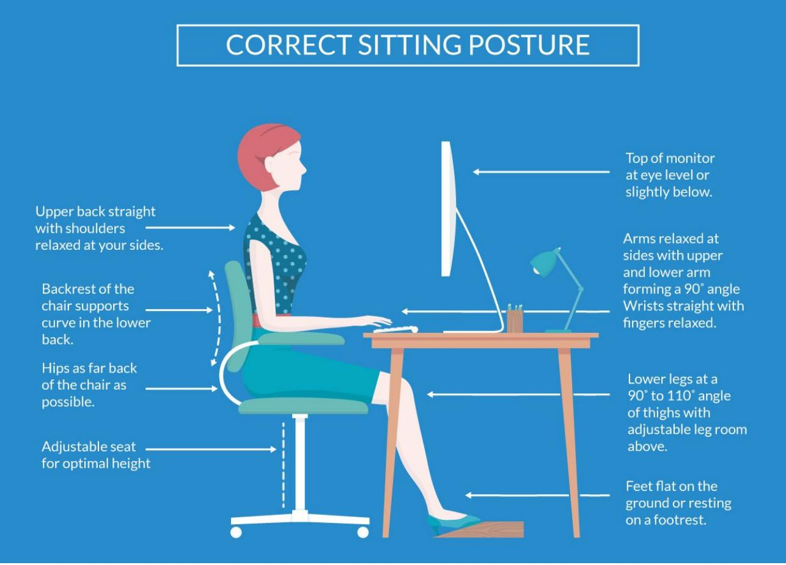

# er

Effective 01/01/2025

## Table of Contents

### **Introduction**

- [Why We Have A Handbook](#page-3-0)
- [Core Purpose, Vision and Values](#page-4-0)
- [Our Strategic Plan](#page-6-0)
- [Corporate Social Responsibility](#page-8-0)
- [Respectful Workplace and Equal Opportunity](#page-10-0)

### **Attendance and Time Off**

- [Alternative Work Week / Flexible Work Hours](#page-16-0)
- [Your Attendance at Work](#page-22-0)
- [Bereavement Leave](#page-23-0)
- [Holidays](#page-25-0)
- [Jury Duty/Other Court Appearances](#page-27-0)
- [Leaves of Absence (LOA)](#page-28-0)
- [Paid Parental Leave](#page-29-0)
- [Paid Time Off](#page-31-0)
- [Voting](#page-34-0)

### **Benefits**

- [Employee Discounts](#page-35-0)
- [Events and Activities](#page-36-0)
- [Fitness](#page-37-0)
- [401(k) Savings Plan](#page-38-0)
- Insurance [/ Qualifying Events](#page-39-0) / COBRA
- [Public Transit Program](#page-41-0)
- [Qualified Parking Reimbursement Program](#page-43-0)
- [Service with the Firm](#page-45-0)
- [Social Security (FICA)](#page-46-0)
- [Unemployment Compensation](#page-47-0)
- [Tuition Reimbursement Program](#page-48-0)

#### **Career Development**

- [Career Ladder Structure / Promotions](#page-51-0)
- [Certifications & Accreditations](#page-53-0)
- [Professional Registration](#page-54-0)
- [Professional Society](#page-57-0)

### **Compensation and Performance**

- [Classifications](#page-59-0)
- [Recording of Travel Time](#page-60-0)
- [Compensation](#page-63-0)
- [Performance Development](#page-64-0)
- [Corrective Action](#page-65-0)
- [Direct Deposit](#page-67-0)
- [Overtime and Premium Pay](#page-68-0)
- [Paydays and Pay Periods](#page-69-0)

### **Employment Practices**

- [Drug-Free](#page-70-0) Workplace
- [Employment Eligibility and Verification](#page-72-0)
- [Employee Records](#page-75-0)
- [Employee Referral Incentive Program](#page-76-0)
- [Initial Employment Period / Onboarding](#page-79-0)  Process [Relocation](#page-79-0)
- [Secondary Employment](#page-82-0)
- [Adjunct Professors](#page-83-0)
- [Separation of Employment](#page-85-0)
- [Internal Employee Transfers](#page-87-0)
- [Telecommuting / Remote Work](#page-91-0)
- [Anti-Slavery](#page-96-0)
- Child [Labor/Youth](#page-97-0) Workers
- Antitrust [and Unfair Competition](#page-98-0)

#### **General Policies**

- [Artificial Intelligence](#page-100-0)
- [Attire](#page-103-0)
- [Business Hours](#page-104-0)
- [Communication Methods](#page-105-0)
- [Computer Networks, Internet Access, Social Media,](#page-107-0)  [Digital Networking](#page-107-0)
- [Confidentiality and Personally Identifiable Information](#page-111-0)
- [Confidentiality Intellectual Property](#page-113-0)
- [Conflicts of Interest](#page-114-0)
- [Environmental / Sustainability](#page-115-0)
- [Foreign Corrupt Practices Act (FCPA)](#page-116-0)
- [Government Relations](#page-117-0)
- [Gresham Smith Branded Merchandise](#page-118-0)
- [Lactation Breaks](#page-119-0)
- [Office Closing](#page-121-0)
- [Office Environment](#page-122-0)
- [Office Furniture](#page-123-0)
- [Parking](#page-124-0)
- [Personal Mail / Personal Telephone Calls](#page-125-0)
- [Philanthropic Sponsorship / Donation Guideline](#page-126-0)
- [Service Animals at Work](#page-131-0)
- [Smoking / Tobacco / E-cigarette](#page-133-0)
- [Solicitations](#page-134-0)
- [Timekeeping Guidelines](#page-135-0)
- [Travel and Expense Policy](#page-138-0)
- [Use of Employee Photographs and Other Medium](#page-148-0)
- [Vehicle Usage](#page-149-0)
- [Visitors](#page-153-0)
- [Wireless Stipend](#page-154-0)

### **Safety and Security**

- [Safety Standards and Expectations](#page-157-0)
- [Security Cards](#page-160-0)
- [Self-Defense](#page-161-0)

### **[State Appendix](https://gspnet4.sharepoint.com/:b:/r/sites/HR/Shared%20Documents/State-Appendix.pdf?csf=1&web=1&e=sxG3ut)**

## Introduction: Why We Have a Handbook

Effective Date: 11/15/22 – Supersedes Date: 5/16/17

The Gresham Smith Employee Handbook addresses many of the policies that affect your daily work life and is to be used as a tool and reference for policies that generally apply to all employees. We recognize that some states where we do business have unique laws that are only applicable to individuals employed in that state. You can access the State Appendix [here.](https://gspnet4.sharepoint.com/:b:/r/sites/HR/Shared%20Documents/State-Appendix.pdf?csf=1&web=1&e=sxG3ut) 

The laws that apply to Gresham Smith and its employees frequently change. Despite the firm's best efforts, there may be times when policies and procedures in the handbook or Appendix may appear to conflict with applicable law. If such a discrepancy is identified, Gresham Smith will always comply with the applicable laws in question. You should inform Human Resources (HR) if you believe there is a discrepancy between the laws and the handbook or Appendix to allow the firm to review and modify appropriately.

Nothing contained in this handbook or any other document provided to you is intended to be, nor should be, construed as a guarantee that employment or any benefit will be continued for any period of time. In an at-will employment relationship, both you and the firm can end the employment relationship at any time and for any reason. Any salary figures provided to you in annual or monthly terms are stated for the sake of convenience and are not intended as/do not create an employment contract.

Any questions regarding content or interpretation may be addressed to the director of HR.

## Introduction: Core Purpose, Vision and Values

Effective Date: 11/15/22 - Supersedes Date: 5/16/17

### **Our Core Purpose:**

We plan, design and consult to create healthy and thriving communities.

### **Our Vision:**

Be a market leader building value with our clients, our people and the world.

### **Our Values:**

In everything we do, we are guided by our Core Values of Commitment, Integrity, Respect and Teamwork. Our Core Values define who we are, what we stand for and how we treat those around us.

#### **Commitment**

*Driven To Be the Best – For Clients, to Employees Service, Diligence, Creativity, Innovation, Perseverance, Quest for Knowledge*

We are passionate about what we do, and we continuously seek to be the best and deliver our best to our clients, our communities and our employees. Commitment also defines how we arrive at solutions through perseverance, a service-minded, consultative approach, and a quest for knowledge that fosters creativity and innovation.

### **Integrity**

*True to a High Level of Values Honesty, Fairness, Devotion, Stability, Loyalty, Quality*

We hold ourselves to high ethical standards—not simply because it's good business, but because it's the right thing to do. Integrity defines how we treat our employees: with fairness and respect; how we deal with our clients: with honesty and transparency; and how we interact with our communities: by seeking through our collective work and actions to improve the cities and towns we call home.

### **Respect**

*Consideration of Clients and Employees, Communication, Service, Involvement, Esteem*

At the heart of our interaction with others is the principle that each person and each community has intrinsic value. This guides how we treat one another and how we work with those around us. Respect is also reflected in our approach to diversity, equity, inclusion and belonging—creating an internal culture that is welcoming to all.

#### **Teamwork**

*Foster the Collaborative Spirit Leadership, Empowerment, Synergy, Innovation, Responsiveness, Knowledge Sharing*

We foster a spirit of collaboration across our firm—sharing knowledge and best practices; offering support and empowering growth; cultivating an environment that welcomes diversity of thought, experience and background; and leading by example. Our team-centered approach extends to how we interact with our clients—by seeking to understand their unique needs and perspectives to arrive at effective solutions. We also develop teaming relationships—both internally and externally—to support causes that contribute to community vitality.

Any questions regarding content or interpretation may be addressed to the director of Human Resources.

## Introduction: Our Strategic Plan

Effective Date: 11/15/22 - Supersedes Date: 5/17/17

Our 2025 Strategic Plan is designed to establish a cohesive direction that positions our firm for growth and long-term health. This is a brief overview, and we encourage you to learn more by visiting our [2025](https://gspnet4.sharepoint.com/SitePages/Strategic-Plan.aspx)  [Strategic Plan portal page.](https://gspnet4.sharepoint.com/SitePages/Strategic-Plan.aspx)

Our plan is divided into two key elements:

- Our long-term direction & strategy road map
- Our growth strategy

## **Long-Term Direction & Strategy Road Map**

The key perspectives of People & Culture, Practice Delivery, Clients and Business Outcomes continue to underpin our long-term direction and road map, which is also based on our Core Purpose, our Vision and our Values.

Five initiatives, which are intended to improve the overall experience of our employees as well as the overall health of our organization, fall under our Long-Term Direction & Strategy Road Map:

- 1. Way to Recruit
- 2. Connect and Thrive
- 3. Workforce Development
- 4. Technology/Innovation
- 5. Environmental, Social and Governance (ESG)

## **2025 Growth Strategy**

Our firmwide growth strategy priorities align with an accelerated pace of new technologies and data analytics that are significantly impacting our clients' businesses, coupled with our ability, as a firm, to develop strategic advantages. Our overall growth strategy is based on the principles of developing deeper client relationships, understanding client challenges that lead to opportunities, delivering exceptional client experiences through superior performance and establishing our position as a trusted advisor to clients.

Specifically, our five growth initiatives, which are focused on areas where we can extend our core business and build emerging business sectors, are:

- Program management
- Geographic expansion
- Experiential design
- Data analytics
- Technology/innovation

In addition, each of our markets develops specific growth initiatives related to our 2025 Strategic Plan as well as market-specific growth opportunities.

## Introduction: Corporate Social Responsibility

Effective Date: 07/01/2025 - Supersedes Date: 11/15/2022

We take our responsibility to practice social, economic and environmental stewardship for the betterment of our staff and our communities seriously. Gresham Smith is committed to developing and implementing design and consulting solutions, corporate policies, philanthropic endeavors and advocacy efforts that balance immediate needs with future impact and value.

Our corporate social responsibility efforts have a tremendous impact on our ability to achieve our Core Purpose to plan, design and consult to create healthy and thriving communities and our vision of being a market leader building value with our clients, our people and the world.

### **We INVEST**

Our people are the foundation of our firm, and we invest in our staff to provide a workplace for professional growth and opportunity and create a sense of belonging and community.

We proactively benchmark, evaluate and improve our internal operations. Continually seeking ways to reduce our energy consumption and waste, Gresham Smith's initiatives include firmwide operational enhancements, a mass transit incentive program, telecommuting, videoconferencing and waste-reduction programs.

### **We CREATE**

Our staff of talented, diverse and passionate people are dedicated to delivering successful outcomes for our clients, our firm and the communities in which they live and work. We think holistically about the design and consulting solutions that we provide to our clients, understanding their long-lasting implications on business, employees and end users.

Our practice-led business model fosters collaboration and innovation in order to develop dynamic solutions that help us meet and exceed our clients' goals. And our overall focus on delivering exceptional and consistent quality aids in our ability to serve as trusted advisors as we partner with our clients.

### **We EVOLVE**

In order to remain competitive in our industry, we continually evaluate our actions and performance across our four perspectives of People & Culture, Practice Delivery, Clients and Business Outcomes.

Through our staff's commitment to the advancement of the A/E industry, we are actively involved in discussions related to trends affecting our clients, regulations and policy changes impacting our industries, and the most effective solutions for a broad range of project types. Through our Innovation Pillar, we take a technology-driven approach to develop novel, high-value solutions for our clients.

### **We GIVE**

Gresham Smith is committed to supporting the philanthropic endeavors of our employees. We encourage our employees to be engaged in civic and community organizations in the communities in which they live and work. Because we believe that each one of us has the opportunity to make a positive difference, we provide a volunteer-hours matching program where we provide a paid match to employees for the hours they spend volunteering during the workweek, and through our Gresham Smith Individual Volunteer Empowerment (GIVE) committee, we support charitable contributions/sponsorships, in-kind services and volunteer activities. Our communities benefit greatly from the collective influence of national and local organizations committed to enhancing our social resources, our environment and the health and wellbeing of others.

As a firm, we support more than 100 charitable and civic organizations across our locations.

### **We ADVOCATE**

We support our employees' involvement and leadership within professional and industry organizations. There is tremendous value in applying passion, knowledge and experience in order to contribute to the advancement of our profession and to support the success of our peers.

## Introduction: Respectful Workplace and Equal Opportunity

Effective Date: 11/15/22 - Supersedes Date: 6/01/20

At Gresham Smith, we have a long history of commitment to fostering a workplace that supports an inclusive culture where all our employees have the opportunity to thrive—both personally and professionally—and we are dedicated to creating and maintaining an environment in which all individuals are treated with respect and dignity. It is our position that every employee has the right to work in a professional atmosphere that embraces all, promotes equal employment opportunities and prohibits unlawful discriminatory practices, including harassment and bullying.

At the core of our Connect and Thrive program is the recognition that it is vital for our employees to feel valued and connected, and to know that they belong. Our Connect and Thrive program does not exist to provide preferential treatment based on an individual's identity. Rather, our program exists to promote equal opportunity to individuals of all backgrounds. We are committed to fostering a high-quality work environment in which inclusiveness is an instinct, not an initiative, and in which each person realizes their maximum potential and contribution. We recognize that different ideas, perspectives, and backgrounds create a stronger and more creative work environment that delivers better results. Our leaders, supervisors and employees all work together to fulfill our commitment and ensure an equal opportunity for all. This shared endeavor instills a deep sense of pride, passion and belonging that transcends any discipline, role, business unit or background, and is unified in our commitment to excellence, innovation and social responsibility.

#### **Equal Employment Opportunity**

It has been, and will continue to be, Gresham Smith's policy and intent to ensure Equal Employment Opportunity (EEO) for our employees and applicants without regard to age, citizenship status, color, disability, genetic information (including family medical history), national origin, race, religion, sex (including pregnancy), gender (including gender identity/or expression, sexual orientation, and status as a transgender or transsexual individual), veteran status, or any other characteristic protected by federal, state or local law. This policy covers all employees and applicants and every facet of employment, including, but not limited to, recruitment and hiring, promotions, training, career development and working conditions.

If you believe this policy has been violated, please contact any one of the following individuals immediately to bring your concern to their attention so appropriate steps can be taken to address the situation:

- Immediate supervisor
- Market vice president/Corporate Services director
- HR partner, and/or
- Director of HR

### **Workplace Accommodations**

Consistent with this policy of nondiscrimination, Gresham Smith complies with all applicable provisions of the Americans with Disabilities Act ("ADA"), as amended by the ADA Amendments Act of 2008 (ADAAA), and all applicable state and local disability accommodation laws. Gresham Smith will provide reasonable accommodations to a qualified person with a disability, as defined by the ADA/ADAAA/applicable law, and who has made us aware of their disability, provided that such accommodation does not constitute an undue hardship on the firm. Employees with a disability who believe they need a reasonable accommodation to perform the essential functions of their job should contact Human Resources to request reasonable accommodation. After receiving a request for accommodation, Gresham Smith will engage in an interactive dialogue with you to determine the precise limitations of your disability and explore potential reasonable accommodations that could overcome those limitations. If your disability or need for accommodation is not obvious, Gresham Smith may ask you to provide supporting documents showing that you have a disability within the meaning of the ADA or other applicable law, and that your disability necessitates a reasonable accommodation. If the information provided in response to this request is insufficient, Gresham Smith may require that you see a health care professional of Gresham Smith's choosing, at Gresham Smith's expense. In those cases, if you fail to provide the requested information or see the designated health care professional, your request for a reasonable accommodation may be denied. Gresham Smith will keep confidential any medical information obtained in connection with your request for a reasonable accommodation.

Gresham Smith also complies with the Pregnant Workers Fairness Act and all similar state and local laws. Gresham Smith will provide reasonable accommodations to applicants and employees for known limitations related to, affected by, or arising out of pregnancy, childbirth, or related medical conditions, provided that such accommodations do not constitute an undue hardship on the firm. Employees who believe they need a reasonable accommodation to perform the essential functions of their job due to pregnancy, childbirth, or a related medical condition should contact Human Resources to request reasonable accommodation. After receiving a request for accommodation, Gresham Smith will engage in an interactive dialogue and documentation policy similar to that described for disability accommodations above.

Finally, Gresham Smith also complies with all applicable provisions of the federal, state, and/or local law that require reasonable accommodation for religious beliefs and practices. Gresham Smith will provide

reasonable accommodations to an employee who makes us aware of their religious beliefs and practices that conflict with work requirements, provided that such accommodation does not constitute an undue hardship on the firm. Employees who wish to request reasonable accommodation in order to perform the essential functions of their job should contact HR to request reasonable accommodation. After receiving a request for accommodation, Gresham Smtih will engage in a dialogue with you to explore potential accommodations that could resolve the conflict between your religious beliefs and practices and one or more of your work requirements. Documentation to support a request for accommodation may be required.

Individuals will not be retaliated against for requesting an accommodation in good faith. Gresham Smith expressly prohibits any form of discipline, reprisal, intimidation, or retaliation against any individual for requesting an accommodation in good faith.

#### **Workplace Harassment**

It is the position of Gresham Smith that harassment in any form is in direct conflict with the firm's Core Values of Commitment, Integrity, Respect and Teamwork, and is unacceptable behavior whether it is conducted inside or outside the workplace or workday. The work environment extends to our clients, vendors and other business associates. People that Gresham Smith works with are held to the same standards as Gresham Smith employees and are expected to refrain from inappropriate conduct as described in this policy. Disrespectful and/or harassing behavior within the work environment will not be tolerated and should be reported to HR or a member of management so it can be addressed.

Sexual harassment means any harassment based on someone's sex or gender. It includes unwelcome sexual advances, requests for sexual favors and other verbal or physical conduct of a sexual nature when, for example: a) submission to such conduct is made either explicitly or implicitly a term or condition of an individual's employment, b) submission to or rejection of such conduct by an individual is used as the basis for employment decisions affecting such individual, or, c) such conduct has the purpose or effect of unreasonably interfering with an individual's work performance or creating an intimidating, hostile or offensive working environment.

Sexual harassment may include a range of subtle and not-so-subtle behaviors and may involve individuals of the same or different gender or gender identity. Depending on the circumstances, these behaviors may include (but are not limited to) unwanted sexual advances or requests for sexual favors; sexual jokes and innuendo; sex stereotyping; verbal abuse of a sexual nature; commentary about an individual's body, sexual prowess or sexual deficiencies; leering, whistling or touching; insulting or obscene comments or gestures; display in the workplace of sexually suggestive objects or pictures; voicemails, emails, text and/or instant messages that include the behavior listed above; and other physical, verbal or visual conduct of a sexual nature.

Harassment (other than sexual) on the basis of any protected characteristic is also strictly prohibited. Under this policy, harassment is verbal, written or physical conduct that disparages or shows hostility or aversion toward an individual because of their age, citizenship status, color, disability, genetic information (including family medical history), national origin, race, religion, sex (including pregnancy), gender (including gender identity/or expression, sexual orientation, and status as a transgender or transsexual individual), veteran status, or any other characteristic protected by federal, state or local law.

Harassing conduct includes (but is not limited to) epithets, offensive jokes, slurs, gaslighting, microaggressions or stereotyping; threatening, intimidating or hostile acts; disparaging jokes; and written or graphic material that disparages or shows hostility or aversion toward an individual or group because of or based on protected characteristic(s) that is placed on walls or elsewhere on the employer's premises or circulated in the workplace (workplace can mean working at another location such as a client site, etc.) on company time or using company equipment by email, phone (including voice messages), text messages, social networking sites or other means.

If you believe this policy has been violated by anyone in any position, you should report it immediately to one of the contacts below. They will take appropriate steps to address the situation:

- Immediate supervisor
- Market vice president/Corporate Services director
- HR partner, and/or
- Director of HR

You also have the right to request that any alleged harassment terminate immediately if you are comfortable doing so. Concerns you raise will be investigated, and the investigation will be conducted as confidentially as possible under the circumstances. Any employee who is determined, after the investigation, to have engaged in harassment in violation of this policy will be subject to appropriate disciplinary action up to and including termination of employment.

### **Workplace Bullying**

Gresham Smith defines workplace bullying as abusive conduct that is in direct conflict with the firm's Core Values of Commitment, Integrity, Respect and Teamwork. This can include (but is not limited to) harassment, discrimination, making threats, verbal or nonverbal abuse, and any other behaviors that are prohibited by law and therefore not allowed under Gresham Smith's policy.

It is similarly important to understand what the definition of workplace bullying does not include. Accountable management efforts do not constitute bullying. This includes undertaking performance discussions and providing corrective feedback, counseling, or taking disciplinary measures.

Not intended to be all-inclusive, the following are some examples of reasonable management practices that do not constitute workplace bullying. This list is provided as examples to demonstrate the spirit and intention of reasonable management practices:

- Setting reasonable performance goals, standards, and deadlines with employee.
- Informing an employee about unsatisfactory work performance or inappropriate behavior in a constructive way.
- Performance management processes.
- Implementing organizational changes or restructuring.

We all have a moral responsibility to prevent bullying, and all employees are encouraged to report any bullying conduct they experience or witness as soon as possible to allow Gresham Smith to take appropriate action. If you feel you have experienced bullying, you should report it immediately to one of the contacts below. They will take appropriate steps to address the situation:

- Immediate supervisor
- Market vice president/Corporate Services director
- HR partner, and/or
- Director of HR

### **Other Conduct**

Other conduct that is prohibited because of its adverse impact on the work environment includes: (1) threats; (2) violent behavior; (3) the possession of weapons of any type*; (4) the use of recording devices, including cellphones, for inappropriate purposes such as bullying, workplace violence, disclosing proprietary information, etc., except as approved by management and HR; and (5) a manager and their direct report having a romantic relationship.

In addition, employees should not be on Gresham Smith premises or in the Gresham Smith work environment if they are under the influence of or affected by illegal drugs, controlled substances used for nonmedical purposes, or alcoholic beverages. Consumption of alcoholic beverages on Gresham Smith premises is only permitted, with prior management approval, for company-sponsored events.

* *If an employee is a handgun carry permit holder, they may legally possess a firearm and ammunition provided it remains securely locked up and out of sight inside the employee's privately owned vehicle unless state law dictates otherwise.*

### **Complaint Procedure/Retaliation**

Gresham Smith encourages immediate reporting of all perceived incidents of discrimination, harassment, bullying or retaliation, regardless of the offender's identity or position. Individuals who believe that they have been the victim of such conduct, or who believe a co-worker has been a victim of such conduct, should immediately discuss their concerns with one of the following:

- Immediate supervisor
- Market vice president/Corporate Services director
- HR partner, and/or
- Director of HR

In addition, Gresham Smith encourages individuals who believe they are being subjected to such conduct to promptly advise the offender that their behavior is unwelcome and to request that it be discontinued. We recognize, however, that an individual may prefer to pursue the matter by reporting it to management, and we will respect an employee's decision to do so.

Any reported allegations of harassment, discrimination, bullying or retaliation will be investigated. We will maintain confidentiality throughout the investigatory process to the extent consistent with adequate investigation and appropriate corrective action.

While we do not want to put a timetable on reporting, we do want to remind our employees that timely reporting is essential for Gresham Smith to stop, investigate and correct the behavior. Delayed reporting makes this difficult. As such, we encourage you to file a complaint as quickly as practicable.

Retaliation against an individual for reporting harassment, discrimination or bullying, or for participating in an investigation of these types of concerns, is a serious violation of this policy and, like harassment, discrimination or bullying itself, will be investigated and appropriate corrective action will be taken to address any retaliatory conduct. Concerns about possible retaliation should be reported immediately to one of the following contacts so they can investigate and address the situation:

- Immediate supervisor
- Market vice president/Corporate Services director
- HR partner, and/or
- Director of HR

The complainant and witnesses will be informed of the general outcome and closure of the investigation. If a party to a complainant does not agree with its resolution, that party may appeal to Gresham Smith's director of HR or the chief operating officer.

### **Conduct Not Prohibited by this Policy**

This policy is not intended to preclude or dissuade employees from engaging in legally protected activities/activities protected by state or federal law, including the National Labor Relations Act, such as discussing wages, benefits, or terms and conditions of employment, forming, joining, or supporting labor unions, bargaining collectively through representatives of their choosing, raising complaints about working conditions for their and their fellow employees' mutual aid or protection], or legally required activities.

## Attendance and Time Off: Alternative Workweek / Flexible Work Hours

Effective Date: 1/12/23 - Supersedes Date: 11/15/22

#### **Key Takeaways**

Regardless of the schedule you work, a regular, reliable schedule that supports team and client connectivity should be maintained.

Various flexible work arrangements are possible with supervisor approval.

Examples of more formalized flexible work schedules are: 9/80 Workweek, 4 ½-Day Workweek, four 10- Hour Day Workweek.

Gresham Smith is committed to providing flexible working hours, where possible, as long as the team and clients are effectively supported. Generally, you will work in the office an average of three (3) days each workweek to ensure that the firm's culture is maintained, team collaboration can continue, and learning/on-the-job mentoring can occur unless you have received approval from the MVP/Corporate Services director to work a different schedule.

The goal of alternative work schedules is to help you with balancing personal and work time commitments while simultaneously enhancing employee performance through flexible scheduling options. You will work with your supervisor to determine any deviations from the standard work schedule. It is the responsibility of the supervisor to notify HR immediately if an employee's regularly scheduled base hours to work are to be revised going forward.

### **Scope, Eligibility and Program Requirements**

- MVPs/Corporate Services directors have the discretion to determine any variances that are needed in the schedules for their specific groups.
- Regardless of what schedule you work, you should maintain a regular, reliable schedule that supports team and client connectivity.
- There may be certain job functions, disciplines, positions and/or projects for which a modified work-hours schedule is not available.
- The Alternative Workweek program is on a volunteer basis.
- Starting an alternative workweek schedule must occur at the beginning of a pay period.
- To be eligible for an alternative workweek schedule, you will need to be in good standing with the firm and receive approval from your supervisor and MVP/Corporate Services director.
- You should expect in some instances that you will need to work on your scheduled day(s) off if client needs or project schedules require it.
- If you are on the Alternative Workweek program, you will be expected to take a minimum of 30 minutes for lunch each day. Any occasional exceptions should be approved by your supervisor. Exceptions should only be allowed where permissible by law.
- Nothing in Gresham Smith's Alternative Workweek program or related procedures, including the time reporting/tracking requirements, will affect or in any way alter your exempt or non-exempt status.
- You must accurately record all time worked on your timesheet.
- The firm may cancel this program at any time at its sole discretion, subject to any applicable legal notice or other procedural requirements.

### **Standard Workweek**

Gresham Smith's standard workweek is 40 hours. For full-time employees, work is generally performed eight hours per day, five days per week, and typically during Monday through Friday.

### **Option 1: 9/80 Workweek Guidelines**

The basic concept of a 9/80 work schedule is that you will work 80 hours (including actual hours worked, paid time off and approved leave) over a two-week work period within nine working days, instead of 10, thus getting every other Friday off.

### Work Schedule Setup

If you elect this option and are approved to participate in the 9/80 program, you will be placed in one of two groups with alternating Fridays off. The group schedules will be arranged to provide sufficient office coverage to ensure that client and team support are not impacted.

### Work Schedule and Time Reporting

- The 9/80 schedule enables employees to work 9 hours per day Monday through Thursday, while alternating Fridays—off one Friday and work 8 hours the following Friday—in order to complete the 80-hour schedule in the two-week time frame.
- A sample work schedule is provided below. It is recognized that employees may not work exactly the same number of hours every day, but should work the minimum number of hours required in that period (including hours worked, paid time off and approved leave).
- Switching of Fridays is not allowed. In order for this alternative work schedule to meet all guidelines, it is necessary that we maintain consistency of the days off. If a client meeting or other function requires you to work on your scheduled Friday off, you will not be allowed to automatically "switch" Fridays. MVPs/Corporate Service directors may, at their discretion, approve alternative days off to the regularly scheduled day provided you are working the required hours during the overall time period.
- A 30 minute minimum lunch period will be required, which is in addition to time worked.
- Employee timesheets should reflect actual hours worked each day.

- The firm will pay overtime in accordance with all applicable federal, state, and local laws that differ from the federal requirement to pay overtime after 40 hours in a workweek.
#### Group A

|        | Monday | Tuesday | Wednesday | Thursday | Friday |
|--------|--------|---------|-----------|----------|--------|
| Week 1 | 9      | 9       | 9         | 9        | Off    |
| Week 2 | 9      | 9       | 9         | 9        | 8      |
| Week 3 | 9      | 9       | 9         | 9        | Off    |
| Week 4 | 9      | 9       | 9         | 9        | 8      |

#### Group B

|        | Monday | Tuesday | Wednesday | Thursday | Friday |
|--------|--------|---------|-----------|----------|--------|
| Week 1 | 9      | 9       | 9         | 9        | 8      |
| Week 2 | 9      | 9       | 9         | 9        | Off    |
| Week 3 | 9      | 9       | 9         | 9        | 8      |
| Week 4 | 9      | 9       | 9         | 9        | Off    |

### **Option 2: 4 ½-Day Workweek**

The basic concept for the 4 ½ day workweek is the achievement of 40 hours, including hours worked, paid time off, or approved leave.

- 1. Employees who choose the 4 ½-day workweek will work 9 hours per day, Monday through Thursday, and 4 hours every Friday.
- 2. A sample work schedule is provided below. It is recognized that employees may not work exactly the same number of hours every day, but should work the minimum number of hours required in that period (including hours worked, paid time off and approved leave).
- 3. A 30-minute minimum lunch period will be required, which is in addition to time worked.
- 4. Employee timesheets should reflect actual hours worked each day.
- 5. The firm will pay overtime in accordance with all applicable federal, state, and local laws that differ from the federal requirement to pay overtime after 40 hours in a workweek.

#### Group C

|        | Monday | Tuesday | Wednesday | Thursday | Friday |
|--------|--------|---------|-----------|----------|--------|
| Week 1 | 9      | 9       | 9         | 9        | 4      |
| Week 2 | 9      | 9       | 9         | 9        | 4      |
| Week 3 | 9      | 9       | 9         | 9        | 4      |
| Week 4 | 9      | 9       | 9         | 9        | 4      |

#### **Option 3: Four 10-hour Workday Workweek**

This workweek schedule is simple. You work 10-hour workdays Monday through Thursday, and take Fridays off.

- 1. If a holiday falls on one of your 10-hour workdays, you will record 8 hours and will work 2 hours on another day in that workweek, if non-exempt (hourly), or within the pay period, if exempt (salaried), or use PTO hours.
- 2. It is recognized that employees may not work exactly the same number of hours every day, but should work the minimum number of hours required in that period (including hours worked, paid time off and approved leave).
- 3. A 30-minute minimum lunch period will be required, which is in addition to time worked.
- 4. Employee timesheets should reflect actual hours worked each day.
- 5. The firm will pay overtime in accordance with all applicable federal, state, and local laws that differ from the federal requirement to pay overtime after 40 hours in a workweek.

### **Time Reporting – Accounting for Paid Leave:**

Paid Time Off (PTO) - If an employee uses PTO during the workweek, the same number of hours will be entered for each corresponding workday based on their workweek schedule.

- Example 1
An employee who is working in a Group A schedule requests PTO for a Thursday. Nine hours of PTO are input on their time card for the day off, and 9 hours are deducted from the employee's PTO accrual since the employee was scheduled to work 9 hours.

- Example 2
An employee working in a Group A schedule is scheduled to work on a Friday and requests PTO for that Friday. Eight hours of PTO are input on their time card for the Friday off and 8 hours are deducted from the employee's PTO accrual since the employee was scheduled to work 8 hours.

Bereavement Pay – If you use paid bereavement, follow the same rules used for PTO by entering the number of hours for each corresponding workday based on the workweek schedule (for example, 9 hours for a scheduled Monday, Tuesday, Wednesday or Thursday, and either 4 hours, 8 hours, or 0 hours for Friday depending on the alternative schedule).

Holiday Pay – Holidays are based on 8-hour days and should be recorded as 8 hours on the timesheet even if it falls on a regular 9-hour day. The 1-hour difference should be made up during the same timesheet period or PTO may be used for the additional hour. If a holiday falls on a Friday that you are scheduled to be off, you should take your off day the day before the Friday holiday.

Overtime Pay – If you are an exempt (salaried) employee who receives premium pay, any approved hours worked over the assigned alternate schedule should be listed in the "OT" (overtime) field on your timesheet. If you are a non-exempt employee, you will have 4 hours every other week that are considered overtime when the weekly schedule includes four 9-hour days and one 8-hour day. Any applicable overtime will be paid according to federal and state laws.

### **General Administration of Alternative Workweek Program**

#### Enrolling in an Alternative Workweek Schedule

If you wish to enroll in the Alternative Workweek program, you should first discuss with your supervisor and request your preferred alternative workweek schedule. Your supervisor should then communicate their agreement to the MVP/Corporate Services director who has the final approval and will determine which group you will be assigned to. The supervisor will communicate the approved change to the HR Partner, who will enter the schedule change in the HRIS. The personnel action will route to the MVP/Corporate Services director for final approval, and HR will confirm enrollment and the effective date via email.

#### Addressing Conflicts

You should work with your supervisor to address any issue that may interfere with your ability to adhere to your scheduled workweek. It is the responsibility of the supervisor to manage the work schedules of their staff while ensuring that a high standard of performance is demonstrated in our:

- Ability to meet client's needs.
- Ability to meet deadlines and deliverables.
- Employee's performance and productivity.
- Financial commitments.

#### Termination Notification Process

If you elect to terminate your participation in the Alternative Workweek Program, you must submit a written request using email to notify your supervisor. Upon receipt of your notification to withdraw from the program, you will return to working a standard workweek schedule at the start of the new payroll

cycle. Your supervisor will make the change in the HRIS. You will not be allowed to terminate your participation in the program during the middle of a payroll cycle. Changes to an Alternative Workweek schedule are based on supervisor discretion and are limited to one change per quarter.

#### Misuse of the Program

 

Alternative Workweek programs are a privilege, not a right. The firm is built on integrity, trust, commitment and teamwork, and these traits are the foundation for the initiative's success. If you should misuse the program, it will result in termination of the Alternative Workweek option for you.

#### Reservation of Rights

Management reserves the rights to interpret, modify or revise this program, in whole or in part as it deems necessary and, subject to applicable laws, will provide a one-month notification period to employees, when possible, prior to rescinding the Flexible Workweek program.

#### Program Administration

Questions regarding this program should be referred to your HR partner.

## Attendance and Time Off: Your Attendance at Work

Effective Date: 11/15/22 - Supersedes Date: 12/01/11

#### **Key Takeaways**

Deviations from your standard work schedule should receive supervisor approval.

Notify your supervisor immediately if you will be late to work or away from the office for an extended period of time.

Since proper staffing is crucial to our ability to meet project objectives, regular attendance at work is important. Also, you must inform your supervisor in advance of impending absences or if you will be late for work whenever possible.

The firm's core work hours are 8 a.m. to 5 p.m. With your supervisor's approval, there can be flexibility to modify your start and end times. With the firm's hybrid work model, you should be in the office an average of three (3) days each workweek, and any deviation from the average of three (3) days in the office workweek must be approved by your supervisor and MVP/Corporate Services director.

## Attendance and Time Off: Bereavement Leave

Effective Date: 08/01/2025 - Supersedes Date: 11/15/2022

### **Key Takeaways**

The firm provides up to six days of bereavement leave after the loss of an immediate family member, 3 days for reproductive loss, and 2 days for extended family and non-family bereavement as described in this policy. Exceptions will be reviewed by your MVP/Corporate Services director and discussed with your HR Partner. Bereavement leave is charged to 19006.00.

Gresham Smith provides employees with time off in the event of the death of someone close to you. We aim to support employees during difficult times by providing them with the time and flexibility they need to grieve, manage their personal affairs, and seek emotional recovery.

Employees may use a maximum of 6 bereavement days annually. If there are extenuating circumstances and you need an exception to this limit, please reach out to your Market Vice President, Corporate Services Director, or the Director of Human Resources.

#### Immediate Family Bereavement Leave

Employees who experience the death of an immediate family member are eligible for up to 6 days of paid bereavement leave. Immediate family members are defined as:

- Spouse or domestic partner
- Child (biological, adoptive, stepchild, or foster child)
- Parent (biological, adoptive, stepparent, in-law, or legal guardian)
- Grandparent (biological, adoptive, stepparent, or in-law)
- Sibling (brother, sister, adopted, or in-law)
- Miscarriage or stillbirth

Additional relationships may be included under applicable state law. Please see the [State Appendix](https://gspnet4.sharepoint.com/:b:/r/sites/HR/Shared%20Documents/State-Appendix.pdf?csf=1&web=1&e=sxG3ut) for more information.

Employees can use these dates intermittently or consecutively based on their personal needs to handle grief, funeral services, or related arrangements.

#### Reproductive Loss Leave

Gresham Smith acknowledges the physical, emotional, and psychological impacts of reproductive loss, including failed IVF/IUI treatments, surrogacy, or adoption. Employees are eligible for up to 3 days of paid leave (up to two times per year) following a loss. If additional time is needed, please reach out to your supervisor and HR Partner for options.

#### Extended Family and Non-Family Member Bereavement Leave

For the loss of a non-family member, such as close friends or extended family not listed above, employees are eligible for up to 2 days of paid bereavement leave (up to three times per year) following a loss. This leave includes travel time, where applicable, to allow employees to attend memorial services or funerals or handle related affairs.

#### Considerations

- 1. Notification: Employees are requested to notify their supervisor and HR Partner as soon as possible following the loss.
- 2. Leave Usage: Bereavement leave can be used intermittently or consecutively, depending on the employee's needs. There is a maximum benefit of 6 days annually. If additional time is needed more than the allotted paid bereavement leave, please consult with your supervisor or HR Partner. Employees may take PTO or unpaid leave if additional leave is needed. Please coordinate all leave with your supervisor. Leave must be used within 90 days of the loss.
- 3. Timesheet: Approved bereavement leave is charged to 19006.00. Please enter the relation to your loved one in the timesheet comment section. If approved to work an alternative schedule, when entering bereavement leave on the timesheet, one day is equivalent to 8 hours. Refer to the bereavement section of the Alternative Workweek policy for more information.

## Attendance and Time Off: Holidays

Effective Date: 01//1/24 - Supersedes Date: 11/15/22

### **Key Takeaways**

The firm provides eight paid holidays each year to all Gresham Smith employees. This includes one flex holiday, which can be used throughout the year at the employee's discretion.

Holiday pay will be calculated based upon the percentage of your regularly scheduled base hours you work each week.

All employees of the firm, regardless of classification (excluding independent contractors or individuals who are working through a contract agency since they are not a Gresham Smith employee), are eligible for holiday pay. A holiday is not considered as time worked for the purposes of calculating overtime.

### The firm observes the following eight paid holidays:

| New Year's Day   | January 1                                |
|------------------|------------------------------------------|
| Memorial Day     | Last Monday in May                       |
| Independence Day | July 4                                   |
| Labor Day        | First Monday in September                |
| Thanksgiving Day | Fourth Thursday in November              |
| Christmas Eve    | December 24                              |
| Christmas Day    | December 25                              |
| Flex Holiday     | Date chosen at the employee's discretion |

Unless otherwise notified, holidays falling on Saturday are observed the preceding Friday; those falling on Sunday are observed on the following Monday. You may request additional time off to observe religious holidays. Time off without pay will not be granted unless your paid time off (PTO) balance has been exhausted.

Part-time and temporary employees who work during the pay period in which the holiday falls will receive holiday pay. The calculation will be based upon a percentage of their regularly scheduled base hours to work each week as defined in the Human Resource Information System (HRIS.) For example, if an employee's scheduled hours to work is 30 hours per week, they will receive 75% of 8 hours (6 hours) for each holiday, rounded to the nearest quarter hour.

### Flex Holidays

Regular, full-time employees receive 8 hours of flex holiday time per calendar year. This flex holiday time may be used to observe or celebrate religious or cultural holidays that aren't part of the firm's paid holidays, and must be used during the course of the year. Employees hired on or after December 1st of the calendar

year are ineligible for flex holiday pay until January 1st of the new year. Flex holidays can be charged to 19004.02.

As with the standard observed holidays, part-time and temporary employee holiday and flex holiday pay will be calculated based upon a percentage of their regularly scheduled base hours to work each week as defined in the HRIS. For example if an employee's scheduled hours to work is 30 hours per week, they will receive 75% of 8 hours (6 hours) for each holiday, rounded to the nearest quarter hour.

Employees approved to work an alternative schedule should refer to the Time Reporting – Accounting for Paid Leave, Holiday Pay section of the Alternative Workweek policy for more details.

## Attendance and Time Off: Jury Duty / Other Court Appearances

Effective Date: 11/15/22 - Supersedes Date: 6/01/20

### **Key Takeaways**

You will be paid for jury duty or other non-personal court appearances. Personal court appearances will not be paid by the firm. You will be able to use your accrued, unused PTO.

You must notify the firm immediately when called for jury duty or other non-personal court appearances (e.g., witness or subject matter expert) and provide a copy of the summons to your supervisor. Since personal court appearances will not be paid by the firm, you can use your accrued, unused PTO to cover your time off.

You will receive your regular payroll check through the Gresham Smith payroll system while serving on a jury or attending a non-personal court appearance. Payment received by you from the court should be signed over to Gresham Smith since the firm is providing 100% of your salary while you are serving.

You should return to the office after your presence is no longer required where consistent with state law. For timesheet purposes, jury duty and/or other non-personal court appearances are charged to 19007.00.

## Attendance and Time Off: Leave of Absence (LOA)

Effective Date: 11/15/22 - Supersedes Date: 12/01/11

#### **Key Takeaways**

Inform the Human Resources partner of your possible need for a leave of absence as soon as you are aware. Delayed notification may postpone approval.

Review the [Leave of Absence Guide](https://gspnet4.sharepoint.com/sites/HR/Lists/BenefitsFAQ/Attachments/189/2025%20Leave%20of%20Absence%20Guide.pdf) for additional details pertaining to your specific leave type.

A leave of absence is a temporary suspension of active work status for a stated period of time. The specific allowable leave time will depend upon the type of leave in which you qualify. You must initiate your leave request through Human Resources and receive approval as applicable.

Each individual request for a leave of absence will be considered for approval. Your specific leave may qualify for one of the following categories: Family and Medical Leave (FMLA), personal leave, medical leave (not eligible for FMLA), maternity/paternity leave (including domestic partners), Worker's Compensation leave, or military leave.

All applicable leaves of absence will run concurrently with the FMLA, and other Gresham Smith leaves as permitted by law. Please review the [State Appendix](https://gspnet4.sharepoint.com/:b:/r/sites/HR/Shared%20Documents/State-Appendix.pdf?csf=1&web=1&e=sxG3ut) for laws pertaining to the various leave laws in your state or reach out to HR for more information.

Details related to your specific type of leave will be made available by Human Resources following receipt of your leave request.

## Attendance and Time Off: Paid Parental Leave

Effective Date: 01/01/24 - Supersedes Date: 11/15/22

### **Key Takeaways**

Full-time and part-time eligible employees will be provided up to 15 days of paid parental leave when specific criteria has been met.

You will provide your supervisor and HR partner with notice of your request for leave at least 30 days prior to the proposed date of the leave (or if the leave was not foreseeable, as soon as possible).

One way Gresham Smith supports its working parents is through paid parental leave. Review the following and refer to the [Leave of Absence Guide](https://gspnet4.sharepoint.com/sites/HR/Lists/BenefitsFAQ/Attachments/189/2025%20Leave%20of%20Absence%20Guide.pdf) for additional guidelines.

## **Eligibility**

Eligible employees must meet the following criteria:

- Be a full or part-time, regular employee (temporary employees are not eligible for this benefit). In addition, employees must meet one of the following criteria:
	- o Have completed your initial employment period (including any extension past the initial 90 day period).
	- o Have given birth to a child (including surrogacy).
	- o Be a spouse or domestic partner of a person who has given birth to a child (including surrogacy).
	- o Have adopted a child or been placed with a foster child (in either case, the child must be age 17 or younger). The adoption of a child due to a new marriage is excluded from this policy.

## **Amount, Time Frame and Duration of Paid Parental Leave**

- Eligible employees will receive a maximum of 15 days of paid parental leave per birth, adoption or placement of a child/children. The fact that a multiple birth, adoption or placement occurs (e.g., the birth of twins or adoption of siblings) does not increase the 15-day total amount of paid parental leave granted for that event. In addition, in no case will an employee receive more than 15 days of paid parental leave in a rolling forward 12-month period, regardless of whether more than one birth, adoption or foster care placement event occurs within that 12-month time frame.
- The 15 days of paid parental leave are compensated at 100% of the employee's regular, straighttime pay. Paid parental leave will be paid on a semi-monthly basis with the regularly scheduled payroll. There is no project number for tracking this leave. Any employee interested in utilizing this benefit must reach out to their HR partner or the benefits manager for coordination.
- Approved paid parental leave must be taken within 12 months of the date of birth, adoption or placement of a child with the employee and must be taken in 8-hour increments or the daily hours you are scheduled to work.
- Upon termination of the individual's employment at the firm, they will not be paid for any unused paid parental leave for which they were eligible.
- Additional parental leave benefits may be provided under applicable State Law. Please see the [State Appendix](https://gspnet4.sharepoint.com/:b:/r/sites/HR/Shared%20Documents/State-Appendix.pdf?csf=1&web=1&e=sxG3ut) for more information.

### **Coordination With Other Policies**

Paid parental leave taken under this policy will run concurrently with leave under FMLA and as permitted under any applicable state law. All other requirements and provisions under FMLA will apply. Please refer to the [Leave of Absence Guide](https://gspnet4.sharepoint.com/sites/HR/Lists/BenefitsFAQ/Attachments/189/2025%20Leave%20of%20Absence%20Guide.pdf) for further information.

After the paid parental leave or short-term disability leave for employees giving birth is exhausted, the balance of leave (if applicable) will be compensated through employees' accrued paid time off (PTO) or taken unpaid.

### **Requests for Paid Parental Leave**

The employee will provide their supervisor and HR partner with notice of the request for leave at least 30 days prior to the proposed date of the leave (or if the leave was not foreseeable, as soon as possible).

## Attendance and Time Off: Paid Time Off (PTO)

Effective Date: 6/7/2024 - Supersedes Date: 6/1/2023

#### **Key Takeaways**

Providing eligible employees with paid time off (PTO) is one way for the firm to further support each individual's personal time-off needs.

PTO accrual is based upon an individual's Career Ladder Level, employee status and time with the firm. 200 hours is the maximum amount of annual PTO that can be accrued or carried over from one year to the next. Whenever possible, PTO should be scheduled in advance and your supervisor informed at that point to ensure projects can be effectively managed.

It is important that employees have the opportunity to enjoy time away from work to help balance their lives and meet their diverse individual and family needs. Therefore, a paid-time-off (PTO) policy has been established to promote a more flexible approach to time off with pay. Employees are accountable and responsible for managing their own PTO hours to allow for adequate reserves if there is a need to cover vacation, brief periods of incapacity, appointments, emergencies or other situations that require time off from work.

This policy will be applied consistently with any applicable federal, state and local laws.

### **Eligibility**

Eligible employees (full-time or part-time categories) must be scheduled to work at least 24 hours per week on a regular basis. Employees who are scheduled to work less than 24 hours per week or who are temporary or contract employees are not eligible to accrue PTO.

### **PTO Accrual**

Eligible employees will begin to accrue PTO immediately upon employment and can take PTO as it is accrued. Please note that part-time employees will earn PTO on a prorated basis as follows:

- Part-time schedule of 24 29 hours per week 60% of the full-time accrual
- Part-time schedule of 30 34 hours per week 80% of the full-time accrual
- Part-time schedule of 35 39 hours per week 93% of the full-time accrual

Full-time employees who convert to part-time status will receive a letter to outline their PTO accrual schedule along with pertinent information regarding how other programs are affected due to their part-time status.

Based upon the Career Ladder Level (CLL) and service with Gresham Smith, full-time employees accrue PTO each payroll period as outlined below.

#### **PTO Benefit Accrual**

| Years of       | Full-Time Accrual in   | Years of Full-Time Accrual in Hours |                           |
|----------------|---------------------------|-------------------------------------------|---------------------------|
| Employment of  | Hours Per Pay Period      | Employment or                             | Per Pay Period            |
| Promotion Date | (24 pay periods Per Year) | Promotion Date                            | (24 pay periods Per Year) |
| 0-2            | 5.00 (120.00)             | 9                                         | 7.04 (168.90)             |
| 3              | 5.33 (128.00)             | 10                                        | 7.22 (173.35)             |
| 4              | 5.67 (136.00)             | 11                                        | 7.41 (177.80)             |
| 5              | 6.00 (144.00)             | 12                                        | 7.59 (182.25)             |
| 6              | 6.33 (152.00)             | 13                                        | 7.78 (186.70)             |
| 7              | 6.67 (160.00)             | 14                                        | 7.96 (191.15)             |
| 8              | 6.85 (164.45)             | 15                                        | 8.15 (195.60)             |
|                |                           | 16 and over                               | 8.33 (200.00)             |

- Career Ladder Levels P7, P8, P9, TP7, TP8, TP9, OR7, OR8, OR9, M1, M2, M3, M4, A5, A6, I5, I6, T7, T8:
	- o Upon hire or promotion, employees will accrue 200 hours (five weeks) of PTO each year throughout their tenure with Gresham Smith.
- Career Ladder Levels P5, P6, TP5, TP6, OR5, OR6, T6, I4, A4:
	- o Upon hire or promotion, employees in these levels will accrue PTO beginning at the eightyear incremental accrual rate (164.45) according to the table below and will increase yearly up to a maximum of 200 hours (five weeks) per year.
- All other CLL's not identified above will begin at the 0-2 accrual rate.

## **Other Considerations**

- PTO can be taken as it is accrued, however, it must be taken in at least 1/4 hour increments.
- A maximum of 200 hours can be carried over from one calendar year to the next (January 1 through December 31).
- PTO hours cannot be used in advance of accrual.
- Accrued PTO balances will be applied to personal time off, including the offset of deficiencies in base hours and unpaid leave, with the exception of FMLA or military leaves of absence.
- Accrued, unused PTO balances will be paid out to employees upon separation up to a maximum of 25 days (200 hours).
- To ensure new employees have some PTO hours available for use upon hire, up to 40 hours of PTO can be borrowed during the first four months of employment, if needed. If a new hire borrows PTO, they must include a comment in their timesheet stating, "New Hire-Borrowing PTO." Borrowing time could result in a negative balance in the new employee's PTO bank. After the first four months of employment, no additional hours can be taken until their PTO bank has a positive balance, and future borrowing of PTO hours after this time frame will not be allowed.
- Additional paid leave benefits may be provided under applicable State Law. Please see the [State](https://gspnet4.sharepoint.com/:b:/r/sites/HR/Shared%20Documents/State-Appendix.pdf?csf=1&web=1&e=sxG3ut)  [Appendix](https://gspnet4.sharepoint.com/:b:/r/sites/HR/Shared%20Documents/State-Appendix.pdf?csf=1&web=1&e=sxG3ut) for more information.

### **Scheduling**

Whenever possible, PTO should be scheduled in advance. To ensure that client needs can be fully met, PTO must be scheduled in a manner to work with Gresham Smith commitments. Every effort will be made to accommodate individual requests for PTO, although unavoidable circumstances may require denial of PTO requests. Scheduling PTO as far as possible in advance will minimize or eliminate potential scheduling conflicts. Please talk with your supervisor regarding any upcoming PTO requests.

Questions regarding this policy should be directed to HR.

## Attendance and Time Off: Voting

Effective Date: 11/15/22 - Supersedes Date: 5/15/18

### **Key Takeaways**

The firm encourages you to be informed about public policy issues affecting you and your family.

To support your individual involvement in the democratic process, the firm will match up to 30 minutes maximum (charge to 19001.00) for voting time where you are registered to vote.

Gresham Smith is committed to being involved and engaged in the public policy decisions that shape the communities where we live, work and play. We also encourage our employees to be informed about the issues affecting you and your family and urge you to make your voices heard in local, state and national elections.

To help support your individual involvement in the democratic process, Gresham Smith will match up to 30 minutes maximum for voting time (e.g., if it takes you one hour to vote, you may bill 30 minutes on your timesheet to 19001.00.) Gresham Smith will comply with all state laws that may provide greater time off and benefits for voting leave. This applies for any election or referendum happening where you are registered to vote. We hope this will make it a little easier to fit a trip to the polls into your workday.

## Benefits: Employee Discounts

Effective Date: 11/15/22 - Supersedes Date: 12/01/11

### **Key Takeaways**

Employees are eligible to receive money-saving perks based on our corporate partnerships.

Discounts are available for computers, tickets, banking, phone services, car rental, and more.

The Gresham Smith Employee Discount Program exists to offer current employees discounts on products and services as a perk of our corporate partnerships. Visit the [Employee Discounts](https://gspnet4.sharepoint.com/sites/HR/SitePages/Perks-&-Discounts-Modern.aspx) page on the Human Resources Portal to find out what discounts you are eligible for, including computers and software, banking, phone services, tickets, dry cleaning, clothing, health and wellness, and car rental.

## Benefits: Events and Activities

Effective Date: 11/15/22 - Supersedes Date: 9/01/12

### **Key Takeaways**

Special employee events and activities vary depending upon your office and market/department. Check with your MVP/Corporate Services director for your group's activity schedule.

Several special events and activities are sponsored throughout the year for employees, with Gresham Smith providing funding or allowing use of firm facilities. They range from employee involvement in community activities to social events sponsored specifically for employees and their families.

Many of the special activities such as summer picnic, holiday party, athletic teams, etc., are typically organized and carried out by employees who volunteer to lead an employee activity. With MVP/Corporate Services director approval, time to plan and coordinate an activity will be paid by the firm.

Special events and activities planned pursuant to this policy are voluntary and employees may not be compensated for time spent attending unless otherwise noted.

Employees who would like to request a reasonable accommodation due to a disability or their religion related to special events or activities should contact Human Resources.

## Benefits: Fitness

Effective Date: 11/15/22 - Supersedes Date: 10/30/17

### **Key Takeaways**

The firm encourages our employees to care about their health and to work toward a healthier life. To assist you, a one-time reimbursement is available for limited activities.

Gresham Smith encourages its full-time and part-time employees to work toward a healthier life by providing a one-time reimbursement of up to $100 (gross) toward the employee's annual contracted fitness center membership or employee/family joining fee.

To receive reimbursement, submit a check request with a copy of the receipt to HR-Nashville for approval. It will then be routed to Payroll for processing. Please note that the payment will be taxed at the time reimbursement occurs. Please contact your HR partner for more details.

## Benefits: 401(k) Savings Plan

Effective Date: 01/01/2025 - Supersedes Date: 11/15/2022

### **Key Takeaways**

The firm supports your future by providing eligible employees a mechanism for saving money for retirement.

The firm provides a 401(k) savings plan, which includes a firm match.

Our 401(k) plan is designed to give eligible employees the opportunity to save money to accumulate retirement funds. You are eligible to join the plan or to change your contribution at any point throughout the year. Visit the [Benefits](https://gspnet4.sharepoint.com/sites/HR/SitePages/HRFAQ.aspx) page on the Human Resources Portal to learn more about the 401(k) program.

New hires may not be able to access their account for enrollment until approximately five business days following their first paycheck. As a new hire, you should have received an informational enrollment email including login instructions. If you have not yet received this email, please contact our Human Resources department. Additional details related to enrollment, rollovers, loans, or additional investment tools and resources are available online.

Investment changes are allowed throughout the year. You can diversify your investment among several categories. Each of these categories has different risk and return characteristics. The plan is amended from time to time to comply with changes in laws. Each participant will receive a Summary Plan Document.

The firm's matching contribution offers a dollar-for-dollar match up to a maximum of 5%.

## Benefits: Insurance / Qualifying Events / COBRA

Effective Date: 6/1/23 - Supersedes Date: 11/15/22

### **Key Takeaways**

Benefit plans are offered to full-time or part-time employees who are regularly scheduled to work a minimum of 24 hours per week in support of healthcare and dependent daycare needs. Temporary employees who are regularly scheduled to work a minimum of 24 hours per week are eligible for medical/health insurance.

Qualified life event changes to your insurance coverage must be made within 31 days of your life event. If you don't make the change within 31 days, your next opportunity will be during open enrollment and will be effective on January 1.

Under COBRA, employees who are no longer eligible for health benefits due to their end of employment or other reasons as defined in this policy, will have the option to elect COBRA for the continuation of benefit coverage for a period of time. COBRA must be elected within 60 days from when the qualifying life event occurs.

Gresham Smith benefit plans are offered to any full-time or part-time employee who are regularly scheduled to work a minimum of 24 hours per week. Temporary employees who are regularly scheduled to work a minimum of 24 hours per week are eligible for medical/health insurance.

The cost of insurance for most of the plans is intended to be shared between you and the firm. This joint effort makes it possible to offer better coverage and gives you the opportunity to structure your coverage to best fit your needs and the needs of your family. The insurance package is reviewed annually and any changes in cost or plan provisions are communicated following this review.

The Cafeteria Plan allows you to pay certain premium costs with pretax or post-tax dollars, to set aside pretax or post-tax dollars to pay for healthcare expenses not covered by your group insurance, as well as dependent daycare costs. The firm is able to provide this pretax benefit to you by having an IRS-approved plan document on file and by following IRS guidelines in its administration.

Eligible premiums are automatically deducted on a pretax basis; however, you do have the option of paying all or part of your premiums with after-tax dollars. If you wish to pay premiums with after-tax dollars, please contact Human Resources.

Detailed information about our plans can be viewed on the Gresham Smith portal, the HR home page, and in the certificate of coverage booklets located in HR.

You may not make changes to your benefit elections at any time other than open enrollment, unless you have a qualifying life event as detailed below and in our benefit materials.

### **Qualifying Events**

If you have a qualifying life event during the year, you must make your changes within 31 days of the life event. If you do not make your change request within 31 days of the life event, you will not be allowed to make application for that change until the next open enrollment period which will be January 1. Please note that your requested change related to pretax elections must be consistent with your life event.

### Qualifying life events include:

- Change in legal marital status (marriage, divorce).
- Change in the number of dependents (birth, adoption, death, etc.).
- Change in your employment status.
- Change in your spouse's or dependent's (including domestic partner) employment or student status.
- Change in the eligibility of your dependent, including domestic partner.
- Change in residence where medical options are different from current options.
- Loss of other coverage entitling you or a family member, including domestic partner, to enroll for health coverage.
- Receipt of a qualified medical child support order (QMCSO).
- Entitlement or loss of entitlement to Medicare or Medicaid by you or a dependent, including domestic partner.
- Change in coverage options or other benefits under the health plan.
- Election change under the health plan of your spouse or dependent(s), including domestic partner.

*Note: Verification of qualifying status event is required. Changes for qualifying life events are all completed online through our [Benefits Administrator.](http://www.benefitsolver.com/)* 

## **COBRA**

Under the Consolidated Omnibus Budget Reconciliation Act (COBRA), employers offering group health plans are required to offer continuation of group health coverage for terminated employees and qualified beneficiaries upon occurrence of qualifying events.

These qualifying events include:

- The employee's death.
- Voluntary or involuntary termination of employment (other than for "gross misconduct") or reduction in hours.
- Divorce or legal separation from spouse, including domestic partner.
- A dependent child ceasing to be eligible under the applicable plan provision.

If one of these events occurs, you or your qualified beneficiary must notify HR within 60 days from the date of the qualifying event so written notification can be prepared by the benefits administrator.

## Benefits: Public Transit Program

Effective Date: 11/15/22 - Supersedes Date: 3/01/18

### **Key Takeaways**

The Public Transit Program enables full-time and part-time employees to set aside funds semimonthly on a pretax basis for the purchase of transit passes (bus, train, commuter van line) and receive a company match up to $50 per month.

Upon terminating employment, your debit card can be utilized for transit until the end of the month in which employment ends. Any unused amounts will be forfeited.

Gresham Smith is committed to integrating sustainability into our culture, processes and policies; therefore, the firm supports its employees by offering a Public Transit Program that includes an employer matching contribution as detailed below.

### **How Does the Public Transit Program Save You Money?**

The Public Transit Program can help you reduce your transportation expenses to and from work by using an individual account to save money for your monthly transit pass (bus, train, commuter van line) on a pretax basis. The IRS sets the monthly contribution limits which is typically updated each calendar year (this maximum includes your personal contribution and any employer contribution combined) for public transit.

Transit Passes means any pass, token, fare-card, voucher or similar item that entitles the employee to transportation. The transportation must be on mass transit facilities or provided by a company in the business of transporting persons if such transportation is provided in the type of vehicle with a seating capacity of at least 6 adults (excluding the driver).

You make pretax salary contributions (subject to plan limits) to your account then use these funds to cover your out of pocket qualifying transit expenses. Pretax contributions reduce your taxable income, so you have fewer taxes withheld. These accounts are not subject to the "use it or lose it" rule as long as you are employed by Gresham Smith so your account balances may be carried forward year to year. However, to keep your account "open" you must continue to contribute at least $1.00 per month.

### **Employer Matching Contribution:**

If you are a participant in the Transit Program, you are also eligible to receive a company matching contribution of up to a maximum of $50 per month. The applicable company contribution will be deposited into your account at the same time that your per paycheck individual contribution is deposited.

### **Additional Details:**

- Eligibility: Full-time and part-time employees are eligible as of date of hire. Contribution Limits: The minimum amount which an individual can contribute is $1.00 per month. The company will then match your individual contributions dollar for dollar, up to a maximum company monthly match contribution of $50. The maximum that an employee can contribute into the plan per month is the pre-determined IRS limit less any applicable employer contribution.
- Enrollment, Changes or Cancellation: Enrollment or changes to contribution amounts will be completed online through the benefit enrollment system [(www.benefitsolver.com)](http://www.benefitsolver.com/). Changes may be submitted at any time but enrollment/changes will be processed for the effective date of the first day of the next month following the requested change. The change will be reflected on the employee's paycheck the first payday of the month following the change.

*Example: April 29 Enrollment/change submitted online May 1st Effective date May 15 First payroll deduction occurs*

- Deductions: Deductions are taken semimonthly (each paycheck date) and deposited into your account.
- Termination of Employment: Upon terminating employment, the debit card utilized for transit can be used until the end of the month in which employment is terminated. Any unused amounts will be forfeited.

For more information: Details and contact information for the third-party administrator of this account can be found on the internal benefits page under Public Transit/Parking Program. For additional questions, please email [benefits@greshamsmith.com.](mailto:benefits@greshamsmith.com) 

## Benefits: Qualified Parking Reimbursement Program

Effective Date: 11/28/22 - Supersedes Date: 11/15/22

### **Key Takeaways**

The Qualified Parking Reimbursement Program is a pretax program that is available to those full-time and part-time employees who pay a fee to park at or near their office location and do not have an option for payroll pretax deduction for that parking fee. It also includes parking at or near a location from which an employee commutes to work by mass transit.

There are annual IRS contribution limits and a claim reimbursement deadline of 180 days.

Enrollment or changes to contribution amounts can be completed online through the benefit enrollment system [(www.benefitsolver.com)](http://www.benefitsolver.com/).

The Qualified Parking Reimbursement program is available for employees who pay a fee to park at or near their office location and do not have an option of payroll pretax deduction for that parking fee. If you currently pay for parking through pretax Gresham Smith payroll deduction, you are already receiving a pretax benefit on your parking expenses and should not enroll in this plan. If payroll deduction is not available for your parking facility that is located at or near your Gresham Smith office location, you may want to consider enrolling in this program to receive the pretax benefit.

## **Qualified Parking per IRS guideline**

"Qualified Parking" means parking provided for an employee at or near the business premises of the employer. It can also mean parking fees that are paid to park at or near a location from which the employee commutes to work by mass transit in a commuter highway vehicle or by carpool (such as a fee to park your vehicle at a train station for a portion of the day while you take the train to the office). It does not include parking at or near an employee's residence and does not include the actual transit/ride share fee. This program is only related to the actual applicable parking fee(s).

You make pretax salary contributions (subject to plan limits) to your account equal to the expenses you know you will pay out of pocket for qualified parking expenses. Pretax contributions reduce your taxable income, so you have fewer taxes withheld. Your account pays you back when you submit claims for eligible expenses that have not been reimbursed or you may use the available debit card set up for this account to pay directly for qualifying parking expenses. These accounts are not subject to the "use it or lose it" rule as long as you are employed by Gresham Smith so your account balances may be carried forward year to year. Age of the claim cannot be older than 180 days. Reimbursement for expenses must not exceed the actual amount of your qualified parking fee or your available account balance. The IRS sets maximum monthly contribution limits which are typically updated each year for qualified parking expenses.

### **Additional Details:**

- Eligibility: Full-time and part-time employees are eligible as of date of hire.
- Enrollment, Changes or Cancellation: The minimum amount you can contribute to your account is $1.00 per month. Employees can contribute up to the applicable IRS maximum allowable limit per month. Changes may be submitted at any time, but enrollment/changes will be processed for effective date of the first day of the next month following the requested change. The change will be reflected on the employee's paycheck the first payday of the month following the change.

*Example: April 29 Enrollment/change submitted online May 1 Effective date May 15 First payroll deduction occurs*

- Enrollment: Enrollment or changes to contribution amounts will be completed online through the benefit enrollment system [(www.benefitsolver.com)](http://www.benefitsolver.com/). Applicable IRS limits will be noted on the enrollment site.
- Reimbursements: Reimbursement for manual claims will be issued weekly. Reimbursements may be made via paper check, ACH, or debit card issued from WEX. To request reimbursement via direct deposit, you should set up your account information online through [https://wexinc.com/login/benefits-login/.](https://wexinc.com/login/benefits-login/)
- Deductions: Deductions are taken semimonthly (each paycheck date) and deposited into your account.
- Claims filed on the weekend or holiday will be considered received the following business day.
- Termination of Employment: Upon terminating employment or if you no longer choose to participate in the plan, an employee will have 90 days to submit manual claims to HR Simplified for funds used through the last day of employment or date the employee stops participation. Any unused amounts will be forfeited.

For more information, details and contact information for the third-party administrator of this account can be found on the internal benefits page under Public Transit/Parking Program. For additional questions, please contact Accolade Member Services at: member.accolade.com, or 866-406-0833.

## Benefits: Service with the Firm

Effective Date: 11/15/22 - Supersedes Date: 12/01/11

### **Key Takeaways**

Time with Gresham Smith in a full-time or part-time position will determine service recognition and paid time off (PTO) accrual.

Even if there is a break in Gresham Smith service, all time worked at the firm is counted for full-time or regular part-time employees.

The firm appreciates an employee's continued employment with the firm and provides service awards for each fifth year of service in recognition of their commitment to the firm.

Years of Gresham Smith employment will determine service recognition and paid time off (PTO) accrual.

Even if there is a break in Gresham Smith service, all time worked at the firm in a regular full-time or regular part-time position is counted. Service in a temporary position is not counted for service recognition or PTO accrual.

The firm appreciates and recognizes employees who are loyal to the firm through years of employment/service. Awards will be presented to eligible personnel after completion of each fifth year of service.

## Benefits: Social Security (FICA)

Effective Date: 11/15/22 - Supersedes Date: 12/01/11

### **Key Takeaways**

Both the employee and the firm are required to make contributions to the federal Social Security fund each payroll.

If the employee reaches the annual FICA limit, the deduction will stop and start again in January of the next year.

All employees (with some exceptions) are covered under Social Security. Social Security is a federally administered insurance program that provides a broad range of benefits for employees and their families. Both the employee and the firm are required to make contributions to the federal Social Security Fund. A percentage of your earnings, as determined by the Social Security Administration, are withheld from each payroll.

Gresham Smith will forward the employer and employee deducted dollars each pay period for deposit. After the maximum withheld from an employee reaches the annual limit as set by the Social Security Administration, the deduction will stop and restart in January of the next year.

## Benefits: Unemployment Compensation

Effective Date: 11/15/22 - Supersedes Date: 12/01/11

### **Key Takeaways**

If your employment terminates with the firm, you may be eligible to apply for unemployment compensation.

Unemployment benefits is a type of state-provided insurance that can pay unemployed individuals on a weekly basis when they lose their job. Certain eligibility requirements must be met to receive unemployment compensation. You can check with your local unemployment office for more specifics.

## Benefits: Tuition Reimbursement Program

Effective Date: 6/1/23 - Supersedes Date: 1/12/23

### **Key Takeaways**

Full-time or part-time employees who are regularly scheduled to work at least 24 hours each week with at least 12 months of service can be considered for reimbursement toward fees associated with an undergraduate or graduate degree.

Tuition will be reimbursed up to the lesser of $5,250 or 100% of associated costs per calendar year.

Gresham Smith's Tuition Reimbursement Program aids those employees who aspire to reach higher skill levels and professional competencies, and who are working toward a degree that is job related and applicable to the employee's current position or probable career path as defined by the employee's supervisor and MVP or Director.

Employees who have at least 12 months of service with Gresham Smith will be considered for reimbursement toward an undergraduate or graduate degree assuming the criteria is met in the requirements section of this policy. The employee assumes financial responsibility for the employee's educational costs. Tuition will be reimbursed up to the lesser of $5,250 or 100% of the cost of tuition, university mandated fees, and required course books/materials per calendar year, based on the schedule below (Reimbursement).

The Tuition Reimbursement Committee (COO, CFO and HR Director) will establish an annual budget and will consider applications [(click here)](https://greshamsmith-616984.workflowcloud.com/forms/5da98dfb-7948-4a37-8481-bf5301ca1cc9) based upon specific criteria as outlined in the following guidelines:

## **Eligibility**

- 1. The employee has worked for Gresham Smith for a minimum of 12 consecutive months.
- 2. The employee is classified as a full-time or part-time employee (defined as having a work schedule of at least 24 hours per week).

### **Requirements**

- 1. Approval is granted on a course-by-course basis, not for an entire degree program.
- 2. The employee must be meeting or exceeding job performance expectations.
- 3. Approved courses must be included in the employee's development goals.
- 4. Coursework must be job related and applicable to the employee's current position or probable career path as defined by the employee's supervisor and MVP/Director. All courses must be preapproved by the employee's supervisor, MVP/Director and reviewed by the HR Partner. Courses will be approved on a case-by-case basis, prior to the commencement of the course.
- 5. The college level coursework must be offered by an accredited college or university, and the successful completion of the course must earn college credit hours.
- 6. Corresponding school programs that lead to a degree must be accredited by the National Home Study Council and may qualify for reimbursement under this Program.
- 7. Employees who have obtained at least a 4-year international degree and are licensed in another country, but that degree and license are not recognized in the U.S., may be approved for classes that enable them to become degreed and licensed in the U.S.
- 9. The coursework cannot interfere with the employee's work schedule. Class attendance must be during non-work hours, and study should occur during non-work time (except the employee's lunch hour). Exceptions to this must be discussed with the employee's supervisors and MVP/Director and approval obtained for an alternative work schedule.

### **Application**

- 1. [The Tuition Reimbursement Application is linked here.](https://greshamsmith-616984.workflowcloud.com/forms/5da98dfb-7948-4a37-8481-bf5301ca1cc9) After completion it will be routed for consideration by the Tuition Reimbursement Committee.
- 2. The application must be submitted at least 30 days in advance of the class start date and all the criteria identified in this policy must be met.
- 3. The application must provide the course title and description, including an estimated cost for the course. It must also describe how the coursework will benefit the firm and further the employee's career goals.
- 4. The application must be approved by the employee's supervisor, MVP/Director, and reviewed by the HR Partner prior to submittal to the Tuition Reimbursement Committee.

### **Reimbursement**

- 1. To receive reimbursement, the employee must submit the written pre-approval, all supporting documentation, evidence of a grade of at least C, and appropriate proof of payment to Human Resources within 30 days of course completion. Reimbursement will be made within 30 days after the request has been approved. Gresham Smith will not provide reimbursement for any course that was not pre-approved in writing by the appropriate parties as noted above prior to the commencement of the course.
- 2. Reimbursement will be made according to the following schedule up to the lesser of $5,250 or 100% of the cost of tuition, university mandated fees, and required course books/materials per calendar year:
	- a. Grade A, B or Pass in a Pass/Fail course 100% reimbursement
	- b. Grade C 50% reimbursement
	- c. Grade D or Fail in a Pass/Fail course 0% reimbursement
- 3. Employees will not be reimbursed for tuition or costs covered by any other source of financial aid.
- 4. Tuition reimbursement will be based upon in-state tuition rates.
- 5. Eligible employees will become ineligible for tuition reimbursement if disciplinary action is taken at any time during the semester or period for which the reimbursement is sought.

### **Other Considerations**

Certificate programs are not included in the Tuition Reimbursement Program unless part of a program towards an accredited degree. All other certificate programs may be considered through the firm's Build-U Program. These requests must be submitted, approved and budgeted by contacting the Training & Development Manager in Human Resources.

### **Payback Provision**

The employee must remain employed by Gresham Smith for at least 12 months after completing the course for which they received tuition reimbursement. If the employee voluntarily resigns within 12 months of completing the course, they must repay the Firm for any tuition related assistance that was received within the 12-month period prior to the last day worked. This refund will be deducted from the employee's final compensation (except when prohibited by law), and to the extent the employee's final compensation is insufficient to satisfy the full amount of the tuition reimbursement, the employee will remain obligated to repay the balance to Gresham Smith via personal check within 30 days of the termination of their employment.

Contact your Human Resources Partner with any questions.

## Career Development: Career Ladder Structure / Promotions

Effective Date: 11/15/22 - Supersedes Date: 12/01/11

#### **Key Takeaways**

The career ladder structure helps guide supervisors in appropriately placing employees on the correct ladder and level.

Each ladder level describes the general characteristics of the positions assigned to a level, duties/responsibilities, and behavioral competencies. The ladder level also includes minimum education, minimum years of experience, and pay type (exempt, exempt with premium pay or non-exempt), etc.

Job descriptions are to be used in conjunction with career ladders. The position description contains basic position information and is used as a guideline for hiring, career development discussions, etc., and won't include every task or responsibility.

Promotions are based upon a number of factors. Rewarding employees through promotion is one way to recognize those who make significant and effective work contributions.

Career ladders categorize positions across disciplines by similar levels of responsibility, complexity, discretion and minimum requirements. They offer you a resource for your career planning and provide a path for upward mobility as experience, licensure, education and skills are attained and the firm has a need.

Each Career Ladder Level (CLL) has unique specifications and provides a means of aligning different disciplines using minimum experience requirements, responsibility levels and education. In addition, each career ladder describes training and personal development requirements which are necessary for promotion to the next level. Your eligibility for CLL changes, including promotions, occurs only when you have met the specifications of the next level, which are the minimum requirements.

Your job description will identify the actual duties of your position, and will build upon the career ladder structure requirements. These job descriptions are used as guidelines for hiring and career development discussions. You should keep in mind that position descriptions do not necessarily cover every task or responsibility you may be assigned, and do not limit management's right to assign additional duties as needed.

Career development at Gresham Smith is structured by six career ladders with defining characteristics:

- 1) Administrative Professional Levels A1-6
	- Bachelor's degree.

- Administrative business support.
- Accounting, IT, Marketing, HR, etc.
- Exempt, or exempt with premium pay.
- 2) Construction Inspection Levels I1-6
	- Degree not required refer to career ladder descriptions for experience or combined education and experience requirements.
	- Field-based.
	- Visits project sites.
	- Ensures projects are completed to plans and codes.
	- Non-exempt (hourly), exempt, or exempt with premium pay.
- 3) Management Levels M1-5
	- Bachelor's degree or greater combination of education and experience required.
	- Senior management.
	- Exempt (salaried).
- 4) Professional Levels P1-9 (TP4 TP9)
	- Bachelor's degree or greater in specific disciplines.
	- Examples include architecture, engineering, interior design.
	- Two tracks: Professional (licensed) and Technical Professional (not licensed).
	- Exempt or exempt with premium pay.
- 5) Support Levels S1-7
	- Degree not required.
	- Non-exempt (hourly).
- 6) Technical Production Levels T1-8
	- May or may not require some college-level education.
	- Positions include CADD drafting and technical designers.
	- Non-exempt (hourly), exempt (salaried), or exempt with premium pay.

### **Promotions**

You are encouraged to prepare yourself for promotion and assumption of greater responsibilities in preparation for vacated or new positions.

Promotions are based on past and present performance and qualifications. When considered for promotions, you are evaluated on criteria such as, living the firm's four Core Values of Commitment, Integrity, Respect and Teamwork, client development skills, technical experience and ability, achieving associated career ladder competencies, creativity, effectiveness of performance, ability to manage work, ability to manage others, ability to communicate with and work effectively with others, among other factors.

Please see your supervisor or HR partner for a copy of your Career Ladder Level.

## Career Development: Certifications and Accreditations

Effective Date: 01/01/2025 - Supersedes Date: 11/15/2022

### **Key Takeaways**

To support you in your professional certification or accreditation process for your area of practice, the firm will reimburse you for certain costs and time away from work to take the exam (if required). Specific accreditations are charged to a project number and you can reach out to

[Learning@greshamsmith.com](mailto:Learning@greshamsmith.com) to obtain more information about this, exam fees and any available study materials.

Gresham Smith encourages professional certifications and accreditations as warranted by your area of practice. The firm will reimburse you for exam fee costs (reimbursed upon passing) incurred while taking an exam for a certification or accreditation. A reasonable time away from work to take the exam (if required) will also be paid by Gresham Smith. A certification or accreditation must be based on the firm's needs, be pre-approved by your supervisor and MVP/Corporate Services director and must follow the out-of-house training request process prior to you taking the exam.

To support employees in obtaining robust exam preparation resources in the format and on the schedule that best meets their needs, the firm *may* reimburse for online or in-person preparation courses and study materials, if approved by the MVP/Director through the Out-of-House learning/training process. Time spent studying is not reimbursable. For more information on possible reimbursement for preparation courses and study materials, see the [Professional Registration](#page-54-0) policy.

Some study materials are maintained by the Learning Resource Library on a check-out basis. Loan periods are 120 days, and shipping is covered by the firm. Note that the firm may purchase learning materials that are covered by copyright laws. To reduce the firm's exposure and liability, *you should never scan or download copyrighted material to a shared folder that others can access or provide single-use login information that is assigned to you.*

Gresham Smith will reimburse you for one certification or accreditation per year unless your position requires additional certifications or accreditations. In this case, you will be reimbursed for expenses, time to take the exam, and any study materials.

## Career Development: Professional Registration

Effective Date: 01/01/2025 - Supersedes Date: 06/01/2023

### **Key Takeaways**

The firm will pay for state registration in which the registered professional currently works, and this is considered the employee's "benefit license."

Additional registrations requested by the firm will be paid and charged to the market overhead number. Specific reimbursement details are outlined in this policy.

The firm provides reimbursement for approved preparation courses and study materials for licensure pursuit and maintains a library of standard materials for most exams, available at no cost to the employee.

Work on Gresham Smith projects under the direction of registered professionals is qualifying experience in any design discipline. Therefore, you may cite such experience for registration in any state. The variety of work you are exposed to as a Gresham Smith employee and the technically specialized nature of most of our projects, are of permanent value to your career development.

Gresham Smith will also assist you with obtaining your initial professional registration by providing:

- A letter certificate signed by your MVP, furnished on request, outlining the scope, nature of your work and time spent on specific projects.
- Copies, photographs and/or renderings from projects, with which you have had substantial design or contract document preparation responsibility, will be made available for your work recorddiary.

#### **Preparation Courses and Study Materials**

To support employees in obtaining robust exam preparation resources in the format and on the schedule that best meets their needs, the firm will reimburse for online or in-person preparation courses and study materials within the following parameters:

- ARE up to $4,000 per employee to complete all six exams.
- FE up to $2,000 per employee.
	- o Funds cannot be "rolled over" from FE to PE
- PE up to $2,000 per employee
- NCIDQ up to $2,000 per employee to complete all three exams.
- LARE up to $2,000 per employee to complete all four exams.

Amounts are based on the average cost of commonly used, high-quality resources for each exam type. Funds are required to be used within two years of the date of the initial Out-of-House request. Amounts spent by the employee above the listed amounts or outside the 2-year period are not reimbursable. Time spent studying is not reimbursable. Reimbursement requests should be billed to 19821.XX.LEP.XXX. Part-time and temporary employees should refer to the Classification policy for questions about this

benefit. Otherwise, please email [learning@greshamsmith.com](mailto:learning@greshamsmith.com) for more information.

Some study materials are maintained by the Learning Resource Library on a check-out basis. Loan periods are 120 days, and shipping is covered by the firm. *Note: The firm may purchase learning materials that are covered by copyright laws. To reduce the firm's exposure and liability, you should never scan or download copyrighted material to a shared folder that others can access or provide single-use login information that is assigned to you.* 

#### **Exam and Other Associated Expenses**

If you are in a discipline that requires a single exam or multi-part exams, you will be able to charge time and expenses for the first time each unique exam is taken if, 1) the testing window is during Monday-Friday, 8 a.m. - 5 p.m., and 2) regardless of whether you pass or fail. For your first attempt per exam (whether you pass or fail), you can submit your time for taking the exam and any associated expenses using the registration number 19821.XX.REG.

Upon passing your exam, provide formal documentation of your benefit professional licensure (not just passing the exam) to [Registration@greshamsmith.com.](mailto:Registration@greshamsmith.com) After passing all state exams and receiving the state approval letter, the firm will reimburse/pay these fees. Newly-licensed employees are eligible for a one-time congratulatory bonus of $3,500. Questions on the congratulatory bonus can be directed to HR@greshamsmith.com.

#### Associated Expenses:

Associated expenses reimbursed could include mileage that exceeds your normal office commute. For more information, reference the "Personal Vehicle" guidelines in the Travel & Expense Policy.

- If you charged time, asked for exam cost reimbursement, and then failed the exam, you are not eligible to charge time or gain reimbursement for that exam's retake.
- Time spent studying will be on your own time not on work time.
- All fees/charges you have paid and are requesting reimbursement be made directly to you will require adequate documentation from you of such fees/charges.

Note to interior designers: If licensure is not available in your home state, and the NCIDQ certification is used instead, Gresham Smith will pay for the certification renewal. If licensure is available in your home state, Gresham Smith will pay for that state licensure and not the renewal of the NCIDQ certification unless the MVP decides to maintain the NCIDQ for potential licensure in other states. This would be approved annually by the MVP.

### **Additional Registration Requests by Gresham Smith**

If the firm requests that you obtain an additional registration, the fees will be charged to the market overhead project number. When such a request is made, Gresham Smith will cover all costs, such as exam fees, study materials, time to take the exam, and the annual renewal fee. If you fail a registration exam that the firm has requested you take, your MVP's approval would be required for subsequent retests.

#### **Indemnification and Malfeasance**

If your professional registration or license is utilized on a Gresham Smith project, the firm will indemnify and hold you harmless within the constraints of the firm's insurance coverage with respect to any claims, judgments or other liability resulting from the use of your license. In cases of malfeasance (as determined by the firm), the firm, in its sole discretion, will decide whether or not to indemnify you on a case-by-case basis depending upon the circumstances and scope of wrongdoing.

### **Recertification/Continuing Education**

It is the responsibility of each licensed professional to meet the continuing education requirements for professional development as a condition for registration renewal in the state(s) in which they maintain registration. Gresham Smith will support your efforts through sponsorship of professional society memberships and meeting attendance, as well as facilitation of in-house classes that meet criteria for ongoing skill enhancement and continuing education requirements. Additionally, Gresham Smith will reimburse you when a state requires specific coursework and/or instruction that is not attainable through the above-mentioned activities. In such cases, you are expected to seek a low-cost option and utilize the current out-of-house training approval process.

## Career Development: Professional Society

Effective Date: 6/1/23 - Supersedes Date: 11/15/22

### **Key Takeaways**

Gresham Smith encourages employees to actively participate in professional societies.

Gresham Smith will pay for one professional "benefit" society membership with MVP/Corporate Services director approval.

Reasonable time off with pay (up to four hours per month) will be provided for you to participate in the activities of a professional society.

If you attend less than 50% of your benefit society activities, and the requirement is not met by equivalent activity as stated in this policy, society participation in the following year will be at your own expense.

You are encouraged to participate in activities of the professional society most directly related to your field of work. Active involvement in a professional organization strengthens the individual, the firm, and the profession. Gresham Smith will pay for one society membership. This would be considered your "benefit society."

### **Reimbursement for Membership Fees**

You will complete a check request form that has been designed specifically for society membership renewal and submit it to your MVP for approval. If participation is approved, Gresham Smith pays national and state dues and reimburses you for local society expenses as long as there is active participation on your part. Society fees that are in addition to your one benefit society membership may be approved by the MVP and should be charged to market overhead.

If membership is due to potential clients being members, that membership should be charged to marketing. Consult with your MVP for approval and the appropriate marketing number. If you attend less than 50% of your benefit society's activities, and the requirement is not met by equivalent activity as stated below, participation in that professional society for the next year will be at your own expense.

## **Definition of Active Participation**

Active participation requires attendance at no fewer than 50% of the society's activities or holding a leadership position in the society. Below is a breakdown of the participation that will satisfy the activity requirement:

- Attending at least 50% of the regular business meetings of the society. Strictly social functions, such as golf tournaments, award galas and holiday parties are not considered business meetings.
- Serving on a society committee and attending a committee meeting is the equivalent of attending a regular business meeting.
- Acting as chairperson of a society committee meets the entire annual participation requirement.
- Attending a board meeting is the equivalent of attending a regular business meeting.
- Acting as a primary officer of the society meets the participation requirement. Primary officer positions include president, president-elect, vice president, treasurer or secretary.
- Attending the entire national or state society's annual convention meets the participation requirement.

### **Reimbursement for Time Away for Society Activities**

Upon your supervisor's approval, you are allowed reasonable time off with pay (up to four hours per month) to participate in the activities of a professional society. Time away from work for attendance at regular monthly professional organization meetings will not require approval. MVP/Corporate Services director approval will be necessary for time away from work due to board or committee responsibilities because the time commitment will likely be greater. Time off and expenses to attend national or state society annual conventions will be recommended and approved by the MVP/Corporate Services director and charged to the applicable project number based upon the primary purpose of your attendance (i.e., networking as part of your society membership, developing business for the firm, or accumulating credits toward your license renewal, etc.).

## Compensation and Performance: Classifications

Effective Date: 6/1/23 - Supersedes Date: 11/15/22

### **Key Takeaways**

Based upon the number of hours you work will determine which classification you will be assigned. Depending upon the classification, the pay type and benefits will vary.

The following definitions have been established in order to standardize terminology. Most positions require a full-time commitment; therefore, before a part-time position can be authorized, the employee's MVP/Corporate Services director must approve. Please note that temporary employees are paid on an hourly basis.

- **Full-time (FT)** employees working indefinitely at least 40 hours each week.
- **Part-time (PT)** employees who are indefinite and regularly scheduled to work 24-39 hours each week. Part-time employees qualify for all available benefits (prorated holiday, paid time off [PTO], eligibility to participate in the 401(k) program and all available insurance plan offerings).
	- o **Exam Prep/Exam Costs:** If the MVP/Corporate Services director confirms a part-time employee will be offered full-time employment., the firm may allow online exam preparation access or exam cost reimbursement on a case-by-case basis. For more information, please email [Learning@greshamsmith.com.](mailto:Learning@greshamsmith.com)
- **Temporary**
	- o **Temporary Part-time (TPT)** employees who work less than 24 hours per week. These individuals are paid hourly, and benefits are not available except for prorated holiday pay and eligibility to participate in the 401(k) program.
	- o **Temporary (TE)** employees who are working any schedule in a temporary assignment for one year or less, including student interns.
		- o Temporary employees will not receive benefits except prorated holiday pay and eligibility to participate in the 401(k) program. However, if the temporary works a minimum of 24 hours per week, they will also be eligible to participate in the medical plan.
		- o Employees in the classification of temporary are considered non-exempt and are paid on an hourly basis.
		- o Exam prep and exam costs can be authorized by the MVP/Corporate Services director if the temporary employee will be offered full-time employment. The firm may allow online exam preparation access or exam cost reimbursement on a caseby-case basis. For more information, please email [Learning@greshamsmith.com.](mailto:Learning@greshamsmith.com)

## Compensation and Performance: Recording of Travel Time

Effective Date: 11/15/22 - Supersedes Date: 12/01/11

### **Key Takeaways**

Employees are responsible for accurately tracking, calculating and reporting travel time on their timesheets in accordance with this policy.

All employees should consult with their HR partner for guidance before travel occurs.

The need to travel and spend time out of our assigned office on specific client assignments or in training is an inherent part of our professional practice. The following defines the firm's travel policy in compliance with applicable state and federal laws and provides guidance regarding when travel time should be considered hours worked thus recorded to the appropriate project(s) using the firm's timekeeping system. Guidance is subject to change based on adherence with relevant laws and firm policy. For more information regarding Gresham Smith's timekeeping policy, see "General Policies: Timekeeping Guidelines".

## **General Notes**

- Applying these guidelines in specific situations can be challenging. Managers and employees are encouraged to consult with their Human Resources partner for guidance before travel occurs.
- Employees are responsible for accurately tracking, calculating and reporting travel time on their timesheets in accordance with this policy.
- Meal periods should be deducted from all travel time.
- If an employee requests a specific travel itinerary or mode that is different from the one authorized, only the estimated travel time associated with the authorized schedule, route and mode of transportation should be reported on the timesheet unless an exception is approved by the MVP or director.
- If this travel time causes a non-exempt employee to work more than 40 hours in a work week, the employee is entitled to overtime at time and a half pay.
- If this travel time causes exempt premium employees to work more than their scheduled hours for a timesheet period, the employee is entitled to premium pay in accordance with firm policy.
- Travel and any related overtime should be approved prior to travel.
- For purposes of this policy, "standard office hours" are defined as 8:00 am to 5:00 pm. Standard office hours may vary based on an individual employee's work schedule. This definition applies to normal workdays (Monday – Friday) and weekends (Saturday and Sunday).

## **Travel Time between Home and Work**

Normal travel (commute travel) from home to work, and vice versa at the end of the workday, is not considered hours worked.

To the extent that an employee performs work while traveling (e.g., preparing for a meeting, reviewing documents, making telephone calls), this time constitutes hours worked even if the travel time would otherwise not be considered hours worked.

#### **Travel Not Involving an Overnight Stay**

With certain exceptions, hours spent in authorized travel on official business – when an overnight stay is not required – is considered time worked.

*Exceptions*: An employee's normal meal time and normal commuting time (the time they would have spent traveling to and from their usual work location may be deducted from the employee's compensable time.

To the extent that an employee performs work while traveling (e.g., preparing for a meeting, reviewing documents, making telephone calls), this time constitutes hours worked even if the travel time would otherwise not be considered hours worked.

### **Travel Involving an Overnight Stay**

When employees are required to take a trip by car, plane, train or any public transportation that keeps them away from home overnight, the employee is considered to be in "travel status." This includes time spent "in transit" during the employee's standard working hours and in the regular workweek and is considered hours worked.

Travel hours on Saturdays, Sundays and holidays matching up to an employee's normal working hours on other days of the week also must be counted as time worked. However, meal periods are excluded.

The time that an employee spends traveling "away from home outside of standard working hours as a passenger in a car, or on airplane, train, boat, bus, etc." is not considered hours worked unless work is being performed while traveling.

Also, when an employee travels between two or more time zones, the time zone associated with the point of departure should be used to determine whether the travel falls within normal work hours.

### **Driving on Behalf of the Employer**

With the exception of commuting between home and work, driving a vehicle on behalf of an employer is considered to be hours worked, regardless of whether the travel takes place within or outside standard work hours. The act of driving is considered a manual labor activity which needs to be counted as hours worked.

Time spent by passengers traveling in a car outside the normal workday hours is not considered to be hours worked. To the extent passengers perform work while traveling (e.g., preparing for a meeting, reviewing documents, making telephone calls), this time constitutes hours worked even if the travel time would otherwise not be compensable.

### **Travel between Work Locations**

Once employees start their workday, all time spent traveling as part of their main activities must be counted as hours worked. Where an employee's job involves traveling from one workplace to another after reporting for the day's work, the travel time must be counted as hours worked.

### **Travel Involving Non-Workdays and Holidays**

Time spent "in transit" on days that are not (a) regularly scheduled workdays for the employee and/or (b) Firm holidays during hours corresponding to the employee's standard working hours should be counted as time worked for time tracking purposes.

Time spent on personal activities (e.g., eating or sleeping) on Saturdays, Sundays, and holidays, but not while "in transit," is not counted as time worked for pay purposes, provided the employee has no work duties or responsibilities.

### **Other Travel Periods (Do Not Count Toward Hours Worked)**

- Time spent waiting at the airport outside of normal work hours.
- Travel between home and work or between hotel and worksite.
- The extra time it takes to travel when an employee decides to drive a car versus when flying is authorized and available (the authorized and available flying mode, however, is counted).

### **Flex Time**

There are times where overtime-eligible employees may be working hours beyond their normal schedules, including weekends. Where possible, managers may request that employees "flex" their time (i.e., adhere to schedule outside of their regular work week schedule) to stay within a forty-hour work week.

Questions pertaining to this policy should be directed to your HR partner or the director of Human Resources.

## Compensation and Performance: Compensation

Effective Date: 11/15/22 - Supersedes Date: 12/01/11

### **Key Takeaways**

Employee salaries should reflect the employee's performance, their level of experience and responsibility, the impact of the position within the firm, as well as marketplace data for pay equity consideration. You are encouraged to discuss any salary considerations directly with your supervisor.

It is the intention of the firm that salaries paid to individual employees reflect the employee's performance, their level of experience and responsibility, the impact of the position within the firm, as well as marketplace data for pay equity consideration. The firm strives to maintain competitive salary levels in relation to other firms in the profession and the general business community in order to attract and retain a capable and well-qualified staff. Individual salaries reflect a variety of factors as described above and should be discussed between you and your supervisor.

Each component of the program is designed to comply with federal and state wage laws as well as support ongoing business objectives while meeting the needs of our staff. The program reflects the Core Values of the firm and these values are reflected in the following program objectives:

- Ensure accountability for compliance with rules and regulations governing compensation practices within the firm.
- Administer total compensation equitably.
- Reward employees based on work performance and contribution level.
- Administer according to the firm's operational performance expectations.

## Compensation and Performance: Performance Development

Effective Date: 5/1/23 - Supersedes Date: 11/15/22

### **Key Takeaways**

Performance Development encourages two-way communication between you and your supervisor.

The firm's focus is on your professional development, goal setting and results.

Regular bi-weekly one-on-one meetings between an employee and their supervisor encourage continued conversation on goal setting, personal development plans, and set the stage for annual performance reviews.

Focusing on professional development, goal setting, and results is a top priority for the firm. To support this focus, the firm has adopted a Performance Development cycle as a way to facilitate understanding and provide the opportunity for you and your supervisor to discuss goal progress, obstacles to progress, development opportunities and successes. Significant to this cycle is the continuous feedback process, which provides you and your supervisor an opportunity to meet bi-weekly, one-on-one, to discuss goal progress, personal development, and performance. It is the supervisor's responsibility to provide clear direction to ensure goals are being met while providing an opportunity for you to ask questions to clarify what you are being instructed to do.

Performance Development connects you to the firm's mission and supports you in a number of ways:

- Establishing goals to help you align your personal growth plan to the objectives of the firm, market and your career aspirations.
- Reviewing and discussing key duties, competencies and performance expectations required for the position/role.
- Identifying educational and development opportunities to sustain, improve, or build upon your work performance and skills. Tracking these with a personal development plan provides a way to monitor progress and keep you on track.
- Opportunity to provide feedback about project progress and work performance.

Communication is ongoing and your supervisor is expected to effectively communicate when you are performing well in your position or when there is need for improvement. To ensure that you are continually developing according to you and your supervisor's expectations, regular bi-weekly discussions will occur with all employees, even if it is a short discussion. These touchpoints are critical to all employees in the firm regardless of their experience and skill level. Goals are reviewed on an ongoing basis, and a salary review will occur annually.

## Compensation and Performance: Corrective Action

Effective Date: 11/15/22 - Supersedes Date: 12/01/11

### **Key Takeaways**

The firm trusts that employees will conduct themselves as professionals while at work and any time they are representing Gresham Smith.

At times, it may be necessary for the firm to counsel an employee for unprofessional behaviors or performance that falls below expectations. The list below identifies some examples of the types of conduct that may warrant disciplinary action or termination of employment.

The firm trusts that you will perform and conduct yourself professionally. To ensure consistency as much as possible in our firm, there are established policies, certain rules and procedures that we all must follow. These have been established to protect you as well as other employees and to promote harmonious, efficient work practices.

Our normal practice is to help you identify any problems you may be experiencing and to work with you to improve your behavior and performance; however, there may be times when counseling an employee for undesirable behaviors or performance that fall below expectations is necessary. When this occurs, the following guidelines are used by the firm to determine the extent to which discipline may be appropriate. They are not intended to be all-inclusive, rather, they are merely examples of the types of conduct that may warrant discipline.

The specific disciplinary action will normally be based on an assessment of the offense, the circumstances and any previous history. The firm reserves the right to take whatever disciplinary measure it deems is appropriate in accordance with labor laws and practices. Also, the firm reserves the right to discipline employees for engaging in other misconduct not addressed by the following guidelines, and the right to bypass disciplinary procedures and to discharge employees for misconduct where it believes that the circumstances warrant it. Failure to observe established policies and practices can lead to disciplinary action, including warnings, suspension, probation and/or separation of employment.

Offenses warranting corrective action and/or possible termination of employment include violations of firm policies contained in this handbook, which include the following examples:

- Excessive tardiness or unexcused absences from work or from the office during the workday.
- Damage to or neglect of firm property.
- Non-productive activities such as excessive breaks, personal phone calls, etc.
- Misuse of remote work privileges
- Use of abusive language.
- Work performance that falls below expectations.
- Conduct that disrupts business activities.
- Conduct that creates an intimidating work environment.
- Failure to follow CADD standards.
- Violating a confidence; unauthorized release of confidential information.
- Inappropriate attire.
- Unsafe work practices.
- Harassment, including sexual harassment.
- Deliberate injury to another person.
- Falsification of records or documents.
- Violation of policies related to drugs/alcohol.
- Theft of firm or another employee's property.
- Offensive or disruptive email or voicemail messages.

## Compensation and Performance: Direct Deposit

Effective Date: 11/15/22 - Supersedes Date: 12/01/11

### **Key Takeaways**

Your wages will be direct deposited electronically after you submit a direct deposit authorization form.

Your first paycheck will be for the portion of the pay period in which you work. Please review the Paydays and Pay Periods policy that explains the subsequent payment details.

Gresham Smith has a direct deposit program for its employees. Your wages will be deposited electronically in a bank account and/or other online financial institution (where allowed by law) of your choice. You must submit a signed Gresham Smith direct deposit authorization form providing your account details. You may change your direct deposit at any time by submitting a new direct deposit authorization form to the payroll department.

When you start work, the first paycheck will be for the portion of the pay period in which you worked. Thereafter, payment will be made as outlined in the Paydays and Pay Periods policy. Your paycheck deposit advice is available in Vantagepoint each payday denoting your gross check amount, your deposited net pay and an itemized deduction listing. Please check with your financial institution regarding their particular posting procedures.

If your employment ends, your final pay will be for the portion of the pay period in which you worked plus, if applicable, unused, vested and earned paid time off (PTO) (200 hours maximum).

## Compensation and Performance: Overtime and Premium Pay

Effective Date: 11/15/22 - Supersedes Date: 12/01/11

#### **Key Takeaways**

Due to the nature of the design profession, overtime may be applicable at times.

When overtime occurs, compensation will be computed according to your pay status as identified in your career ladder.

The firm will pay overtime as required by all applicable federal and state laws.

It is in everyone's best interest to complete work during your scheduled work hours; however, the nature of the design profession sometimes dictates otherwise. The firm expects every member of the staff to be available for overtime work during critical project periods. When this occurs, compensation is computed based upon your pay status (non-exempt, exempt or exempt with premium pay) as indicated in your career ladder. To learn more about your overtime status and eligibility, you can request a copy of your career ladder from your supervisor. The firm will pay overtime as required by all applicable federal and state laws.

## Compensation and Performance: Paydays and Pay Periods

Effective Date: 11/15/22 - Supersedes Date: 12/01/11

### **Key Takeaways** Employees are paid twice monthly—on the 15th and last day of the month. Any scheduled deductions such as parking fees, insurance premiums, etc., will occur twice a month.

Employees are paid twice monthly, typically on the 15th and the last day of the month. This may vary if payday falls on a weekend or federal holiday.

For non-exempt employees, paychecks will include compensation for all regular and overtime hours worked (if applicable) and recorded on the time records submitted at the close of the pay period. Pay periods for non-exempt employees coincide with timesheet periods. For example, hours submitted on a timesheet period ending June 15 will be included on the June 30 paycheck. The number of days in a pay period will vary slightly based on the monthly calendar. February is an exception and may include one period of nine workdays.

For exempt (salaried) employees, each paycheck equals 1/24 of the employee's annual salary; therefore, each paycheck represents pay through the current pay date. For example, the June 30 paycheck represents normal salary compensation through June 30. References to timesheet or pay periods are for recording of hours and job cost purposes only and do not represent the period of payment for salary purposes. As common in the A/E industry, specific levels of exempt employees may receive premium pay and those hours will be paid on the following paycheck after the timesheet submittal similar to the example for non-exempt employees above. Please refer to the previous section "Overtime and Premium Pay" for further pay definition.

In accordance with the requirements of federal and state (or local) laws, deductions will be made automatically from your paycheck for federal withholding and Federal Insurance Contribution Act (FICA/Social Security), as well as other withholding required under applicable law. Applicable and agreed to insurance premiums, 401(k) contributions, United Way contributions, parking fees and other similar deductions will also be deducted twice a month.

## Employment Practices: Drug-Free Workplace

Effective Date: 11/15/22 – Supersedes 06/01/17

### **Key Takeaways**

Gresham Smith intends to provide a drug-free, healthy, safe and secure work environment.

Never come to work under the influence or bring illegal drugs on premises.

You must report any conviction within five (5) days from the conviction to your HR partner.

Some clients require pre-project drug screenings.

Contact our Employee Assistance Program (EAP) for free confidential assistance to help you find resources for drug or alcohol rehabilitation.

Gresham Smith is committed to providing a safe work environment and to fostering the wellbeing and health of its employees. That commitment is jeopardized when any firm employee illegally uses drugs on the job, comes to work with drugs present in their body, or possesses, distributes, or sells drugs in the workplace.

The goal of this policy is to balance our respect for individuals with the need to maintain a safe, productive, and drug-free environment. Therefore, Gresham Smith has established the following policy:

- It is a violation of firm policy for any employee to possess, sell, trade, or offer for sale illegal drugs or otherwise engage in the illegal use of drugs on the job.
- It is a violation of firm policy to use or be under the influence of illegal drugs at any time while on or using firm property, conducting firm business or otherwise representing the firm.
- It is a violation of firm policy for anyone to use prescription drugs illegally. However, nothing in this policy precludes the appropriate use of legally prescribed medications.
- It is a violation of firm policy to be under the influence of alcohol while at work or to be using alcohol during the workday unless alcohol is served at an event sponsored by the firm or a client.

If you are suspected of being under the influence of a controlled substance, you may be subject to a screening test. Additionally, pre-employment or pre-project screenings are frequently required for specific project types or clients. All screenings are at the expense of Gresham Smith and will be facilitated by an approved testing facility in accordance with applicable federal, state, and local law.

A positive result from the screening will be treated with an emphasis on rehabilitation. Subsequent screenings may be required in an effort to support abstinence and rehabilitation sustainability. A negative dilute result from the screening will require a second collection at an approved testing facility within a specified time frame. In the event a second collection is required, those results become the result of record. If a second negative dilute is reported, it will be treated as a positive result. A refusal to comply with the firm's requested screening will also be treated as a positive result.

If you need help in dealing with drug or alcohol abuse, you are encouraged to use the assistance provided by our health insurance plan, if enrolled, and/or the free confidential services offered by the Employee Assistance Program.

You must, as a condition of employment, abide by the terms of the above policy and report any conviction under a criminal drug statute for violations occurring on or off firm premises while conducting firm business. A report of conviction must be made within five (5) days after the conviction to your HR partner (this requirement is mandated by the Drug-Free Workplace Act of 1988.)

In issuing this policy, we do not intend to imply that we will condone illegal drug activities away from the workplace. We expect our employees to comply with federal, state, and local drug laws away from the workplace as well.

The firm encourages your participation in facilitating the maintenance of a drug-free workplace. If you suspect a violation of this policy, you should immediately report this to your supervisor, MVP/Corporate Services director or HR partner. No retaliatory action will be taken against you for reporting a good faith belief that this policy is being violated.

## Employment Practices: Employment Eligibility and Verification

Effective Date: 08/01/2025 - Supersedes Date: 11/15/2022

### **Key Takeaways**

Gresham Smith hires those who are legally entitled to work in the U.S. Visa support may be possible for those who have temporary work visas.

A new hire's eligibility to work must be verified through the I-9 process within the first three days of employment. Candidate prescreening will occur to verify the information supplied in the application. Former employees who left in good standing are eligible for rehire and will be considered along with other qualified applicants. Rehired former employees will be subject to the 90-day initial employment period.

Verification of employment for current or former employees is limited to specific information as detailed in this policy and must be approved by Human Resources. Former employee work references pertaining to their work product, work habits, behavior, etc., are not provided by the firm.

Employees are encouraged to refer candidates, including family members, for employment if they think the candidate would be a good fit for the firm. Immediate family members, as defined in this policy, cannot report in the same market/Corporate Services department and cannot report to a family member in a supervisor/employee relationship.

## **Employment Eligibility**

It is the policy of Gresham Smith to employ only those individuals legally eligible to work in the United States. In complying with the Immigration Reform and Control Act of 1986, it is against firm policy to discriminate because of an individual's national origin, citizenship, or intent to become a U.S. citizen. Individuals who are being considered for hire or who have temporary work visas that need periodic renewal will be required to meet all immigration employment eligibility requirements.

Gresham Smith participates in E-Verify and will provide the federal government with your Form I-9 information to confirm that you are authorized to work in the U.S. If E-Verify cannot confirm that you are authorized to work, we are required to give you written instructions and an opportunity to contact the Department of Homeland Security (DHS) or Social Security Administration (SSA) so you can begin to resolve the issue before any action can be taken against you, including terminating your employment. We are only permitted to use E-Verify once you have started work and completed the Form I-9.

## **Candidate Prescreening**

It is our intent to make the best hiring decisions possible based upon the information given during the interview process. We will perform applicable prescreening for the highest level of education, licensure or certification, motor vehicle record, Social Security number, criminal conviction history as indicated on the application, and work authorization. The results from our verification of these items will be a factor in determining whether or not to hire a candidate.

### **Former Employee Rehire Eligibility**

Former employees who left Gresham Smith in good standing are eligible for rehire for appropriate and available positions and will be considered along with other qualified applicants. If hired, they will be subject to the 90-day initial employment period.

All insurance benefits become effective upon a rehired employee's full-time hire date, if the employee returns within one year of separation. A readjusted hire date will be given for service award eligibility. Any prior employment with Gresham Smith will be included in their vesting record with our 401(k) plan administrator and their vesting credit will be updated as applicable.

### **Employment Verification**

It is the policy of Gresham Smith to provide a limited verification of employment on current and former employees. Any verification of employment must be approved by HR, and the information provided is limited to the following:

- 1. Dates of employment.
- 2. Positions held (title).
- 3. Confirmation of base pay rate (upon separation if a former employee), if requested and authorized.

Work references regarding a former employee's work product, work habits, behavior, etc., are not provided by the firm.

### **Employment of Relatives**

We encourage you to network with individuals and refer those who you believe would be a good fit for Gresham Smith.

Members of your family are eligible for employment if they are the best candidate for the position and if hired, will not work directly for or supervise a family member, and will not hold a position in the same chain of command where they can influence or engage in decisions involving a direct benefit to a family member. Such decisions include recruitment, performance development, promotion, and leave requests.

Additionally, in order to avoid potential conflicts of interest, individuals who are members of the same family shall not be assigned to, or serve on, the same project team.

"Family" is defined as your spouse or domestic partner, or parent, grandparent, child, or sibling of yours or your spouse or domestic partner.

Questions should be directed to HR.

## Employment Practices: Employee Records

Effective Date: 11/15/22 - Supersedes Date: 12/01/11

### **Key Takeaways**

In the first week of employment, certain mandatory forms will need to be completed. In the first three days of employment, the I-9 immigration verification form must be completed and required supporting documentation provided to enable a new employee to continue to work beyond the three-day period.

The firm maintains confidentiality of employee information where practicable.

Upon commencing employment with Gresham Smith, you are required to complete mandatory forms for withholding federal and state (local) income tax, immigration verification (I-9), I-9 work eligibility verification, and other payroll deductions and applications for the firm's insurance and other benefit programs. You should complete these forms during the first week of your employment except for the I-9 form, which is legally due within three days after your hire date. The firm will maintain copies of these forms.

A personnel file for each employee is maintained in the Human Resources department's Human Resource Information System (HRIS). You have access to your record via Employee Self-Service (ESS) where you can keep your record up-to-date in regard to relevant information such as address, telephone number and marital status changes. You also have access to submit new education, certifications, or other professional achievements.

The HRIS administrator may request verification of these submissions prior to the record being updated to your profile. Additional information regarding your performance supplied by a client or supervisor is also kept in this record. It is our firm's policy to respect individual privacy, and to maintain in confidence all information and records pertaining to its employees to the extent practicable in keeping with the firm's interests and in accordance with applicable law. Employees currently employed may request copies of any information contained in their file. Former employees are not entitled to access their personnel files unless required under applicable state or local law.

## Employment Practices: Employee Referral Incentive Program

Effective Date: 6/1/23 - Supersedes Date: 11/15/22

### **Key Takeaways**

If you are proactive in outreach and recruitment efforts for passive candidates, you may be eligible for cash incentives.

Review the eligibility requirements for incentives, and the required candidate referral submittal process. Cash incentives are based upon the hired candidate's career ladder level.

The Employee Referral Incentive Program encourages an employee's active participation in locating, hiring and retaining top talent. Successful candidates for employment will exhibit the firm's Core Values, have a track record of successful performance, and display high levels of skill, innovation and professionalism. We encourage employees to continuously network through professional organizations, personal acquaintances or other contacts. We trust that our employees know the firm best and can identify candidates who would be a great fit.

### **Communication of Position Openings**

To keep you informed of current openings, Human Resources will post recruitment activity on the portal under "Human Resources/Careers at Gresham Smith" and the www.greshamsmith.com/careers webpage.

### **Employee Eligibility for Cash Incentive**

- Open, full-time and part-time positions (scheduled to work a minimum of 24 hours each week), in which an employee requisition has been approved, will qualify for an award incentive.
- Referral bonuses are not awarded for the referral of relatives of employees. Relatives are defined as parents, stepparents, grandparents, in-laws, spouses or domestic partners, children, step-children, adoptive children, grandchildren, siblings, uncles, aunts, nieces and nephews.
- Previous student interns are eligible if the candidate has worked in a full-time capacity for another firm in the A/E/C Industry for at least one (1) year after graduation.
- A referral bonus will not be provided for former employees who worked for Gresham Smith three (3) years ago or less when they are referred and/or reapply.
- All employees may participate in the program, except members of the HR recruitment team, Gresham Smith directors, MVPs, EVPs or Management Team, owners in the firm, summer interns and supervisors who have hiring responsibility for their own departments or work units. It is expected that all supervisors and staff have the responsibility to seek out and recruit potential candidates for the firm's open positions. Therefore, any employee involved in the selection process that has influence in the decision-making function for that position is not eligible for the award incentive. Supervisors may, however, refer candidates for positions in other departments and be eligible for the award incentive.
- The candidate for employment should identify the employee(s) as their referral source on the online application for hire. If more than one referring employee is listed on the Application for Employment, the referral bonus will be shared equally by all eligible referring employees.
- If a candidate for hire has already responded to a position opening before the employee supplies that person to HR as a candidate, the employee will be ineligible for participation in this program for that particular applicant.
- Applicants are ineligible referrals if they have applied to any position at Gresham Smith within the past year.
- Referrals expire after 12 months from the original date of receipt.

### **Employee Effort in Securing a Referral**

The employee's outreach and recruitment efforts must be proactive and show an adequate level of involvement to attract the candidate and provide a personal endorsement (not just open mail or email and forward). There must be an established active affiliation between the employee and the candidate, which will be confirmed during the interview process. Employees should be familiar with the candidate's work style and ethic to develop an initial impression of their fit within Gresham Smith's culture.

We do ask that in the employee's discussions with the candidate, they try to obtain enough information about the candidate's work style/work ethic, etc., to have an initial impression that they fit within Gresham Smith's culture.

### **Required Candidate Referral Submittal Process**

To recommend a candidate for hire, the employee must:

- Provide the HR Recruitment team with the candidate's resume and a personal endorsement prior to the formal interview process.
- Provide personal knowledge of the candidate's professional abilities, work style and/or work ethic, qualifications and fit within Gresham Smith's culture to the recruiter. Alert the recruiter to the candidate's incoming application and provide a statement describing affiliation to the candidate and reasons for recommendation. Be sure to list what steps or actions were taken to actively recruit the candidate.
- Recommend to the candidate that they apply online. The candidate should list the employee's name in the application.

## **Employee Referral Award Incentives**

When a candidate is referred by an employee and is subsequently hired as a regular full-time or part-time employee (scheduled to work a minimum of 24 hours each week), a referral bonus will be paid. The varying referral bonus amounts are reflective of the difficulty of finding qualified high-performing candidates at each level and are not intended to imply that everyone's contributions to the success of the firm are not equally valuable.

#### **$2,000.00 (gross) incentive for the referral of a successful candidate in the following career ladders:**

- Administrative (A1-A4 levels)
- Inspection (I1-I4 levels)
- Professional (T/P1-T/P3 levels)
- Support (S1-S7 levels)
- Technical (T1-T5 levels)

### **$4,000.00 (gross) incentive for the referral of a successful candidate in the following career ladders:**

- Administrative (A5-A6 levels)
- Professional (T/P4-T/P9 levels)
- Technical (T6-T8 levels)
- Management (M1-M5 levels)
- Inspector (I5-I6 levels)

- Other designated key positions
At the discretion of the management team, additional levels may also be considered for unique or highly strategic situations.

The referral bonus will be made in one (1) installment, paid after 90 days of the referral's successful employment. Both the current referring employee(s) and the new hire must be actively employed by Gresham Smith at the time the referral bonus is to be paid. Applicable state and federal taxes will be deducted from the cash incentive prior to check issuance.

If the referring employee is on leave of absence at the time a referral bonus is due, payment of the bonus will be deferred until the referring employee returns from leave and will be paid on the next regularly scheduled payroll following their return.

Open positions are posted on the Gresham Smith website, or through the portal page. Job openings are frequently posted on the firm's LinkedIn page. Employees are encouraged to repost openings on their personal social media accounts.

No one knows the firm better than its employees, and this perspective is vital to ensuring that we find the right people for the right roles. On behalf of Gresham Smith, we look forward to your referrals!

Gresham Smith is an Equal Opportunity Employer.

##  Employment Practices: Initial Employment Period/Onboarding Process

Effective Date: 01/01/24 - Supersedes Date: 11/15/22

#### **Key Takeaways**

The new employee initial employment period is the first phase of onboarding spanning the first 90 days of employment, and is an introductory opportunity to integrate within the firm. Onboarding will continue for months after hire.

New employee progress will be evaluated throughout the first 90-day phase of employment. To ensure employees have the proper resources and support to be successful in their positions, regular discussions, coaching, and feedback will occur during this timeframe as well as a formal documented 90-day review near the end of the 90 days.

Performance discussions will be ongoing throughout your career with the firm.

As a new member of Gresham Smith, your transition into our work environment is very important to us. We will work to ensure that you have the proper materials, tools and training to perform your responsibilities effectively and that you integrate within your new environment as quickly as possible.

At the beginning of your employment, you will speak with various Gresham Smith members to receive an introduction to Gresham Smith's policies and procedures that are immediately relevant. During this time, your supervisor will discuss additional topics to complete the onboarding process. A combination ondemand/face-to-face onboarding session will be made available to you that will discuss many other aspects of Gresham Smith and its practices. Feel free to ask questions of any member of management, your supervisor, HR partner or your new hire buddy; however, we encourage you to start with your direct supervisor. They will be in a better position to respond to your needs.

The first ninety (90) days of employment with the firm are considered to be the first phase of onboarding and provide an initial period of training and adjustment. This is your opportunity to become acquainted with Gresham Smith, as well as our opportunity to become acquainted with you. Throughout this time, your performance will be evaluated and discussed with you. At the end of your initial employment period, your supervisor will conduct a 90-day review to highlight areas of strength and any areas of opportunity.

After the 90-day review discussion with the employee and supervisor is completed and documented, additional discussions may occur if there are concerns about performance or behavior that needs to be addressed.

Successful completion of the initial employment period does not mean that discussions about your performance will end and it does not alter your status as an at-will employee. We want you to be successful, and we encourage immediate and open communication between you and your supervisor throughout your career with us.

## Employment Practices: Relocation

Effective Date: 11/15/22 - Supersedes Date: 12/01/11

### **Key Takeaways**

The firm supports relocated employees in the transition to their new community by providing resources to help them learn about their new location.

To make the transition from your previous hometown to your new Gresham Smith hometown as smooth as possible, the firm will:

- 1. Provide information about your new community as soon as appropriate in the recruiting process.
- 2. Arrange with local newcomer agencies to give you a tour of any areas of interest including schools, homes and shopping centers.
- 3. Any applicable employee relocation assistance is discussed with the new hire or transferred employee on a case-by-case basis.

## Employment Practices: Secondary Employment

Effective Date: 09/01/2024 - Supersedes Date: 11/15/2022

### **Key Takeaways**

Even though employees are discouraged from performing professional services outside of the firm, if you do, please review and comply with the requirements in this policy.

Discuss your intent to perform work outside of Gresham Smith with your supervisor and ensure there are no conflicts of interest as outlined below before you engage in outside work.

Gresham Smith employees are discouraged from performing professional services outside of the requirements of the firm. We recognize that our employees may have talents and interests outside of our company that do not only enrich their personal lives but also enhance their professional capabilities. The use of your time outside of the office is a personal matter, but if undertaken, the work must not create a conflict of interest, interfere with your employment at Gresham Smith, or involve the firm's clients without written approval by your MVP/Corporate Services director and the COO.

If performing outside professional services, the following will be observed:

- 1. You must discuss with your supervisor and get approval on the scope of services you are planning to provide prior to doing the work.
- 2. Outside professional services will not be performed on office premises or with firm-owned equipment including, but not limited to, computers, software, vehicles, survey equipment, or copiers.
- 3. There is to be no conflict with the employment requirements of the firm, including any requirement for overtime work.
- 4. Personal clients and other interested parties will be clearly informed that outside professional services are being performed without any supervision or connection with your regular employment by the firm.
- 5. If you perform outside professional services, you are advised to procure professional liability insurance to protect yourself from claims that may arise out of such services. The professional liability insurance carried by the firm does not cover staff members providing outside services.

After formal review and approval, Gresham Smith allows full-time employees to take employment as adjunct professors at a college or university. Please reference the Adjunct Professor policy for full details.

This policy is not intended to prevent or discourage employees from engaging in legally protected activities/activities protected by state or federal law, including the National Labor Relations Act.

## Employment Practices: Adjunct Professors

Effective Date: 09/01/2024

### **Key Takeaways**

Gresham Smith allows full-time employees to hold concurrent employment as a university or college professor teaching on topics relevant to the AEC industry while employed.

The firm offers several compensation options to ensure that employees suffer no financial impact from time devoted to their adjunct role. The options are dependent on the compensation provided by the associated college or university.

If the commitment requires the employee to transition to part-time work, the part-time status must define a set number of hours per week and cannot fluctuate.

To foster an environment of learning and growth, Gresham Smith allows full-time employees to hold concurrent employment as a university or college professor teaching on topics relevant to the AEC industry while employed. In addition to the provisions outlined in this policy, employees must ensure that their adjunct role does not interfere with their primary responsibilities at the firm. The adjunct professor role may be approved to include up to 8 hours per week. Any scheduling conflicts must be addressed and resolved in a way that prioritizes the employee's responsibility to Gresham Smith. Employees must take extra care to ensure that no confidential or proprietary information from the firm is used, discussed, or disclosed in any way in their adjunct professor role. Prior written approval from the MVP/Director and COO is required.

## Benefits

Gresham Smith offers the following benefits for full-time employees who have chosen and have approval to be an adjunct professor:

- 1. If the adjunct professor role is unpaid, employees may charge up to 8 hours per week to 19020.00 for time devoted to their adjunct role and will be paid their full salary amount.
- 2. If the adjunct professor role is paid and the employee maintains a full-time schedule at the firm, the employee should not record any time related to their adjunct role and will be paid their full salary amount.
- 3. If the adjunct professor role is paid and requires the employee to transition to a part-time 32+ hour schedule, Gresham Smith will match the difference between the employee's normalized full-time equivalent salary and what they are being paid by the university/college to ensure there is no financial loss to the employee. The specific requirements are outlined below:
	- a. Documentation of the employee's pay with the college or university must be submitted to Human Resources and reviewed each term of the adjunct role.
	- b. If the adjunct professor role is paid and the amount paid is the same or more than their Gresham Smith equivalent salary, then Gresham Smith will not pay any supplemental pay for those adjunct professor hours.
- c. The part-time status must be a minimum of 32 hours, must define a set number of hours per week, and cannot fluctuate. This change must be effective at the beginning of a pay period. Also, the employee should not record any hours related to their adjunct role on their timesheet.
- d. For the sole purpose of this policy, a status change to part-time will not impact PTO accrual or holiday hours.

The use of these benefits must be evaluated on a per-semester basis with your MVP or Corporate Services Director. Questions should be directed to your supervisor, MVP/Corporate Services Director, or HR Partner.

## Employment Practices: Separation of Employment

Effective Date: 6/7/2024 - Supersedes Date: 4/2/2024

### **Key Takeaways**

Employment is "at-will" between Gresham Smith and its employees.

If you resign and are a non-associate/senior associate, we ask that you provide a minimum of two weeks' notice. Associates, senior associates, and owners are required to provide at least a 30-day notice according to their agreement.

All verifications of employment must be reviewed and approved by Human Resources, including workrelated references on LinkedIn, etc.

### **Resignation**

As a matter of professional courtesy, we ask that if you decide to leave the firm, you give at least two weeks' notice unless otherwise contractually obligated. The firm, at its option, may ask you to leave prior to completing the full notice. If so, and you have completed your 90-day initial employment period, you will be paid for wages in lieu of notice of up to two weeks for non-associates and non-senior associates. Associate and senior associates are required to give at least 30 days' notice in accordance with their signed agreements unless an exception is granted by the management team.

### **Final Pay and Benefits After Separation**

When you separate your employment for any reason, any earned, vested paid time off (PTO) time (200 hours maximum) will be paid to you during the next full payroll cycle unless earlier payment is required by state or local law. If you borrowed PTO and your balance is negative, the hours owed will be deducted from your final paycheck. Your health, dental and vision insurance will end at midnight on the last day of the month in which your employment terminates. Benefit premiums will be deducted on your final paycheck of that same month. Life insurance that the firm purchased and any additional that you are paying for expires at midnight on your last day worked. Portability privileges for selected insurance benefits and distribution of your 401(k) retirement funds will be discussed during your exit interview with HR.

Professional society dues, professional registrations, upcoming conference fees, study courses and fees which you asked Gresham Smith to pay for within that same year are subject to repayment upon resignation on a prorated basis or in full as appropriate. Professional dues, registrations, study courses and fees that Gresham Smith requested you obtain will not be repaid.

### **Exit Interview**

If you resign, you will be asked to participate in an exit interview with HR prior to departure. Information received will be confidential and examined for possible improvements to the Gresham Smith work environment.

### **Layoff**

When your position must be eliminated for economic or other business reasons, the separation is classified as a layoff. Benefits are handled the same as described in the Resignation section in this policy. If you are subsequently rehired by Gresham Smith, seniority will be handled as described under "Employment of Former Employees."

### **Verification of Employment**

All verifications of employment must be reviewed and approved by HR, including work-related references on LinkedIn, etc.

## Employment Practices: Internal Employee Transfers

Effective Date: 6/7/2024 - Supersedes Date: 7/1/2023

### **Key Takeaways**

The internal transfer policy is intended to guide both supervisors and employees who are transitioning into new positions due to various reasons such as promotions, re-organizations, growth opportunities, or pursuing a new career path (this does not include status changes).

Gresham Smith's needs and those of the employee will be considered before finalizing a transfer.

Transfer eligibility criteria outline the conditions that employees must meet to be considered for internal transfers within the firm.

Internal transfers are defined as employees transitioning to new positions, markets and/or locations within the firm.

The internal transfer policy is intended to guide both supervisors and employees who are transitioning into new positions due to various reasons such as promotions, re-organizations, growth opportunities, or pursuing a new career path (this does not include status changes). This policy is designed to demonstrate Gresham Smith's commitment to supporting its employees' career growth while maintaining professionalism and confidentiality as much as possible throughout the internal transfer process and empowering employees to explore new opportunities within the firm. It should be noted that employees who request an office location change for personal reasons, do not need to apply through the recruitment process and instead, will work with their supervisor and MVP/CS Director to consider such a move.

Generally, internal transfers are not automatic but are preferred over external hiring since they promote career development, retain talent, preserve institutional knowledge, boost employee morale, foster a positive work culture, and align with succession planning. The needs of Gresham Smith and the employee's current department coupled with those of the employee will be considered before finalizing a transfer. Any exceptions to this policy must be approved by the director of HR and the COO.

### **Internal Employee Transfer Eligibility Criteria**

The following internal employee transfer eligibility criteria outline the conditions that employees must meet to be considered for internal transfers within the firm. By setting clear eligibility criteria, the firm ensures that internal transfers are granted to employees who have demonstrated their commitment, capability, and good conduct within the firm. This approach helps in maintaining a high standard of performance and professionalism across different roles and departments while providing opportunities for career advancement and growth. The key points include:

- 1. **Full-time and Part-time Employees:** Both full-time and part-time employees are eligible for internal transfers, encouraging mobility and growth opportunities for various employment types within the firm.
- 2. **Good Standing:** Employees must be in good standing, indicating a positive employment record, that includes living the firm's Core Values.
- 3. **Minimum Employment Duration:** New employees are generally required to be employed in their current position for at least one year before becoming eligible to apply for an internal transfer. Exceptions to this rule can be made in extraordinary situations, which should be discussed with the supervisor, MVP/CS Director, and the director of Human Resources. This policy promotes stability and commitment to the current role before seeking internal mobility.
- 4. **Performance and Disciplinary History:** Employees applying for an internal transfer must have a satisfactory job performance record and should not be the subject of any formal disciplinary actions. This ensures that employees with a positive work history and conduct are considered for transfers.
- 5. **Qualifications Match:** Employees applying for an internal transfer must meet the minimum experience, skill, and education qualifications specified for the open position. This requirement ensures that employees transferring internally are qualified and capable of fulfilling the responsibilities of the new role.

### **Internal Employee Transfer Types**

#### **Growth Opportunity/New Career Path**

Employees are encouraged to remain with the firm while preparing for future opportunities. The following highlights the supportive and confidential nature of the firm's internal transfer process:

- 1. **Development Opportunities:** Employees are actively encouraged to seek out development opportunities within Gresham Smith. This reflects a commitment to continuous learning and career growth within the firm.
- 2. **Transparency with our Internal Career Portal:** The availability of positions online through our internal career portal ensures transparency in internal job postings. This allows employees to explore potential career moves and align their skills and interests with available opportunities.
- 3. **Discussions with the HR Partner:** Employees are welcome to have confidential discussions with their HR Partner regarding internal transfer opportunities. This channel provides a space for employees to inquire about potential moves and receive guidance/coaching about the positions they are interested in being considered for.
- 4. **Application Process:** Employees considering an internal transfer are not required to notify their current supervisors during the application stage.
- 5. **Formal Interview Stage:** It is only necessary to discuss the interest in a new position with the current supervisor once the employee has reached the formal interview stage. This ensures that

discussions about potential transfers are based on a more concrete stage of consideration, helping in more informed and meaningful conversations.

- 6. **Supervisor Communication Protocol:** If supervisors wish to contact specific employees about transfer opportunities, they should do so after notifying the employee's current supervisor and MVP/Corporate Services Director. This protocol respects the existing working relationships and ensures that communication is handled professionally and transparently.
### **Internal Transfer Process**

The internal transfer process outlines the steps and protocols that the firm follows when employees wish to transfer within the organization. This ensures that transfers are made with specific goals in mind for the employee that align with the firm's strategic objectives:

- **Business Need Requirement:** Internal transfers are initiated based on identified business needs within the firm. This ensures that transfers are made with specific positions in mind, aligning with the firm's strategic objectives.
- **Internal Posting:** When a transfer opportunity arises, the position is posted internally for a minimum of 3 days. This open posting period allows interested employees to learn about the opportunity and apply, promoting transparency and equal access to information about internal job openings.
- **Formal Application:** Employees interested in an open position must formally apply by submitting their application through the published requisition. This application step ensures that all necessary information is collected and documented for the consideration process.
- **Interoffice Transfers Protocol:** In the case of transfer opportunities between different Gresham Smith offices, contact and coordination must be made through the MVP/CS Director. This centralized communication ensures a streamlined process for interoffice transfers and maintains consistency in the handling of such requests.

### **Notice of Transfer**

If an employee is chosen for an open position or interoffice transfer, the following outlines the key steps in this process:

- 1. **Employee Responsibility:** It is the employee's responsibility to inform both their current supervisor and HR Partner about the transfer. This open communication ensures that all relevant parties are aware of the upcoming change.
- 2. **Agreed Upon Transfer Date:** The specific date of the transfer will be agreed upon by the supervisors of the affected areas and the employee. This collaborative approach allows for coordination between teams and ensures that the transfer occurs at a mutually beneficial time.

- 3. **Notification to Human Resources:** The Talent Acquisition Team will be notified by the transferring employee's MVP/CS Director, supervisor, or HR Partner. This notification ensures that HR is aware of the transfer request and can facilitate the transfer process effectively.
Nothing in this policy is intended to alter the at-will relationship and is not intended to/do not create an employment contract.

Questions about this policy should be directed to your Human Resources partner.

## Employment Practices: Telecommuting / Remote Work

Effective Date: 11/15/22 - Supersedes Date: 6/01/20

### **Key Takeaways**

Deviations from the standard work schedule of 3 days in the office and up to two days working remotely must be approved in advance by your supervisor, MVP/Corporate Services director and chief operating officer.

Equipment for the home includes two monitors, a wired keyboard, a docking station (built into the monitor) and a wired mouse. Any home furniture will be purchased by the employee unless they work full time from home and are not in a city where Gresham Smith has an office. In these situations, a stipend may be provided.

To support your work/life balance, the firm offers a variety of work schedules. The firm's standard work schedule is three days a week in the office and up to two days working remotely. You can work in the office full time; however, any deviations from the standard work schedule resulting in less time in the office will need to be approved in advance by your supervisor, market vice president/Corporate Services director and chief operating officer.

## **Equipment, Maintenance and Repairs**

Telecommuters may be assigned an in-office space or may work in a shared arrangement to maximize office space needs, and each MVP/Corporate Services director will make this decision. For your home, the firm will provide you with a laptop, two monitors, a wired keyboard, a docking station (built into the monitor), a wired mouse and standard software. Of course, the laptop, headset and other portable equipment will travel back and forth between home and office. It is expected that you will arrange high-speed internet connections required to support you in the telecommuting/remote work arrangement. If you are expected to run Revit or Civil 3D from home, the Information Technology staff will need to review. For example, Collaboration for Revit (C4R) may be required for the entire project team. The laptop will be maintained, serviced and repaired as directed by the IT department. When you are authorized to use your own equipment, the firm will not assume responsibility for its cost of equipment, repair or service. Printers are not provided for home use. We encourage the use of PDF files for final documents. If printing is needed, a local provider such as a FedEx office is a potential resource.

## **Office Supplies**

Gresham Smith will provide employees working from home with a reasonable number of appropriate office supplies such as pens, Post-It notes, legal pads, etc., to assist with the expected completion of job responsibilities.

### **Expense Reimbursement**

Gresham Smith will reimburse you for reasonable business-related expenses such as phone calls, shipping costs, etc., that are incurred in accordance with job responsibilities assuming those same costs would be incurred if work was performed in the office. To receive reimbursement, the expenses must be preapproved and submitted with appropriate documentation consistent with Gresham Smith business practices. The firm will comply with all federal and state laws governing expense reimbursement for remote workers.

### **Asset Security**

Consistent with the organization's expectations of information asset security for employees working at the office, if you telecommute or work full time remotely, you will be expected to ensure the protection of proprietary company and customer information accessible at your home office. Steps include, but are not limited to, use of locked cabinets, desks, regular password maintenance, appropriate insurance coverage and any other steps appropriate for the job and the environment.

### **Home Work Environment**

If you work at home, you are expected to establish an ergonomically appropriate work environment free from distractions within your home for work purposes. To accomplish this, please refer to the sections included in this policy: "Ergonomics Working Positions" and "Checklist for the Home Office Environment." Gresham Smith will not be responsible for costs associated with the initial setup of your home office such as remodeling, furniture or lighting, repairs, maintenance or modifications to the home office space.

### **Work Schedule and Accessibility**

You and your supervisor must agree upon which days you will work remotely each week, and the manner and frequency of communication. You agree to be accessible by phone or electronically during core business hours. Voice or video communications will be made in a location where the background noise and image will represent a reasonably professional work environment, and interruptions will be kept to a minimum. Since communication and connectivity are so important, it is required that Microsoft Teams and be activated and utilized.

If you are a non-exempt (hourly) employee, you must keep an accurate record of all hours worked and all unpaid meal breaks regardless of your work location. Advance approval from your immediate supervisor is required to work overtime hours. Gresham Smith will compensate non-exempt telecommuting/remote workers for overtime work consistent with applicable state and federal law.

## **Power Outages, Schedule Changes – Notification Process**

If a situation occurs that interferes with your ability to perform work in a telecommuting/remote work arrangement, you must notify your supervisor immediately. Examples of situations are power outages, equipment failure, any unexpected deviation from regular hours worked, or use of paid time off (PTO) which was not previously scheduled or approved.

### **Other Important Items**

Telecommuting is not permitted to be a replacement for appropriate dependent care. Although your schedule may be modified to accommodate dependent care needs as if in the office, the focus of the arrangement must remain on job performance and meeting business demands. If dependents in need of primary care are in the home/alternate work location during your work hours, some other capable individual must be present to provide the care.

#### **Attendance at Meetings**

Supervisors may require telecommuting/remote work employees to attend work-related meetings as needed to discuss work progress or other work-related issues. Meetings may take place at the workplace, a client office or project location. If you are required to travel to a client office or project location, travel mileage will be reimbursable for the miles from the office to the travel destination in accordance with accounting procedures.

#### **Tax and Other Legal Implications**

Tax and other legal implications for the business use of your home are based on any IRS and state and local government restrictions.

Other than Gresham Smith's insurance coverage provided specifically for Gresham Smith-owned equipment, no insurance coverage will be provided for the telecommuting/remote worker's residence or alternate location, or any contents thereof. The telecommuting/remote worker is responsible for notifying their personal insurance carrier of the telecommuting/remote work arrangement. Depending upon the carrier, you may only need to make record of the work-at-home arrangement in the event of a claim.

## **Parking**

If you are approved to work from home (regardless of the number of days out of the office) and you normally pay for parking through payroll deduction, you can choose to continue this arrangement or make alternate parking arrangements at your own expense. Employees in the Nashville office have the option of riding the shuttle. Employees may consider public transportation, ride share, etc., as additional alternatives, and any expense incurred will be paid by the employee.

### **Checklist for the Home Office Environment**

The telecommuting/remote worker is responsible for ensuring a safe and ergonomically correct home/work office as a condition for telecommuting. The telecommuter should review the following checklist with their supervisor prior to embarking on a telecommuting/remote work arrangement.

#### **Safety and Security**

A home office should offer the same level of safety and security as you would receive at the office. While working alone in itself is not a risk, it can present a unique situation and awareness is critical to reducing/eliminating these risks.

#### **Emergency Procedures**

- Is there a smoke alarm?
- Does your supervisor know how to reach someone near you in the event of an emergency?
- Are emergency contact numbers accessible: such as hospital, fire or police?
- Is there a first aid kit that is easily accessible?

#### **Home Office Environment**

- Discuss the defined workspace to ensure it is free from distractions and obstructions.
- Is the work area adequately illuminated with lighting directed toward the side or behind the line of vision?
- Is the area well-ventilated and heated?
- If extension cords are used, do they have proper grounding?

#### **Ergonomics**

Are the desk, table, chair, computer and other equipment of an appropriate design and arranged to eliminate strain on all body parts in conformance with the firm's ergonomic guidelines.

### **Ergonomic Working Positions**

To understand the best way to set up a computer workstation, it is helpful to understand the concept of neutral body positioning. This is a comfortable working posture in which your joints are naturally aligned. Working with the body in a neutral position reduces stress and strain on the muscles, tendons and skeletal system, and reduces your risk of developing a musculoskeletal disorder (MSD). The following are important considerations when attempting to maintain neutral body postures while working at the computer workstation:

- Hands, wrists and forearms are straight, in-line and roughly parallel to the floor.
- Head is level or bent slightly forward, forward facing, and balanced. Generally, it is in line with the torso.
- Shoulders are relaxed and upper arms hang normally at the side of the body.
- Elbows stay in close to the body and are bent between 90 and 120 degrees.
- Feet are fully supported by the floor or a footrest may be used if the desk height is not adjustable.
- Back is fully supported with appropriate lumbar support when sitting vertical or leaning back slightly.
- Thighs and hips are supported by a well-padded seat and generally parallel to the floor.
- Knees are about the same height as the hips with the feet slightly forward.

## Employment Practices: Anti-Slavery

Effective Date: 08/01/2025

### **Key Takeaways**

Gresham Smith has a zero-tolerance approach to human trafficking and modern slavery.

At Gresham Smith, we are dedicated to conducting business with integrity, transparency, and respect for human rights. We recognize that human trafficking and modern slavery are global challenges that disproportionately affect vulnerable populations, and we are committed to doing our part in addressing them.

This policy reflects our commitment to preventing any form of modern slavery or human trafficking within our operations or supply chain. We aim to uphold ethical practices and support awareness and compliance with global labor standards.

### **Our Approach**

Gresham Smith is committed to the following actions:

- We strongly oppose human trafficking and modern slavery in any form, and take steps to ensure they are not present in our business.
- We strive to work collaboratively with others to help mitigate the risks of modern slavery across the broader industry and supply chain.
- Where there is credible evidence of non-compliance with this policy, Gresham Smith may choose to end its relationship with the individual or organization, in accordance with applicable legal and contractual obligations.

### **Reporting Concerns**

If you become aware of, or suspect, a possible violation of this policy, please report it to your supervisor, MVP/Corporate Services Director, or HR Partner. All concerns will be handled in a way that respects confidentiality and aligns with local legal requirements and policies. Gresham Smith is committed to addressing concerns promptly, fairly, and respectfully.

## Employment Practices: Child Labor/Youth Workers

Effective Date: 08/01/2025

### **Key Takeaways**

Gresham Smith is committed to compliance with all laws and regulations related to child labor.

Work is carefully assigned to ensure that youth employees perform tasks that are appropriate for their age.

At Gresham Smith, we are committed to fostering a responsible, ethical, and supportive workplace. In alignment with our core values and dedication to integrity, we fully comply with all applicable laws and regulations concerning the employment of minors, also known as youth workers.

We recognize that employment opportunities can be a valuable part of personal and professional development for individuals under the age of 18. Therefore, Gresham Smith may employ eligible youth workers in accordance with federal, state, and local labor laws, including age restrictions, working hours, and job duties appropriate to their age and experience.

### **Responsible Engagement of Youth Workers**

To ensure that our practices support the health, safety, and development of all employees, including minors, we observe the following guidelines:

- Age Verification: Prior to onboarding any new team member, including those under 18, our HR team verifies age eligibility through acceptable documentation (e.g., birth certificate, government-issued ID) as required by applicable laws.
- Compliance with Legal Standards: We carefully assign work responsibilities to ensure that all youth employees perform tasks that are appropriate for their age group and within the permitted scope of work hours, physical demands, and work environments as defined by relevant laws.
- Supplier Expectations: Gresham Smith seeks to work with partners and suppliers who share our commitment to fair labor practices.

## Reporting Concerns

If you become aware of or suspect any violation of this policy or related regulations, you are encouraged to report it to your supervisor, MVP/Corporate Services Director, or HR Partner. Reports will be handled confidentially and in compliance with local legal requirements. Gresham Smith is committed to addressing concerns consistently, fairly, and with respect for all individuals.

## Employment Practices: Antitrust and Unfair Competition

Effective Date: 08/01/2025

### **Key Takeaways**

Gresham Smith is committed to conducting business in a way that supports fair and open competition, with honest and transparent business practices that comply with competition and antitrust laws.

At Gresham Smith, we believe that a healthy, competitive marketplace fosters innovation, efficiency, and success—for both our firm and others. Fair competition encourages us to use resources wisely, innovate boldly, and explore new ways to grow our business and reach new and existing customers. We strive to conduct our business according to the highest standards of ethical conduct and are committed to fully complying with the letter and spirit of all laws that apply to our business, including antitrust and fair competition laws.

This policy reiterates our commitment to conducting business in a manner that supports fair and open competition, with honest and transparent business practices that comply with competition and antitrust laws.

#### **Compliance Requirements**

Antitrust laws help prevent unfair business practices like collusion between competitors, mergers that reduce consumer choice, or actions that make it harder for others to compete. It's important that we all understand our role in upholding these standards.

#### **What to Avoid**

To stay in alignment with these principles, Gresham Smith employees should steer clear of activities that might unintentionally limit fair competition, including:

- Forming inappropriate agreements with competitors
- Sharing sensitive business information
- Discussing certain topics with competitors
- Making agreements about wage or hiring practices with other companies

If in doubt about whether something could be considered unfair practices or anti-competitive conduct that may violate anti-trust laws, please contact [risk.management@greshamsmith.com.](mailto:risk.management@greshamsmith.com) 

### **Reporting Concerns**

If you know of or suspect a violation of this policy, please report it right away to your MVP/Corporate Services director, or your HR Partner. Questions about how the policy applies can be directed to Risk Management.

#### **Protection from Retaliation**

Gresham Smith is committed to maintaining a safe and open environment where you feel comfortable raising concerns. If you see or suspect a violation of this policy, report it to your MVP/Corporate Services director or HR Partner right away. We welcome your openness and are committed to protecting anyone who reports concerns in good faith.

You're also protected from retaliation for choosing not to engage in anti-competitive behavior or for raising a concern. If you believe you've experienced unfair treatment for speaking up, contact your HR Partner immediately.

## General: Artificial Intelligence (AI)

Effective Date: 11/16/23 – Supersedes 5/24/23

#### **Key Takeaways**

This policy does not address every situation and does not relieve anyone accessing any system of their obligation to exercise good judgment.

All Gresham Smith employee classifications, including full-time, part-time, temporary, contract, student and intern, are covered by this policy.

Specific guidelines for the use of AI are clearly defined in the Policy Statement section of this policy, so be sure to review that guidance carefully.

### **Purpose**

The purpose of this artificial intelligence (AI) policy is to ensure that Gresham Smith employees use AI systems and tools in a responsible, professional, and ethical manner, and remain in full compliance with all rules and regulations governing our professional practice, as well as Gresham Smith clients' confidentiality requirements and our own policies, procedures, culture and values.

We encourage the use of AI tools to assist in many aspects of the work we do as we recognize the benefits they can bring. This is a developing area of expertise that provides significant opportunities but also introduces a number of concerns, and the firm and our employees need to be cognizant of the potential impact of AI's usage. We expect employees to be engaged in considering the variety of tools that are available while recognizing the requirement to request and receive approval prior to using.

We understand the need for formal submittal and approval may be frustrating and potentially timeconsuming for employees, but this approach is to protect employees and Gresham Smith from potential issues caused by utilizing unregulated and unproven systems.

Usage of such public and online tools potentially introduces additional reputational, legal, ethical and contractual risk to Gresham Smith, and one of our firm's highest priorities is to protect corporate and client data as well as to comply with regulations regarding security and confidentiality.

Gresham Smith has established a Governance Board to keep the firm's leadership up-to-date with developments in this area, to maintain this AI policy, and to review the suitability and security of AI tools as they are developed and considered for use.

This policy does not attempt to anticipate every situation that may arise and does not relieve anyone accessing any system of their obligation to exercise good judgment. This technology is evolving at a rapid pace and it is expected that this policy will change and be updated over time. Until that time, this policy

governs use of all AI, unless you obtain advance written approval from your Market Vice President or Corporate Services Director (see below).

### **Scope**

This artificial intelligence (AI) policy is applicable to all employees of Gresham Smith, including full-time, parttime, and temporary employees; contract employees; students; and interns (together, "Employee(s)"). The requirements defined in this policy are applicable to all data, systems, and services owned and/or managed by Gresham Smith and its affiliates.

### **Policy Statement**

Gresham Smith policy and guidance for using artificial intelligence (AI) tools, includes the following:

Acceptable use of AI tools:

- AI tools sanctioned by the AI Governance Board can be used. A [listing of approved AI tools](https://gspnet4.sharepoint.com/sites/Innovation-Pillar/SitePages/Artificial-Intelligence.aspx) is maintained on the Gresham Smith employee portal. Employees should only use AI tools represented on this list for business purposes.
- If using approved AI as a starting point for a document or research, the final version must not contain external or internal confidential or protected information, must be validated by a suitably qualified person, and must never use the exact same text, image, or any type of result provided by AI. Always use your own text, image or formatted result.
- All usage of approved AI tools should be conducted in accordance with this policy and the AI usage guidance document located on our AI portal page.

### **Tool Approval Process**

- The AI Governance Board, made up of representation from IT, Innovation, Risk Management, Human Resources and the Management Team is responsible for the review and approval of all AI tool requests.
- Staff should submit a request through the AI Usage Request process for any AI tool they believe to be beneficial in their work. The AI Governance Board will assess the tool for privacy, compliance and feasibility before approving or rejecting the request.

### **Unapproved Usage of AI Tools**

- Employees should not post or enter ANY personally identifiable information (PII), internal Intellectual Property (IP), Gresham Smith data, or client information or data under any circumstances on any public and unapproved artificial intelligence software or web service. If you are not sure of the sensitivity of the information, presume it is confidential and proprietary and refrain from inputting the information into any AI system.
- Due to copyright and privacy concerns, you should not use public and unapproved AI services to generate external or internal communications, policies or documentation.
- Data (both text and imagery) submitted to a public and unapproved AI generator should be treated as an external disclosure to the public, and thus falls under Gresham Smith's policy regarding data confidentiality and privacy. These policies can be found in our Employee Handbook.
- You should assume that everything you upload to public and unapproved AI results in a public disclosure, stripping away any confidentiality or privacy rights that may have existed in the content before the upload.
- Uploading content to public and unapproved AI sites may also weaken or destroy our rights and our clients' rights under copyright and other IP laws. Some users and/or groups may be approved, for limited research, testing and development purposes to use the available tools but that usage must comply with all applicable policy considerations and be pre‐approved in writing. For clarification of needs and approval request consult with your Market Vice President or Corporate Services Director (addressed above).
- Individual Employees may have personal risk for their use of AI for which Gresham Smith shall not be responsible in any way.
- Because of the rapid evolution of AI technology, unless notified in writing of changes to these policy terms, they shall be adhered to regardless of subsequent changes to this technology.
- Violations of this policy may mean that the Employee could be subject to corrective action in accordance with the Employee Handbook.

## General: Attire

Effective Date: 11/15/22 - Supersedes Date: 5/21/12

### **Key Takeaways**

Dress according to client expectations and if in doubt, opt for more standard business attire. Familiarize yourself with the attire examples for what is and isn't appropriate for the work environment.

In our business of consulting, dress and behavior at work are important considerations as we work with our clients. Gresham Smith's objective in establishing an attire policy is to allow you to work comfortably in the workplace while projecting a positive image for our clients. Because all clothing is not suitable for the office, these guidelines will help determine what is and isn't appropriate for work.

When meeting with clients, you are expected to dress according to the client's expectations. This could mean business-casual dress (e.g., khakis and collared shirts, skorts or capris, jeans free of rips, tears and fraying), standard business attire (e.g., shirt and tie, dress pants or pantsuits and business appropriate shoes). When in doubt, opt for the more standard business attire.

When you work in the office, you may dress business casual to include jeans. Clothing that has the company logo is encouraged. Sports team and university names and brand names on clothing are generally acceptable during the workweek. You may want to keep appropriate attire on hand that allows you to change at work in the event you are called unexpectedly to a client meeting or facility. Appropriate attire also means wearing the proper safety gear at a construction site and dressing appropriately for your workday (i.e., survey personnel who work in the field everyday would dress accordingly).

Inappropriate clothing for work examples include apparel that is more appropriate for lounging at home, the beach, yardwork or sports activities. Torn, dirty, frayed or wrinkled clothing and flip-flops are not acceptable. Clothing and accessories shall not contain any political, offensive, harassing, or discriminatory words, terms, logos, pictures, cartoons, slogans, or writing or images.

This policy is not intended to prevent or discourage employees from engaging in legally protected activities/activities protected by state or federal law, including the National Labor Relations Act.

If you have questions regarding these guidelines, please speak with your supervisor for guidance.

## General: Business Hours

Effective Date: 11/15/22 - Supersedes Date: 6/1/20

### **Key Takeaways**

Standard business/work hours are observed Monday through Friday, from 8 a.m. to 5 p.m. with one hour for lunch.

The standard workweek falls between Sunday 12:01 a.m. to Saturday 12:00 midnight.

### **Standard Business/Office Hours**

Standard work hours are observed Monday through Friday from 8 a.m. to 5 p.m., with one hour for lunch. The firm encourages supervisors to work with their employees to provide flexibility in work schedules, when requested, as long as the change isn't detrimental to the team or our ability to service our clients. Any significant deviation from the standard work hours must be approved by your supervisor in advance of any changes. For the purposes of calculating time worked, the workweek is Sunday 12:01 am through Saturday 12:00 midnight.

Due to the nature of our business, you may occasionally need to work at the office during non-standard work hours. To ensure your safety, facility access procedures must be followed. Check with your supervisor for specific details for your location.

## **Alternative Work Schedules**

The firm recognizes that alternative work arrangements can be appropriate in certain situations. An alternative work arrangement is described as any work arrangement that varies from the standard three days in the office and two days out of the office each week or 40-hour workweek, such as working four 10-hour days, 9/80 workweek schedule, etc. Review the Alternative Workweek/Flexible Working Hours policy for additional information.

Alternative work arrangements must be reviewed and approved by your supervisor and MVP/Corporate Services director prior to modifying the standard workweek. A change in the HRIS by the supervisor must be made for recordkeeping purposes.

## General: Communication Methods

Effective Date: 11/15/22 - Supersedes Date: 9/30/20

### **Key Takeaways**

The firm uses various methods of communication, so become familiar with each one and reference the guidelines in this policy.

Project communication requiring archived documentation should be filed according to current recordkeeping protocols. Discuss this with your project manager or administrative assistant for guidance. Electronic mail (email) and voicemail are communication tools owned by Gresham Smith and are to be used for business purposes.

## **Bulletin Boards**

There are several bulletin boards located throughout our facilities. Special notices and other information are posted for your review. Use of these bulletin boards is permitted by you, but your notice must be approved by your HR partner. After one week, your posting should be removed to allow others to use the space. Unauthorized postings will be removed.

## **Electronic Mail and Voice Mail**

Electronic mail (email) and voicemail are communication tools to be used for business purposes. Email and voicemail are supplied by Gresham Smith with the intent of expediting communication throughout the firm and beyond. Since the email and voicemail systems are owned by the firm, all messages created, sent or received remain the property of the firm. Your firm email should not be used for personal business, and your personal email should not be used for business purposes.

Any message can be read by those individuals authorized to enter personal email "boxes" for business or legal reasons. No permanent backup is maintained for email. Project communication requiring documentation should be filed according to current recordkeeping protocols. You can discuss current protocols with your project manager or administrative assistant.

All officewide or firmwide emails must be approved in advance by HR, corporate communications or their designees.

The email and voicemail systems are not to be used to create any offensive or disruptive messages. These systems should not be used to send or receive copyrighted materials, trade secrets, proprietary financial information or similar materials without prior authorization. See additional guidance below in the section titled "Email Signatures and Digital Etiquette."

Notwithstanding the firm's right to retrieve and read any electronic mail messages, such messages should be treated as confidential by other employees and accessed only by the intended recipient.

Employees are not authorized to retrieve or read any email messages that are not sent to them. Any exception to this policy must receive approval by your MVP/Corporate Services director.

#### **Email Signatures and Digital Etiquette**

You should understand that any communication—whether internal or external—via email or other form of company-owned digital communication, such as Teams, etc., can reflect positively or negatively on the firm and our culture. You should also note that colleagues, clients and other individuals may have opinions or perspectives that differ greatly from their own. As a result, you should ensure that any quotes or elements used in your signature blocks, out-of-office responses, etc., are business-appropriate and should refrain from using quotes or elements that can be perceived as unprofessional, or that endorse or disparage particular political, societal or ideological perspectives. If you are unsure about whether or not to include a specific element in your signature block, it is best to err on the side of caution and either not include it or seek guidance from HR.

This policy is not intended to prevent or discourage employees from engaging in legally protected activities/activities protected by state or federal law, including the National Labor Relations Act.

### **Internet Usage – Social Media/Digital Networking**

Social media/digital networking has become an integral part of our personal and professional lives, and since both are so closely interconnected, it is important for us to understand the guidelines surrounding our use of these tools. Please refer to further social media details in the policy entitled "Computer Network, Internet Access, Social Media, Digital Networking."

## **Portal Usage**

The Gresham Smith portal is one of our firm's primary tools for providing current information. You should familiarize yourself with the portal home page and view it regularly for current updates.

### **Information Updates**

To enhance firmwide communication on a broad range of topics, periodic information updates are made available to each employee via a number of communication methods. These updates are intended to enhance overall communication firmwide by keeping you up to date on benefits, project developments and employee contributions. Feel free to contact HR with ideas.

##  General: Computer Network / Internet Access / Social Media / Digital Networking

Effective Date: 11/15/22 - Supersedes 9/30/20

#### **Key Takeaways**

The network, the employee's computer and all information therein is the property of Gresham Smith. Employees should have no expectation of privacy in anything they create, store, send or receive using Gresham Smith's computer equipment.

Safeguard Gresham Smith and client information and review this policy in detail to fully understand the computer network use and limitations including prohibited uses, illegal copying, prohibited communication of trade secrets or intellectual property, etc.

Be a firm advocate, not a firm spokesperson.

### **Acceptable Use of Gresham Smith Technology Systems**

Gresham Smith provides systems, networks, storage environments, software and other tools to aid you in the performance of your responsibilities. You have a responsibility to use Gresham Smith's technology tools in a professional, lawful and ethical manner.

All new hires including part-time employees, full-time employees, temporary employees and contractors must review, acknowledge and agree to adhere to the Acceptable Use of Technology Policy during the onboarding process. By signing the Employee Handbook Acknowledgement, you are also agreeing to review and adhere to the [Acceptable Use Technology Policy.](https://gspnet4.sharepoint.com/:w:/r/sites/Information-Technology/_layouts/15/Doc.aspx?sourcedoc=%7B0ACDF197-52AD-41DC-A9B1-467067FA8E82%7D&file=Acceptable%20Use%20of%20Technology%20Policy.docx&wdLOR=cDB6286DC-2908-4CD7-A72A-1412AF219A6A&action=default&mobileredirect=true)

**Prohibited Communication of Trade Secrets or Intellectual Property.** Unless expressly authorized to do so, you are prohibited from sending, transmitting, receiving or otherwise distributing proprietary information, data, trade secrets or other confidential information belonging to Gresham Smith. Unauthorized dissemination of such material may result in disciplinary action as well as substantial civil and criminal penalties under state and federal economic espionage laws. Please refer to the Confidentiality and Personally Identifiable Information (PII) policy.

### **No Expectation of Privacy**

You are provided with a computer, internet access, and other IT resources to assist you in the performance of your responsibilities. You should have no expectation of privacy in anything you create, store, send or receive using Gresham Smith's IT resources and communications systems. The network, your computer and all information therein is the property of Gresham Smith.

**Waiver of privacy rights.** You expressly waive any right of privacy in anything you create, store, send or receive using IT resources and communication systems, including your firm-provided computer

equipment. You consent to allow Gresham Smith personnel access to monitor, intercept, and review, without notice, all materials created, stored, sent or received by you through any Gresham Smith IT resource or communication system. Do not use Gresham Smith's IT resources and communications systems for any matter that you desire to be kept private or confidential from Gresham Smith.

### **Social Media/Digital Networking**

For many of us, social media has become an integral part of both our personal and professional lives. Increasingly, however, the use of social media presents certain risks and carries certain responsibilities, as the line between "personal" and "professional" can be difficult to distinguish. In addition, social media posts, as well as other digital communication can become public, even if they were originally intended to be private. The goal of this policy is to balance your right to freedom of self-expression with the firm's responsibility to manage its external brand and reputation; maintain its commitment to equal opportunity; protect its intellectual property; and safeguard client confidentiality.

This policy applies to all who work for Gresham Smith on a part-time, full-time, temporary, or contract basis. For the purposes of this policy, social media is defined in its broadest terms to include any content posted on the internet that is available for viewing by others. This includes, but is not limited to, blogs (your own or someone else's), message boards, personal websites, video platforms such as YouTube, and "mainstream" social media channels, such as Facebook, LinkedIn, Instagram, X, Snapchat, TikTok or non-mainstream sites.

#### **Safeguard Gresham Smith and Client Information**

- Each one of us makes decisions that have the potential to affect Gresham Smith and its reputation. Therefore, careful consideration should be given before sharing or posting information that relates to the firm, its clients or its partners. Liking or sharing content that has already been publicly posted or disseminated on the firm's channels, partner channels or client channels is acceptable and encouraged; however, do not disclose confidential or proprietary information. This includes confidential information about the firm's relationships with other companies. Do not post Gresham Smith's intellectual property, including firm trademarks, logos, taglines, copyrights, photos or other intellectual property on your personal social media channels. Gresham Smith highly values its intellectual property and does not grant permission to use this property for non-work-related purposes. Instead, choose imagery that reflects your personal or professional interests.
- Protect confidential information, including internal reports, policies and other business-related knowledge.
- When in doubt, please check with your MVP/Corporate Services director and corporate communications for guidance.

#### **Be Respectful**

- As with all public discourse, it is important to act according to Gresham Smith's four core values of Commitment, Integrity, Respect and Teamwork in all communications. It is also important in the workplace to adhere to the firm's commitment of fostering a culture that welcomes diversity, equity, inclusion and belonging. In addition to complying with Gresham Smith's [Respectful](#page-10-0)  [Workplace and Equal Opportunity](#page-10-0) policies, do not post, or express a viewpoint on another's post, such as by "liking" a Facebook post, anything that Gresham Smith's customers, clients, business partners, suppliers or vendors would find offensive, including ethnic slurs, sexist comments, discriminatory comments, profanity, abusive language, or obscenity, or that is maliciously false. Make sure you are honest and accurate when posting information. If you make a mistake, correct it quickly.
- Remember that the internet archives nearly everything, and even deleted posts can be searched.
- Don't post information or rumors that you know to be false about the firm, co-workers, clients, partners or others.

### **Be a Company Advocate, Not a Company Spokesperson**

While sharing content about the firm or its work, you must take steps to ensure that you are not speaking for the firm unless you have been authorized to do so (e.g., writing a blog for the firm's website or an article for a trade publication). As a best practice, you are encouraged to include a statement in your social media profile that clearly states that your opinions are your own and not the opinions of the firm.

- If you make an endorsement or testimonial regarding Gresham Smith's goods and services on social media, you must disclose your employment relationship with the firm. This is an FTC requirement.
- Do not make unsubstantiated claims about the firm's products, services or actions. Let the firm communicate as it deems appropriate.
- Don't engage in discourse regarding legal issues involving the firm, its partners or its clients.
- Do not respond to media inquiries or posts on behalf of the firm. Similarly, do not respond to media inquiries about Gresham Smith clients, competitors or customers on behalf of the firm.

### **Additional Policy Guidelines**

- Respect trademark and copyright laws.
- Do not expose yourself or Gresham Smith to legal risk by using a social media site in violation of its terms of use. Review the terms of use of all social media sites you visit and ensure your use complies with them.
- Understand that the content on your social media platforms may be evaluated for a reasonable connection to the mission and function of Gresham Smith. If you post content that adversely affects Gresham Smith's operations, hinders an employee's performance of duties, or creates disharmony among co-workers, clients or contractors, you may be subject to disciplinary action up to and including separation of employment.
- Limit the use of social media to personal time unless you are in a position that requires you to use social media as part of your responsibilities, or if you use social media for a specific business-related purpose (e.g., live tweeting from a conference) which has been authorized by your supervisor and Corporate Communications.
- Never use text-based forms of communication while driving on company business.
- With the exception of LinkedIn, supervisors should not request that their direct reports connect with them on social media. If you reach out to your supervisor with a "friend" or connection request, it is up to the supervisor to determine if they wish to communicate with you on a personal social platform.
- Use your personal email account rather than your Gresham Smith email account on social media sites.
- Gresham Smith may monitor employee usage of social media. If an employee engages in activity such as blogging, creating personal websites, e-newsletters or other social media networking activities in violation of this or other applicable Gresham Smith policies, or if this activity is determined to be unprofessional and disruptive to business by Gresham Smith and viewed as compromising the organization, Gresham Smith may request an immediate cessation of such activity.

Gresham Smith prohibits taking negative action against any employee for reporting a possible deviation from this policy or for cooperating in an investigation. Any employee who retaliates against another for reporting a possible deviation from this policy or for cooperating in an investigation will be subject to disciplinary action, up to and including termination of employment. Reports of retaliation should be reported to HR, your supervisor, or another member of management.

This policy is not intended to prevent or discourage employees from engaging in legally protected activities/activities protected by state or federal law, including the National Labor Relations Act.

Violation of this policy may mean that the employee could be subject to corrective action, up to and including immediate termination of employment, and where applicable, possible civil and criminal penalties.

##  General: Confidentiality and Personally Identifiable Information (PII)

Effective Date: 11/15/22 – Supersedes 9/01/12

#### **Key Takeaways**

All employees are to respect client confidences and should not disclose current or potential project information to anyone outside of the firm unless prior written MVP/Corporate Services director approval is obtained. This includes compliance with all Non-Disclosure Agreements (NDA).

Copying any document or computer program for your personal use is strictly prohibited.

Employee-sensitive personally identifiable information (PII) should be kept in confidence unless the employee approves release of the information.

All members of the firm are to respect client confidences as stated in and governed by the respective professional "Codes of Ethics." The professional relationship between each client and Gresham Smith dictates that there is no disclosure of any project information without proper prior written authorization from the MVP/Corporate Services director. This includes responses to inquiries about projects or potential projects from the press, local plan services, contractors, other professionals or the public. Such restrictions apply to all employee social media activity, whether posting new material or responding to communications about firm activity. All media requests for general firm information or interviews with any outside party should be sent to the director of Corporate Communications, who will obtain approval from the CEO. Market requests for information should be sent to executive vice presidents (EVPs).

In carrying out Gresham Smith's business, you often obtain confidential information about our clients. The trust imposed by knowledge of our clients' confidential information is to be carefully honored. No such information will be disclosed to non-employees without prior written authorization from the MVP/Corporate Services director and the principal-in-charge. In addition, such information should not be disclosed even to other Gresham Smith employees unless a need-to-know basis is established. Explicit requirements governing such information may be more explicitly defined by Non-Disclosure Agreements (NDAs) associated with specific clients or projects, and all such requirements must be followed by employees and, when applicable, our consultants.

All employees are under a continuing obligation to confidentially preserve proprietary data developed by and for Gresham Smith, and not reveal it to anyone or use for oneself or others. This not only includes data issued to you for use during your employment, but also any data or program which you personally may develop for use in your job while employed. The proprietary information residing in the firm's software and system programs is a valuable asset and you may not use or release it to others for your own personal profit or benefit. Copying any document or computer program for your personal use is strictly prohibited. If a breach of client or firm confidentiality occurs, you are subject to disciplinary and legal action, up to and including termination of employment.

As a matter of professionalism and as a part of the Intellectual Property and Confidentiality Acknowledgment you signed, former employees should not disclose proprietary or confidential information. Employee personally identifiable information (PII) should also be kept in confidence with the exception of birthdays, home telephone numbers and addresses, which should not be distributed without prior approval by HR.

Sensitive personal information includes but is not limited to legal statistics such as:

### Sensitive PII

- 1. Full name
- 2. Social Security Number (SSN)
- 3. Driver's license
- 4. Mailing address
- 5. Credit card information
- 6. Passport information
- 7. Financial information
- 8. Medical records

## General: Confidentiality - Intellectual Property

Effective Date: 11/15/22 – Supersedes 05/15/17

## **Key Takeaways**

You are expected to help protect the firm's confidential and proprietary information, intellectual property and trade secrets.

You agree not to disclose, use, or reproduce any confidential information or intellectual property for any reason other than as necessary for your performance of your assigned duties for the firm.

You acknowledge that the continued success of the firm depends on the use and protection of the firm's confidential and proprietary information, intellectual property and trade secrets, including without limitation, trade secrets, techniques, equipment, products, formulas, know-how, product improvements, product enhancements, research data, materials, costs, operations, policies, prospects, research and development, work product, and financial information, of any sort (whether merely remembered or embodied in a tangible or intangible form) that is not generally or publicly known (hereinafter collectively "Confidential Information").

As a matter of professionalism and as a part of the Intellectual Property and Confidentiality Acknowledgment you signed, you agree not to disclose, use or reproduce any confidential information for any reason other than as necessary for your performance of your assigned duties for the firm. At any time upon the firm's request, you will immediately return (or destroy, at the firm's discretion) any and all confidential and proprietary information, intellectual property and trade secrets of the firm in your possession or control.

## General: Conflicts of Interest

Effective Date: 11/15/22 – Supersedes 12/01/11

### **Key Takeaways**

Behavior resulting in a potential conflict of interest with any form of Gresham Smith's business should be immediately reported to the MVP/Corporate Services director, HR partner or director of Human Resources.

Using firm assets for personal gain, competing business interests, accepting gifts with from a client or vendor or secondary employment should be approved by your MVP/Corporate Services director or HR prior to engaging in that activity.

In keeping with good business ethics, Gresham Smith expects its employees to conduct themselves at the highest level of ethical and professional behavior, abiding by all applicable laws and regulations. Any observation of behavior not in agreement with this obligation should be reported to the MVP/Corporate Services director, HR partner or the director of HR immediately.

Examples of conflicts of interest include, but are not limited to:

- The use of any firm assets for personal activities or other business ventures.
- Involvement in an outside business/civic interest which competes with the activities/business of Gresham Smith in any way whatsoever, or inappropriate use of Gresham Smith's leverage as a business entity.
- Using unethical business practices when accepting any gifts from a client or vendor. If uncertain about accepting a gift, contact your supervisor for guidance. If your supervisor is uncertain, ask your MVP/Corporate Services director.
- Secondary employment is addressed separately under Employment Practices/External Employment in this handbook.

Questions should be directed to your supervisor, MVP/Corporate Services director or your HR partner.

## General: Environmental / Sustainability

Effective Date: 11/15/22 – Supersedes 12/01/11

### **Key Takeaways**

Gresham Smith will exercise environmental stewardship in all interactions.

The firm will strive to operate within the sustainability optimal intersection.

Gresham Smith is committed to a clean, safe, and healthy environment. As such, we will exercise environmental stewardship in our interactions with employees, clients, business partners and others in the community for our world today and for future generations.

Commitment and Respect for our environment is consistent with our Core Values, and this is demonstrated by ensuring our activities are in harmony with the natural world around us.

Gresham Smith will strive to operate within the sustainability optimal intersection where cost savings and operational efficiencies intersect with environmental improvements and social responsibilities.

## General: Foreign Corrupt Practices Act (FCPA)

Effective Date: 11/15/22 – Supersedes 05/15/17

### **Key Takeaways**

Employees who travel internationally and members of senior leadership must be aware of applicable antibribery and anti-corruption laws and comply when traveling out of the U.S. on business.

Submit your request to travel internationally to your MVP/Corporate Services director at least 21 days prior to travel.

Prior to international travel, you must complete the Foreign Corrupt Practices Act (FCPA) training. You must report suspected or known FCPA violations to Human Resources.

Gresham Smith aligns our business with the applicable anti-bribery and anti-corruption laws. Enacted in 1977, the Foreign Corrupt Practices Act (FCPA) prohibits payment of bribes to foreign officials, requires specific accounting provisions, and is jointly enforced by the Department of Justice (DOJ) and the Securities Exchange Commission (SEC).

If you need to travel on Gresham Smith business outside of the United States, you should submit a request to travel internationally to your MVP/Corporate Services director at least 21 days in advance of expected departure date. Such a request will include the purpose of travel, a listing of all countries/locations to be visited, and the persons you will be meeting (names, titles and organizations), and the date that you received FCPA training (Learning and Development can provide the training).

Because our firm is involved in international business, the required FCPA training participants include the board of directors, management team, EVPs, MVPs, Corporate Services directors, each Gresham Smith foreign office employee, and all international travelers prior to traveling on Gresham Smith business. Upon completion of the FCPA training, these specified individuals sign a Gresham Smith compliance form which is kept on file with HR.

These laws and conventions are interwoven in our required procedures and practices to establish a framework of prohibited activities and includes the obligation of reporting any suspected or known FCPA violations to HR. It is important that you understand the FCPA requirements because failure to comply with the laws mentioned above could result in criminal liabilities and penalties for both you and the firm.

## General: Government Relations

Effective Date: 11/15/22 – Supersedes 12/01/19

### **Key Takeaways**

Individual contributions to any Political Action Committee (PAC) or any election campaigns, political parties, etc. are voluntary and not reimbursable by the firm.

Gresham Smith maintains PACs for any firm political contributions where state law allows. The firm does not consider Federal contributions.

Requests for financial contributions to election campaigns or to support the cause of another organization must be made to the management team.

Gresham Smith maintains Political Action Committees (PACs) to administer and ensure compliance with state laws governing political contributions. All employee contributions to PACs are made on a voluntary basis. Individual employee contributions to any election campaigns, political parties or similar organizations are all voluntary and are not a reimbursable expense.

Requests for financial contributions to election campaigns or to support the cause of another organization must be made to the management team. An overall strategy will be discussed and if deemed appropriate, the financial contribution will be vetted by one of our attorneys to confirm that the amount of the contribution and the manner of payment is in compliance with applicable law. Laws differ among various states and at times contributions by Gresham Smith or one of its supported PACs may not be feasible or allowable. We do not consider requests for federal contributions.

## General: Gresham Smith Branded Merchandise

Effective Date: 11/15/22 - Supersedes Date: 12/01/11

#### **Key Takeaways**

Gresham Smith offers several options to purchase branded items for personal or client needs.

Branded items are available from the on-site swag store or the online company store.

Gresham Smith has established an on-site swag store and an online company store for your use in purchasing branded items for personal or client needs.

**On-site Swag Store:** Gresham Smith offers limited availability of smaller swag items for personal or client needs available for purchase by contacting the Client Experience Specialist. All orders placed will be sent to staff from Nashville via inner-office mail.

**Online Company Store:** Gresham Smith offers branded men's and women's apparel and promotional products available for purchase through our online [Lands' End Company Store.](https://business.landsend.com/store/gsp/)

Bookmark our branded items page for future reference.

## General: Lactation Breaks

Effective Date: 09/01/2024

### **Key Takeaways**

#### Gresham Smith provides break time and wellness rooms in the work place for lactation.

As a part of the firm's commitment to supporting employees when they return from work after the birth of a child and in compliance with applicable federal, state, and local laws, Gresham Smith provides break time and appropriate locations in the workplace for lactation.

Designated Wellness Rooms in each office have been identified for this purpose. The Wellness Rooms will be:

- Separate from bathrooms
- Shielded from view by the public and coworkers
- Able to lock from the inside

Gresham Smith encourages all employees who intend to take breaks under this policy to notify Human Resources of their intent to do so (for example, when discussing their return to work following leave relating to childbirth). Additionally, employees should inform their manager of their lactation schedule and when they will be using the lactation room to avoid any misunderstanding about any absence from the work area. Supervisors and coworkers should not disturb you with work issues when you are using the lactation room.

Employees can utilize the provisions in this policy for up to one year after the child's birth.

Lactation breaks under this policy are unpaid and no work should be performed during lactation breaks. Uninterrupted lactation breaks do not count as hours worked. Employees who are required to record time under the firm's Timekeeping Guidelines must accurately record the start and end of lactation breaks.

Employees who use meal period time to express breast milk should let their supervisor know and will be compensated in accordance with the firm's Alternative Workweek/Flexible Work Hours policy and Timekeeping Guidelines. Exempt employees may be provided break time with pay when necessary to comply with state and federal wage and hour laws.

If you believe this policy has been violated, please contact any one of the following individuals immediately to bring your concern to their attention so appropriate steps can be taken to address the situation:

- Immediate supervisor
- Market Vice President/Corporate Services Director
- HR partner, and/or
- Director of Human Resources

Gresham Smith prohibits taking negative action against any employee for reporting a possible deviation from this policy or for cooperating in an investigation. Any employee who retaliates against another for reporting a possible deviation from this policy or for cooperating in an investigation will be subject to disciplinary action, up to and including termination of employment. Reports of retaliation should be reported to HR, your supervisor, or another member of management.

## General: Office Closing

Effective Date: 11/15/22 – Supersedes 12/01/11

### **Key Takeaways**

If an office is officially closed due to inclement weather or other situations that prevent working in the office, you will be informed to work from home.

If you are unable to work from home, you may be able to make the time up in the same pay period if exempt (salaried), or in the same workweek, if non-exempt (hourly). If not, you can use available PTO.

Always assume the office will be open for normal operation. If you aren't able to work, you may be allowed to make up the time within the same pay period if you are exempt (salaried), or workweek if you are paid on non-exempt (hourly) basis. If this isn't possible, you can use available PTO.

In the event of inclement weather, you must observe weather conditions in your area and determine whether it is unduly hazardous to attempt to come to work. Other situations such as an extended power outage may dictate an office closing. If the office is officially closed for all or part of a normal workday due to weather conditions, or other situations that prevent work from occurring in the office, you will be informed to work from home.

## General: Office Environment

Effective Date: 11/15/22 – Supersedes 12/01/11

### **Key Takeaways**

Help promote harmonious work relationships by minimizing distractions in the office and by being respectful of others and their work-style preferences.

Personal belongings can be brought into the office; however, stolen or damaged personal belongings will be your responsibility. You may want to leave valuable belongings at home or take them with you each day.

Gresham Smith wishes to provide an office environment that promotes harmonious work relationships free of unnecessary distractions. Since workers function differently depending upon their surroundings, courtesy should be used. The following are general guidelines which govern our office environment:

- Personal audio equipment must not interfere with your ability or a co-worker's ability to accomplish their work, nor should it convey an unprofessional image to our visitors. If this occurs, you may be asked by your supervisor to discontinue use of the equipment.
- Be respectful of others if you are in an open cubicle. Speak softly to reduce noise distraction for others.
- Pictures and other personal belongings are permitted as long as they are aligned with the spirit of our Core Values and are appropriate for the work environment.
- Gresham Smith is not responsible for the theft or damage of personal belongings. Such items are brought into the office at your own risk.

This policy is not intended to prevent or discourage employees from engaging in legally protected activities/activities protected by state or federal law, including the National Labor Relations Act.

## General: Office Furniture

Effective Date: 11/15/22 – Supersedes 6/1/20

### **Key Takeaways**

The firm has embraced the open-environment workplace concept and focuses more on collaborative and small gathering spaces in lieu of assigned offices.

Due to our hybrid work arrangement, you will be provided specific equipment for use at home.

### **Standard Office Furniture Policy**

Office furniture standards are established depending upon the needs of your position. These standards will be maintained by the firm's assigned representative when ordering furniture.

### **Home Office**

Employees who have been approved to work full-time from their home receive the same standard desktop equipment that IT provides for employees in physical Gresham Smith office locations. Currently, a typical hardware setup includes two monitors, a docking station (built into a monitor), one wired keyboard and one wired mouse. Printers are not provided, and the use of PDFs is encouraged. Please check with IT or email [servicedesk@greshamsmith.com](mailto:scsmhelpdesk@greshamsmith.com) with any technology questions.

In circumstances where an employee is hired or transferred at the firm's request to a location where no physical Gresham Smith office exists, up to $500 will be reimbursed for an ergonomic workstation to include a combination of a sit/stand desk, ergonomic chair, keyboard, footrest and/or mouse. This ergonomic workstation purchase should be made in the first 120 business days of hire/transfer.

Reimbursement requests should be submitted as a Vantagepoint expense report charged to the safety ergonomics project number. Reimbursement does not apply to employees who choose to relocate for personal reasons nor to employees who periodically work from home but are assigned to a specific Gresham Smith office location. Please check with the safety manager or email [safety@greshamsmith.com](mailto:safety@greshamsmith.com) with any related questions.

## General: Parking

Effective Date: 11/15/22 – Supersedes 12/01/11

## **Key Takeaways**

Parking procedures vary from office to office, so check with your administrative assistant regarding local parking availability.

Any vehicle damage sustained while parked at work will be your responsibility unless the landlord assumes responsibility.

## **Standard Parking Policy**

Human Resources or a designee will provide you with parking location instructions at the start of your employment. Procedures vary from office to office. Please note that any vehicle damage sustained while parked at work will most generally be your responsibility unless the landlord accepts responsibility.

## General: Personal Mail / Personal Telephone Calls

Effective Date: 11/15/22 – Supersedes 12/01/11

| Key Takeaways                                                     |
|-------------------------------------------------------------------|
| It is best not to have personal mail delivered to the office.     |
| Employees should minimize personal phone calls at work.           |
| Personal long distance charges are the employee's responsibility. |

### **Personal Mail**

 

It is requested that personal mail be addressed to your residence and not be received at the office. Incoming personal mail that is clearly identified as such will not be opened prior to routing to you.

### **Personal Telephone Calls**

You are asked to use good judgment in taking personal telephone calls while at work. Frequent or lengthy personal calls can hinder you in effectively performing your responsibilities. Any personal long distance charges are your responsibility.

Violation of this policy may mean that the employee could be subject to corrective action, up to and including immediate termination of employment.

## General: Philanthropic Sponsorship / Donation Guideline

Effective Date: 02/05/24 - Supersedes Date: 11/15/22

### **Key Takeaways**

Gresham Smith is very involved in the communities in which we live and work and supports organizations that have a positive community impact on community well-being, personal health and wellness, and education/STEM-related causes.

The firm encourages you to be involved in your community, and we can support your efforts in a number of ways, including volunteer hours match, in-kind services and charitable financial contribution/sponsorship.

If you would like to be involved in the firm's community philanthropic efforts, you can speak with the community engagement location leader (CEL) in your office to learn more about the community engagement opportunities. The list of CEL's can be found on the Gresham Smith portal.

Gresham Smith and its employees have a long-standing passion and commitment to enriching the lives of others through giving back to the communities we call home. Our philanthropic program is intended to strengthen our communities and takes on a variety of forms, from individual efforts to long-term group events. As a firm that specializes in building, shaping and serving the community, we are committed to focusing our support on organizations that are making an impact on community well-being, personal health and wellness, and education/STEM-related causes.

The firm's multitiered program encourages engagement at firmwide, local and personal levels. Additional charitable engagement is encouraged at a market level to further contribute to the betterment of our communities and in support of partnerships with our clients. Many Gresham Smith employees embrace community involvement and take it upon themselves to serve in leadership roles in their agency of choice and to lead volunteer efforts to help their communities, and Gresham Smith is committed to supporting those philanthropic endeavors. We regularly join them in supporting a particular charity they have become involved with through monetary donation and/or work schedule flexibility that enables them to meet their volunteer obligations.

### **GIVE**

In an effort to focus our energy to make an even greater impact and to ensure continuity of its philanthropic efforts, Gresham Smith established the Gresham Smith Individual Volunteer Empowerment (GIVE) committee. The GIVE committee oversees and directs charitable contribution expenditures of both time and money, and includes all incoming and outgoing requests for charitable contributions/sponsorships, in-kind services or volunteer support.

### **Charitable Contribution Criteria and Guidelines**

All contributions must be reviewed and approved before any commitment can be made on behalf of the firm. Charitable contributions require prior approval of the GIVE committee, or if they are marketing related, of the appropriate executive vice president (EVP). University-related contributions require prior approval of the COO. Please review the following for specific details governing each philanthropic area.

### **Community Involvement**

- Gresham Smith recommends that the organizations considered for sponsorship conform to the 501(c)(3) code designated by the Internal Revenue Service.
- Charitable contributions for community involvement are to be charged to overhead number 19687.00.002) General Ledger Account 763.00.
- Charitable contributions are to be approved by the firmwide GIVE committee prior to any commitment being made.
- A firmwide email will be sent in early November asking employees to submit their GIVE requests for the following year. The GIVE Committee is responsible for reviewing and approving requests. Requests received outside of the annual budgeting process may be considered; however, approval will be viewed as a lower-priority exception.
- The GIVE committee looks for active employee involvement. Sponsorship/donation amounts will be determined, based on the type of volunteer initiative. For instance, if you are an employee requesting sponsorship to participate in a charitable race event, you will generally receive a smaller sponsorship amount in comparison to an employee who is actively involved and serves on the board of the organization for which they are requesting sponsorship.
- Unforeseen employee needs or situations can be submitted to the GIVE committee for consideration using the Employee Community Involvement Request form. An example would be a request for employee donation matching an employee scholarship fund established in memory of a deceased employee, etc. Only the applicable questions would need to be answered on the request form.
- We do not make multi-year commitments. All charitable contribution approvals are one-time gifts and approved only for the year requested. A new request must be made for a future year consideration.
- Each nonprofit organization is limited to one sponsorship/donation per year, except in unusual circumstances. Support of nonprofit industry-related organizations will be evaluated for approval by the EVP as part of the annualmarket business planning process.
- Certain company-sponsored charitable activities such as United Way week may receive GIVE committee approval to pay for employee time for specific activities. This will be on an exception basis and approved in advance by the committee.
- Individual employees may not respond to requests from (or solicit from) individuals or organizations that have an actual or potential business relationship with our firm. Also, the GIVE committee will communicate directly with agencies regarding denied requests.

#### **Generally, Ineligible Community Involvement Sponsorship/Donation Requests Include:**

- Organizations outside of communities in which our offices are located.
- Individuals raising funds for personal activities.
- National, political, labor, fraternal or private member organizations.
- Individual schools within public or private school systems.
- Faith-based organizations, unless they are separate from the main programming of the church.
- Culture and the arts.
- Contribution for events/activities that have already occurred.
- Second parties, except specialized organizations (e.g., United Way).

## **Charitable Contribution Request Form**

When you have a charitable contribution request, you must complete the Employee Community Involvement Request form and submit it to the GIVE committee for consideration. The form can be requested from the HR assistant.

## **Marketing**

To clarify the process for other philanthropic endeavors, please review the following:

- Charitable contributions for marketing purposes are to be charged to the principal-in-charge's (PIC's) marketing number and account number 763.00. Never charge a charitable contribution as a direct expense to a project.
- Where charitable contributions are requested by clients, approval by the EVP is required prior to any commitment being made.
- Individual EVP's will evaluate requests as appropriate to their market, but generally contributions should be targeted to high-priority clients proportionate to the client's potential and consistent with the marketing budget.
- We do not make multi-year commitments. All charitable contribution approvals are one-time gifts and approved only for the year requested. A new request must be made for a future year consideration.

### **Recruiting**

- Contributions to universities are to be for the purpose of furthering our university recruiting program and are to be charged to school-specific project numbers.
- Contributions to universities are to be approved by the COO prior to any commitment being made.
- Contributions will only be considered for universities targeted in our program where Gresham Smith recruiters are actively involved.

### **Political**

Political contributions are to be approved by the chief operating officer prior to any commitment being made.

### **Civic Involvement**

Active participation in the affairs of the community is the responsibility of the professional. Participation by design professionals benefit both the public and the profession since this brings increased professional attention to the activities of the community and results in greater public awareness of the capabilities of design professionals.

Gresham Smith encourages you to be active in community affairs. Although it is expected that these activities usually will occupy non-business hours, the firm will allow occasional paid time off to fulfill civic obligations during business hours. Such requests must be presented to your MVP/Corporate Services director for approval.

Expenses and dues incurred in connection with active participation in civic duties will be borne by you unless otherwise approved by your MVP/Corporate Services director.

#### **Volunteer Time / Firm Match of Volunteer Hours**

- To encourage volunteer efforts, Gresham Smith will match up to 24 volunteer hours per calendar year per employee with MVP/Corporate Services director approval. One hour of volunteer time charged to PTO will receive one hour of match time from the firm. In other words, if an employee volunteers for 48 hours annually, 24 of those hours will be charged to the employee's PTO, and the remaining 24 hours will be charged to a philanthropic number and paid by the firm. This match is related to time spent with the operations or activities of the nonprofit organization during the Monday to Friday workweek. The match is not intended for fundraising activities or weekend volunteering.
- Match eligibility requires that volunteer efforts occur during normal business hours (Monday through Friday, 8 a.m. to 5 p.m.).
- Standing volunteer programs which exceed two hours per month are eligible but must be approved by your MVP/Corporate Services director.
- Company-sponsored "Days of Caring" may also result in more than two hours of time in any given month. Again, this must be approved by your MVP/Corporate Services director.
- Appropriate project numbers for timesheet purposes will be supplied when the request is approved. The comments section of the timesheet must be used to record the agency and nature of the volunteer effort.
- If you are below base hours after your volunteer time is recorded, and you have not made the time up in that work week (non-exempt employee) or in that pay period (exempt employee), you can use PTO to meet base hours.
- If you are above base hours on your timesheet after the volunteer firm match and PTO hours are included, you would reduce the firm match and your PTO hours to reach the base hour pay period number. For example:
	- o Pay period = 80 hours
	- o Total time worked= 78 hours
	- o Time volunteered = 4 hours
	- o Total time = 82 hours
	- o In this example, you would reduce your volunteer time to 2 hours and disregard the PTO reduction (charge 2 hours of firm volunteer match).

## General Policies: Service Animals at Work

Effective Date: 11/15/22 - Supersedes N/A

### **Key Takeaways**

Gresham Smith allows its disabled employees to have registered service animals on premises if they meet the ADA definition of "service animal" unless circumstances result in an undue hardship for the firm. If a service animal is approved to be on premises, certain guidelines must be followed to avoid removal of the service animal including adherence to building management, client or business partner requirements. Questions about this policy should be directed to your Human Resources partner.

Gresham Smith is supportive of our employees with disabilities and will accommodate their needs in the workplace if possible. If you are disabled and are requesting accommodation for a service animal, you must contact the Human Resources (HR) department to supply the proper documentation and register your service animal. Through an interactive process, the firm will work with you to accommodate allowing your service animal in the workplace as long as it does not result in an undue hardship for the firm, our clients or business partners.

For purposes of this policy, "service animal" has been defined by the Americans with Disabilities Act (ADA) as "any animal individually trained to work or perform tasks for the benefit of an individual with a disability." Absent prior authorization, Gresham Smith prohibits employees from bringing onto the premises a pet that does not meet the ADA's definition of service animal. Emotional support animals do not meet the support animal definition.

In compliance with the ADA, employees with disabilities may be accompanied by their service animals in Gresham Smith's offices or at work sites after filing the appropriate documentation and coordination with building management. Generally, registered service animals can accompany employees while they attend any class, meeting or other event, however, exceptions may apply. Also, guidelines for onsite service animals may vary depending upon building management, client or business partner requirements.

If you receive approval from HR to bring your service animal on premises, you must be in complete control of your service animal at all times, and the care and supervision of a service animal is solely your responsibility. In addition, you are completely and solely liable for any injuries or damage to personal property caused by the animal, and repair or cleaning costs incurred by a service animal will be charged to you.

The firm also expects all service animals to exhibit reasonable behavior while on premises. The service animal must be properly groomed and maintained so as to avoid disruption of others in the workplace. In addition to the requirements above, a service animal must:

- Be vaccinated against rabies and other diseases typically found in that animal, and must wear a tag displaying its vaccinated status. An annual veterinary record must be provided to HR to prove wellness, heartworm prevention, parasite control and vaccine compliance.
- Be harnessed, leashed or tethered, unless these devices interfere with the service animal's work or the employee's disability prevents them from using these devices, in which case the employee must maintain control of the animal through voice, signal or other effective controls.
- Not have a history of aggressive behavior or biting and be well socialized to people and other animals.
- Accompany the employee and not be left unattended unless crated.
- Be non-disruptive.

If the service animal consistently behaves improperly, you may be directed not to bring the service animal into the workplace until the service animal's behavior is corrected.

Questions about this policy should be directed to your Human Resources partner.

## General Policies: Smoking / Tobacco / E-cigarettes

Effective Date: 11/15/22 – Supersedes 7/01/14

### **Key Takeaways**

Gresham Smith provides a tobacco-free environment.

Smoking of oral tobacco products is prohibited, including snuff and e-cigarettes, on premises or in firm vehicles.

Because we recognize the hazards caused by exposure to environmental tobacco smoke, as well as the life-threatening diseases linked to the use of all forms of tobacco, it is the firm's policy to provide a tobacco-free environment for all employees and visitors.

The firm's policy prohibits the smoking of any tobacco product, the use of oral tobacco products or snuff, and the use of e-cigarettes on all Gresham Smith premises or in the firm's vehicles.

## General Policies: Solicitations

Effective Date: 11/15/22 – Supersedes 12/01/11

| Key Takeaways                                                                             |  |
|-------------------------------------------------------------------------------------------|--|
| Solicitation and distribution of literature on firm property in work areas is prohibited. |  |

Written and verbal solicitations using computer systems and email are prohibited unless approved by the MVP/Corporate Services director.

Break areas are not considered work areas.

All employees should recognize the following rules, which are provided to respect the rights of our employees:

- Solicitation and distribution of literature by non-employees on firm property is prohibited.
- Solicitation by employees on firm property is prohibited when the person soliciting, or the person being solicited, is on working time.
- Distribution of literature by employees on firm property in working areas at any time is prohibited.
- Distribution of literature by employees on firm property in nonworking areas during working time, as defined, is prohibited.

"Solicitation" as used in this policy refers to communicating with others for the purpose of asking or persuading them to support or patronize an outside organization, candidate, cause, etc. "Distribution" as used in this policy refers to handing out materials or otherwise giving information (such as brochures, leaflets, etc.) to others regarding an outside organization, candidate, cause, etc.

For purposes of this policy, "work time" is the time employees are expected to be working and are being paid. Work areas are those in which work assignments are normally carried out or in which the business of the firm is normally conducted and includes physical workspace, written and verbal communications that include computer systems and email, etc. Break areas are not considered work areas.

## General Policies: Timekeeping Guidelines

Effective Date: 11/15/22 – Supersedes 12/01/11

| Key Takeaways                                                                              |
|--------------------------------------------------------------------------------------------|
| Total hours worked should be recorded to the appropriate project(s) on a daily basis.      |
| Any overtime or travel outside of standard business hours should be pre-approved.          |
| All non-exempt employees are required to take a thirty-minute unpaid meal period each day. |

Accurate and consistent recording of time by both exempt and non-exempt employees is integral to Gresham Smith's recordkeeping and reporting. Total hours worked by each employee should be recorded to the appropriate project(s) on a daily basis using the firm's timekeeping system.

### **Meal Periods**

All non-exempt employees are required to take a thirty-minute unpaid meal period each day. No work should be performed during this meal break. If you are occasionally unable to take a meal period break due to an urgent work commitment, you must notify your manager that same day and you must accurately record in the timekeeping system that you worked through your assigned hours without a meal period break. Non-exempt employees may not work through the required meal period in order to leave work early or arrive late that day. For exempt employees, it is encouraged that those not requiring a lunch break and choose to work during normal lunch hours take appropriate breaks away from their work-related tasks.

### **"Off the Clock" Work – Non-Exempt Employees**

Non-exempt will be paid for all time worked. It is unacceptable for any non-exempt employees to perform any type of work for Gresham Smith without accurately recording it as time worked. In other words, nonexempt employees are prohibited from "working off the clock." Any concerns about recording time worked should be brought to the attention of Human Resources.

### **Start/Stop Times – Non-Exempt Employees**

Non-exempt employees have a 7-minute grace period when beginning or ending their workday. Without prior approval, it is not acceptable for non-exempt employees to:

- Begin working and entering your time more than 7 minutes prior to your assigned start time without prior approval from your manager; or
- End working and entering your time more than 7 minutes after your assigned stop time without prior approval from your manager.

### **Overtime and Travel Time**

Any overtime or travel outside of standard business hours should be approved by an appropriate project manager, supervisor or MVP/CS director prior to incurring those hours. Additionally, the following should be followed when entering overtime on your timesheet:

- Non-Exempt (hourly) and exempt (salaried) employees who receive premium pay should use the 'Overtime (OT)' column to record appropriate hours.
- All other exempt (salaried) employees should only use the 'Regular' column for recording all hours as the OT column is used solely for payroll purposes.

Please see the Recording of Travel Time policy for further travel time entry guidance.

### **Lunch Meetings, Social Events, and Training**

The following provides specific time entry guidance related to lunch meetings, social events, and training:

- Lunch Meetings When attending required meetings or working during normal lunch hours, all time should be charged to the appropriate project regardless of whether lunch was provided.
	- o Project Related Charge all time to the project.
	- o Firm or Market Overhead Charge all time to the appropriate market or firm overhead number.
	- o For clarity, a lunch break at a client location or other office should be treated the same as a lunch break taken when working in your normal office and not entered on your timesheet unless it is required that you work through lunch.
- Attending Social Events and Meetings for Gresham Smith If an employee is required to attend meals or social events for Gresham Smith, the time is counted as hours worked.
- Training and Career Development Gresham Smith provides opportunities for training and career development related to both professional and personal growth. The overall objective is to budget and record time for all commitments – including project and developmental. While project and client commitments are top priorities, your personal development and professional growth are important too. Accordingly, the following guidelines should be followed for time entry for all employees.
	- o Required Training or Classes If attendance is directed by your supervisor, the project code for your time and any associated expenses is dependent on the specific training and can be provided by [learning@greshamsmith.com.](mailto:learning@greshamsmith.com) For clarity, if your supervisor suggests and approves you to take any training or class, it should be considered "required" for the purposes of time entry.
	- o Gresham Smith provides many opportunities for personal and professional development that employees may choose for their own knowledge and learning. Participation in such classes must be approved by your supervisor in advance and if approved, can be charged to the project code provided by learning@greshamsmith.com.

### **Reporting Inaccuracies**

Gresham Smith makes every effort to ensure our employees are paid correctly. Occasionally, however, inadvertent mistakes can happen. When mistakes do happen and are called to our attention, we promptly will make any correction that is necessary. Please review your pay stub when you receive it to make sure it is correct. If you believe a mistake has occurred or if you have any questions, please contact Human Resources immediately.

### **Provisions Specific to Exempt Employees**

Part of being an exempt (salaried) employee is getting our work done regardless of when we accomplish it. Since we are a flexible organization, if you are assigned to work in a Gresham Smith office some work time may be accomplished in other places such as at home in the evenings or on weekends, while traveling, etc., depending upon project demand and deadlines. The expectation is to accomplish your scheduled hours of work per day excluding any personal or social activities from recorded work hours.

## General Policies: Travel and Expense Policy

Effective Date: 02/17/2025 - Supersedes Date: 9/26/23

#### **Key Takeaways**

The firm appreciates the sacrifices you make when traveling on company business and thanks you for your commitment to the firm.

The monetary investment that is made during travel should yield full value to the client and the firm.

Expense reports with itemized receipts should be submitted for reimbursement within 30 days from the date of travel.

Familiarize yourself with expenses that are and are not reimbursable.

For frequent travelers on company business, corporate credit cards are available upon request.

### **Introduction**

The firm understands the sacrifices you make when traveling on behalf of the company, and we appreciate your efforts and commitment. This policy has been developed to promote consistency among all travelers and is intended to guide you to answers for the most common travel questions.

When traveling, you assume significant responsibilities as a representative of the firm and, in fact, your appearance, attitude and conduct reflect directly upon the firm's image. If acceptable by the client, consider using a virtual meeting instead of face-to-face if the type of meeting is conducive to a virtual interaction.

The firm's continued success, in some measure, depends upon careful control of expenditures. It is important that the investment in travel yields full value to the client and the firm, is not used for personal entertainment, and that proper accounting is done for all expenditures.

Employees who are required to travel on behalf of the firm for business purposes should use reasonable judgment when making travel arrangements and incurring travel and entertainment expenses. This balance between the firm's need for cost effectiveness and the employee's need for quality services and support must be achieved. Employee travel should be via the lowest cost alternative, consistent with good business practices (or consider a virtual meeting). Neither luxury nor substandard modes of transportation and accommodations should be used. We encourage your active involvement in providing suggestions on ways to reduce costs. Cost reduction enables the firm's profit margin to grow, which results in increased funds for investments.

Employees who are required to travel on behalf of the firm for business purposes will be reimbursed for reasonable and necessary travel expenses. Reimbursements will be for actual amounts upon submission of approved expense reports. All expenses require original, itemized receipts for reimbursement. If an itemized receipt is not available from the place of business where the expense was incurred, it is the employee's responsibility to specifically identify associated expenses, including the segregation of any expenses for

alcohol. If no receipt is available, additional documentation, such as a credit card statement, may be required. In certain cases of extended travel, temporary assignment or specific contract requirements, allowances such as per diems, may be considered. Allowances are an exception to policy and require preapproval by the MVP/Corporate Services director and accounting. When an employee must travel but does not have the ability to obtain a credit card and does not have financial means to secure travel arrangements, an alternative payment method will be identified. Such arrangements require considerable preplanning and time.

It is the responsibility of each designated travel expense approver(s) (PM, PIC, MVP, EVP, Corporate Services director, etc.) to ensure that all employee travel meets with the firm's objectives and that reimbursement is made only for actual, reasonable business expenses in connection with authorized travel as defined in this document. All travel should be discussed with the appropriate approver prior to travel.

If you are uncertain about a particular expense, contact the appropriate expense approver prior to incurring the expense. If a circumstance arises that is not specifically covered in the travel guidelines, and there is no opportunity to review with the approver, the most conservative course of action should be taken. Any expense that does not comply with the guidelines in this policy will not be reimbursed unless accompanied by an exception approval by the employee's MVP/Corporate Services director and Accounting.

Many of the requirements for expense reimbursement contained within this policy are based on compliance with IRS and other federal agency rules. Though at times these requirements may seem inconvenient, they are necessary to protect the interest of both the company and the individual employee.

#### **Miscellaneous**

- 1. Expense reports and associated original itemized receipts must be submitted in a timely manner (within 30 days of the date of travel) using the online report. Business purpose should be included on the receipt or expense report. Meal and entertainment receipts should be itemized and include place of meal/entertainment, names of guests and business relationship. If an itemized receipt is not available from the place of business the expense was incurred, it is the employee's responsibility to specifically identify associated expenses, including alcohol.
- 2. Certain expenses should not be submitted on expense reports. These include but are not limited to computer hardware and software (except when directed by IT/purchasing), charitable or political contributions, professional license renewals, association dues and training registration fees. These should be preapproved and submitted on the appropriate check request form. Relocation expenses are not reimbursed on expense reports; these are handled through Human Resources.
- 3. In the event you request reimbursement for an expense and you have no receipt, you should request a duplicate receipt if possible. If a duplicate receipt cannot be obtained, proof of payment such as a credit card bill can be substituted. In the rare case that you cannot obtain any form of receipt or

proof of payment, you should document the date, establishment name, type of expense, amount, your name and other attendees, if applicable, and business purpose. Expense report approval must be obtained from designated travel expense approver(s)*,* and a note placed in the comment section that indicates no receipt.

- 4. Each Friday (5 p.m.) is the deadline for submitting approved expense reports to accounting for processing. Expense checks are distributed approximately seven (7) business days following the deadline. From time to time the deadline may be disrupted by the holiday schedule recognized by the firm. When that occurs, it will be communicated.
- 5. All reservations and changes should be made as far in advance as possible to secure best rates.
- 6. The employee will be reimbursed the actual reasonable costs for meals plus taxes and tips (up to 15% -20% of the bill; or tip as required for large groups) for business expenses.
- 7. Laundry and dry-cleaning service will not be reimbursed unless the employee has been away from home for seven (7) consecutive days, or if the trip has been unexpectedly extended.
- 8. Entertainment may be claimed if it is for the purpose of advancing a business relationship and is within the bounds of good taste, moderation, and legal requirement, and the cost is discussed with the MVP/Corporate Services director and EVP. Business purpose should be included on the itemized receipt or expense report. Meal and entertainment receipts should include place of meal/entertainment, date, names of guests and business relationship. Any expense for alcohol should be clearly identified and separated on the itemized receipt.
- 9. The firm will not reimburse meal or other expenses incurred for the benefit of a federal government employee. Federal Acquisition Regulations (FAR) prohibit payment of gratuities on behalf of federal employees in any amount. Reimbursement of meal or other expenses on behalf of state or municipal employees will be considered only if they are allowable within the guidelines for the specific state or municipality. All expenses incurred in dealing with foreign clients and officials will comply with the U.S. Foreign Corrupt Practices Act. In all cases where our client provides guidance on the type of expenses that may be incurred, including those for the benefit of client personnel, the guidelines of the client will govern our employees' actions and any expenses incurred in violation of the client's guidelines will not be reimbursed.
- 10. Expenses not eligible for reimbursement include but are not limited to: airline club dues, rental car club membership dues, shoe shines or repairs, airline headset rental, movies, fines for traffic violations, insurance on life or personal property while traveling, purchase of clothing and/or other personal items (such as gum, magazines, toothbrush, etc.), expenses for family, child, pet, home and property care while on a trip, and fees for multiple pieces of luggage and luggage over weight limitations established by carriers. Alcoholic beverages are to be limited to one drink with dinner.

The one-drink limit does not apply to client, recruitment or company event purposes as long as the expense is reasonable and good judgment is used. Valet service and room service should only be used when there isn't another reasonable option or when personal safety is a concern.

### **Air Travel**

- 1. First or Business Class is not authorized for travel within the U.S. All commercial air travel by employees will be by coach class unless a higher seating class is obtained at no extra cost to the firm. If traveling overseas, Business Class may be used. The lowest available coach fare that meets individual schedule and itinerary requirements should be achieved through the use of advanced purchase, least costly departure terminal, and all other discount mechanisms.
- 2. The firm may be charged airline transaction fees for tickets generated. There may also be costs associated with voids, refunds and lost ticket transactions. Please plan ahead to avoid charges.
- 3. Consideration must be given to the potential risk when large groups of managers or employees are traveling together on the same flight.
- 4. Registered traveler programs, which provide travelers faster service at government security points in certain airports, are a personal choice and a personal expense. Gresham Smith will not reimburse employees for these fees.
- 5. Employees may not fly on a corporate, private or charter aircraft for firm business without approval by the MVP/Corporate Services director.
- 6. Travelers may retain frequent flyer points and awards for personal use. However, employees should not choose a higher airfare on a carrier of choice to earn extra mileage credits or awards. Travelers will not be reimbursed when frequent flyer or similar award programs are used for payment. The same criteria apply to hotel and rental cars.
- 7. Unused airline tickets or vouchers must be returned immediately to the issuing travel agency location for voiding and cancellation or reuse. Never destroy or throw away airline tickets, as these are accountable documents.
- 8. It is expected that each employee uses the best means of traveling to and from the airport, taking into consideration cost, time and transportation availability. A taxi may be used to and from the airport if alternative travel is not available such as a hotel shuttle or train. Where the cost exceeds the cost of a rental car and such rental car is available, the rental car should be selected.
- 9. Selecting the most economical available choice for airport travel parking is required. When available, long-term or satellite parking should be used for trips over 24 hours.

### **International Travel**

Air Travel (Employee and Immediate Family)

For employees who are on an assignment lasting three months or more:

- Maximum of one (1) round-trip airfare reimbursement (and related costs) for each three months worked overseas for the employee to visit immediate family or,
- Maximum of one (1) round-trip airfare reimbursement (and related costs) for each six months worked overseas for the employee and immediate family members to travel to their home base.
- The cost of the employee travel expenses should be charged proportionally to the projects being worked on.
- An employee will be authorized to travel Business Class if:
	- o The employee's international projected travel schedule includes at least a 12-hour, nonstop flight and 10 or less days out of the United States. Otherwise, an employee will travel economy/coach.

### **Travel Restrictions**

Business travel by Gresham Smith employees to countries with a travel warning from the U.S. Department of State is prohibited.

### **Travel Documents**

If business travel requires new or updated visas or passports, the cost is generally reimbursable. The Gresham Smith travel agencies can instruct employees in how to obtain a visa.

Documentation for expenses must include the original, detailed receipt, and also the credit card statement showing the costs in U.S. dollars. Cash transactions are strongly discouraged; but, when necessary, must include documentation to indicate exchange rate for that period.

## **Auto Rental – International**

Employees are to purchase the insurance offered by the rental agency when outside the United States and Canada. Gresham Smith insurance covers international travel. However, in case of an accident, a driver may be detained by authorities until coverage is verified.

## **Ground Transportation**

Travelers to foreign countries are expected to use public transportation, taxis or ridesharing. If driving a personal vehicle is deemed essential by the employee and MVP/Corporate Services director, a vehicle should be leased from a reputable company along with accompanying insurance. This cost can be expensed by the employee for reimbursement.

### **Combined Business and Personal Travel**

- 1. Expenses will be reimbursed only during times when business is conducted. Reimbursement is for the employee only; no companion expenses are reimbursable. Prior approval for the combined travel must be obtained from the employee's MVP/Corporate Services director.
- 2. The difference between the lowest available airfare and actual airfare paid is the responsibility of the employee.
- 3. If a personal vehicle is used, reimbursement will be based on the mileage charge or lowest available airfare, whichever is less.
- 4. Lodging will be reimbursed for days when business is conducted, based on single occupancy and the least expensive room type. Any increased cost for multiple occupancy, upgraded rooms and all costs for days beyond those required for business are not reimbursable.
- 5. Food and beverage expenses incurred during personal travel or due to extended travel time required by the personal travel are not reimbursable.
- 6. Expense reports must include documentation or calculations related to separation of personal from business expenses.

### **Vehicle Usage**

For further details on the usage of personal, company or rental cars for business travel, please review the Vehicle Usage Policy in this handbook. It is important to review the Vehicle Usage Policy as a supplement to the travel policy for further details.

## **Rental Car**

The following are guidelines regarding vehicle arrangements and reimbursement:

- 1. Employees should use designated car rental companies when it is the most cost-effective approach. Please speak with your Administrative Assistant to determine the car rental companies that have firm negotiated corporate discounts.
- 2. The firm authorizes vehicle rentals which are based upon the most economical choice considering the number of riders as well as the purpose and duration of the trip.
- 3. As mentioned in the Vehicle Usage Policy, you are to decline insurance coverage offered by the rental car company. You are covered under Gresham Smith's insurance.
- 4. All Gresham Smith employees who rent vehicles must perform a walk-around inspection prior to leaving the rental vehicle lot, inspecting and noting all existing vehicle damage. If a vehicle is dropped off at a Gresham Smith office, arrange the delivery time so that you are available to perform the inspection—do not delegate this to an administrative person. Pay special attention to all scrapes, dents, etc., especially chips in the windshield. This inspection and notification of preexisting damage to the vehicle prevents future claims against Gresham Smith and you.
- 5. Wherever possible, the rental car must be refilled with gasoline prior to returning the rental car for drop off. Gas charges at the rental location are extremely costly and should be avoided.
- 6. Expenses for parking and tolls for business travel will be reimbursed at cost with presentation of receipt.
- 7. Traffic or parking fines will not be reimbursed.

### **Personal Vehicle**

- 1. When an employee uses his/her personal car for company business, he/she assumes the expenses and liabilities normally associated with operating one's personal automobile.
- 2. Reimbursement for mileage will be the current allowable IRS rate. Reimbursement for gas will not be appropriate when requesting reimbursement for mileage. In order to qualify for this reimbursement, the employee must provide evidence of vehicle insurance coverage to the firm. If the cost of mileage is greater than the cost of an airline ticket, then the use of a personal vehicle must be approved by the MVP/Corporate Services director.
- *3.* Mileage to and from the airport for business travel will be reimbursed only if the mileage exceeds the mileage you typically travel from home to the office. Should you report to the office following a trip to the airport, mileage to and from the airport will be eligible for reimbursement. Mileage to a jobsite or business appointment in lieu of coming into the office will be reimbursed only if the mileage exceeds the mileage you typically travel from home to the office. You will only be reimbursed for the miles that exceed your normal commute to the office.
- 4. Expenses for parking and tolls for business travel will be reimbursed at cost with presentation of receipt.
- 5. Traffic or parking fines will not be reimbursed.

### **Company Vehicles**

Gasoline expense will be reimbursed at actual cost with original receipt. A mileage log or detailed information should be reported including date, project number, business purpose, number of miles driven and the odometer reading. Maintenance and repair costs should be pre-approved by the MVP and CFO if the amount is over $500.

### **Lodging**

- 1. The firm has negotiated rates with many hotels near our offices. Please speak with your AA to determine which hotels have negotiated rates for the location you plan to visit.
- 2. Notify the travel agency of any discounts that may be available to you (AARP, AAA, etc.).
- 3. All reservations should be guaranteed for late arrival. Employees must be aware of the specific hotel's cancellation policy and plan accordingly. If an employee is unable to keep the reservation, he/she is responsible for canceling or paying the "no-show" charge without reimbursement. You must contact the travel agency or the hotel directly and obtain a cancellation number as documentation of the transaction.
- 4. The cost of telephone calls from hotels is expensive. Calls should be for business purposes or to keep in touch with immediate family. Employees who travel frequently may be provided a cellphone that is company paid.
- 5. Single room is standard policy.

## **Corporate Credit Cards**

Corporate credit cards are available for those employees with frequent travel activity upon request. The employee is responsible for payment of all activity on their cards and will be reimbursed for these business expenses through the submission of a properly approved and documented expense report. Late fees, annual fees, and finance charges are not reimbursable.

## **Other Non-Gresham Smith Employee Expenses**

Reimbursement for individuals who are not a Gresham Smith employee has tax reporting implications and should not be included on employee expense reimbursement requests. Non-Gresham Smith individual expenses should be submitted on an approved check request. An invoice and documentation of expenses should be attached unless otherwise specified in a contract.

### **Guidelines for Charging Time and Expenses**

The need to travel and spend time out of our assigned office on specific client assignments, firm business, or in training is an inherent part of our professional practice. It is the firm's intent to capture all hours worked in compliance with all applicable state and federal laws. Hours should be recorded in accordance with the firm's "Recording of Travel Time" policy. Guidelines for how to charge your time and expenses within each category are as follows:

#### **Project Related Travel**

- 1. Project Related Travel (NOT Balancing Workload)
When traveling as a requirement of project execution, time and expenses should be charged to the corresponding project. Travel time should be recorded to the project in accordance with the firm's Recording of Travel Time policy. Please inquire of the appropriate project manager or supervisor to obtain clarification of project travel requirements or necessary approvals.

- 2. Project Related Travel (Balancing Workload)
When traveling to balance workload, travel time and expenses should be charged to the employee's market workload balancing travel number with the base *19550* in accordance with the firm's Recording of Travel Time policy. Project managers should obtain advance MVP approvals for such work sharing arrangements. When expertise is required from another office, the labor and expenses should have been considered in the original project plan and budget and not charged to "balancing workload".

## **Overhead Related Travel**

- 1. Marketing
All travel time should be charged to the appropriate PX's marketing overhead project number in accordance in with the firm's Recording of Travel Time policy.

- 2. Other Overhead Travel
When traveling for overhead purposes, time and expenses should be charged to an appropriate overhead number related to the purpose of your travels (training, market overhead, company meetings, etc.) in accordance with the firm's Recording of Travel Time policy. Confirm the project number with your MVP/Corporate Services director (CS director), location leader or supervisor prior to traveling.

*If there are any questions regarding how your time or expenses should be charged when traveling, please contact your appropriate project manager, location leader or MVP/CS director prior to submitting your timesheet or expense report. Never charge travel to a project without the project manager's prior knowledge. Never charge to another market's workload balancing number.* 

##  General Policies: Use of Employee Photographs and Other Medium

Effective Date: 05/20/23 – Supersedes 11/15/22

### **Key Takeaways**

Gresham Smith employees or those acting on its behalf may take employee photographs or use other medium for business purposes.

All medium will remain the property of the firm.

Employees should not expect privacy, confidentiality, or financial compensation for the medium taken or used by the firm.

### **Gresham Smith's Use of Employee Photographs and Other Medium**

During the normal course of business operations, Gresham Smith employees or those acting on its behalf may take photographs, video, or audio recording ("medium") of individual employees or groups of employees and their personal property in connection with business related efforts and activities. This could involve:

- Recording employee likeness and voice on a video, audio, photographic, digital, electronic or any other medium
- Use of employee names in connection with these recordings
- Reproduction, use, exhibit or distribution in any medium (e.g. print publications, internet, videos, Web content, etc.) for such purposes as marketing, advertising, promotion, illustration or recognition efforts

The medium will remain the property of Gresham Smith, and the firm will determine when and how to use the medium, including the quality of the final product, without employee expectation of privacy, confidentiality, or financial compensation.

If you have any questions pertaining to this policy, please contact your HR Partner or MVP/Corporate Services Director to discuss.

## General Policies: Vehicle Usage

Effective Date: 11/15/22 – Supersedes 12/01/11

### **Key Takeaways**

Employee safety is the firm's primary concern for our employees driving on company business. Therefore, safe operations standards for vehicle usage are included in this policy. Be sure to review the standards and what motor vehicle violations constitute an unacceptable driver.

When driving your personal car on company business, your personal auto liability insurance is the primary coverage. Gresham Smith insurance is secondary for expenses in excess of your coverage. Inform your supervisor immediately of any serious moving violation or change in your license status. When a Gresham Smith employee travels on company business, all insurance coverage offered by the vehicle rental agency should be declined.

Employee safe driving practices while driving on company business are very important to the firm. This policy provides guidelines for safe vehicle operation and the consequences if safe operation standards are not observed.

When traveling locally on business, you can either use your personal vehicle and receive mileage reimbursement or take an Uber/Lift-type service for all local travel and rental vehicles for travel out of town. This policy applies to all drivers who operate any vehicle while performing their duties on behalf of the firm—vehicles owned, leased or rented to Gresham Smith, or personally owned vehicles.

### **Safe Operation Standards for Vehicle Usage**

The following policy has been established to encourage the safe operation of vehicles, and to clarify insurance issues relating to drivers and Gresham Smith.

- All drivers must have a valid driver's license and current comprehensive auto insurance, including liability.
- Motor vehicle records (MVR) will be checked at least every two years for employees who drive on company business. The firm utilizes a background verification vendor to obtain the MVR. A consent/release invitation will be sent electronically to the employee at the time the MVR is scheduled for order. The employee is responsible for completing the consent/release in a timely manner. Without the consent/release, the employee will not be permitted to drive on company business until the motor vehicle record can be obtained.
- Should your record fall into our insurance carrier's guidelines of an "unapproved driver," your driving privileges may be suspended or revoked. Depending upon the severity of the violation(s), your employment may be terminated. Also, your driving record may be checked more frequently than the standard every two-year period.
- Inform your supervisor immediately of any change in your driver's license status. Since radar detectors have one purpose, to permit the driver to operate over the legal speed limit, Gresham Smith requests that you do not use radar detectors while driving on company business.
- Never text or read messages while driving. Drivers must follow all applicable federal, state and local traffic laws and ordinances, as well as generally accepted safe driving practices
- An unapproved driver is determined by the following evaluation based on the current MVR of prospective and current drivers:
	- a. One (1) or more type 'A' violations in the past three years (as defined below).
	- b. Three (3) or more accidents (regardless) of fault in the last three years.
	- c. Three (3) or more 'B' violations in the past three years.
	- d. Any combination of accidents and type 'B' violations that equal four (4) or more in the last three years.

Unapproved drivers will be required to attend a defensive driving course at their cost and supply proof of attendance. After the course completion, the employee's motor vehicle record will be checked at least every six months until the employee is no longer considered an unapproved driver according to this policy. If new violations occur that increase the number of occurrences during the three-year look-back period, the employee will not be permitted to drive on company business.

#### **Examples of Type 'A' Violations:**

- Driving while intoxicated.
- Driving while under the influence of drugs.
- Driving under the influence of alcohol or drugs, including implied consent.
- Negligent homicide arising out of the use of a motor vehicle (gross negligence).
- Operating during a period of suspension or revocation.
- Using a motor vehicle for the commission of a felony.
- Aggravated assault with a motor vehicle.
- Operating a motor vehicle without the owner's authority (grand theft).
- Permitting an unlicensed person to drive.
- Reckless driving.
- Speed contest (racing).
- Hit and run (bodily injury or property damage).
- Fleeing a law enforcement officer.
- Passing a school bus taking on or discharging passengers.
- Perjury, or giving false information on the use or ownership of an automobile, or for the issuance of a driver's license.

#### **Examples of Type 'B' Violations:**

- Any type of driving infraction (other than type 'A' violation) involving the employee that resulted in a citation or ticket.
- Any type of at-fault vehicle-related accident.
- Any type of vehicle-related citation in which the driver was responsible.
- Failure to report an accident.
- Miscellaneous traffic violations of failing to maintain control, improper control, etc., or any offense involving the operation of a motor vehicle not herein specified.
- Following emergency vehicles unlawfully.
- Failure to obey traffic instructions.
- Passing where prohibited.
- Wrong way, side or direction.
- Following improperly.
- Failing to yield the right-of-way.
- Making improper turn.
- Failure to signal intention to change vehicle direction.

#### **Insurance**

When operating your personal vehicle for Gresham Smith's business, your personal auto liability insurance is the primary payer. Gresham Smith insurance is secondary for expenses in excess of your coverage. In the event of damage to your own personal vehicle, you should understand that you are responsible for any damage and that your insurance is primary (it pays first). If you are in an accident while on approved company business, the firm will reimburse you for your personal vehicle insurance deductible up to $500.

If you choose to use your personal vehicle for company business, you must provide Human Resources with an insurance certificate from your insurance carrier prior to you using your vehicle for company business. The required minimum liability coverage is $100,000/$300,000/$100,000 per occurrence, or $300,000 single limit liability coverage. However, a recommendation of $500,000 is strongly encouraged.

You must report your personal car mileage or rental car gasoline expense for reimbursement. Please note that your MVP/Corporate Services director approval must be obtained if the cost of using your personal vehicle exceeds the cost of a rental car or airfare. If you use your personal vehicle without MVP/Corporate Services director approval, reimbursement will be based on the mileage charge, rental car charge or lowest available airfare, whichever is less.

### **Rental Vehicles**

When operating a rental vehicle for Gresham Smith's business, you will need to meet the age and driving requirements of the car rental company. When a Gresham Smith employee travels on company business, all insurance coverage offered by the vehicle rental agency should be declined. It is the traveler's responsibility to decline both the collision damage waiver and personal accident insurance when entering

into the rental agreement. You should indicate on the rental agreement that the vehicle is being rented for Gresham Smith. This practice will ensure you, in case of an accident, that the Gresham Smith's insurance coverage will be primary in settling any claims with the rental or other injured parties.

*Note: While on company business, only authorized Gresham Smith representatives, including clients and family members, are permitted to accompany employees in the vehicle. The auto liability follows the auto, which is rented in Gresham Smith's name, not the driver of the auto.*

In the event of an accident involving a rental vehicle, you should promptly notify the rental agency, Gresham Smith's Human Resources department as well as the local police department. In case of an accident, you should:

- Call the police for an official report.
- Notify the rental car agency immediately.
- Obtain name, address and phone number of any other parties involved in the accident.
- Complete the accident form, which is printed on the inside of the rental jacket.
- Do not assume or admit fault. Others will determine liability and negligence after a thorough investigation is completed.
- Report the accident to Gresham Smith. Make a report to both your supervisor and HR.

#### **Company Vehicle Usage on Construction Projects**

Gresham Smith has developed a policy pertaining to company vehicles that will enable employees to perform their role on construction projects according to the expectation of the clients served. The policy also provides guidelines for use of vehicles after hours, particularly for use as transportation to and from home.

Gresham Smith has company cars available for employees' use while performing tasks within the scope of their assigned duties related to assigned roles on construction project sites. All employees are encouraged to use available company vehicles for any necessary travel on a project site and to limit use of personal vehicles. If a company vehicle is not available for completion of a time-sensitive task, only then can you use your personal vehicle.

Company vehicles are for use on project sites and are not intended for use in traveling to and from home over nights and weekends, unless approved otherwise. Vehicles which are used for a specific project site should be secured at the project site when not in use. If a secure site is not available on-site, the vehicles should be parked at the home office.

If a user of a company vehicle is assigned to a project site(s) that:

- Does not allow secured parking on site, or
- Is determined to be closer to the vehicle user's home than the alternate parking site at the Gresham Smith office location, or

- The user is required to travel to multiple sites each day, and it is determined not to be feasible to park a vehicle at the Gresham Smith office location, then consideration will be given for allowing the vehicle to be driven to the user's home after hours.
Use of a company vehicle by anyone other than the employee is strictly prohibited.

## General Policies: Visitors

Effective Date: 11/15/22 – Supersedes 12/01/11

### **Key Takeaways**

Non-Gresham Smith employees (including former employees) should be escorted while visiting a Gresham Smith office.

We want our guests to feel welcome during their visit to our offices. Visitors, which include former employees or family members entering our premises, should be escorted while visiting to ensure we know who is in our facility in the event of an emergency. At no time should visitors be permitted to tour our facility without being escorted.

## General Policies: Wireless Stipend

Effective Date: 11/15/22 – Supersedes 04/27/17

### **Key Takeaways**

A monthly cellphone stipend may be provided to employees who meet the eligibility requirements and receive MVP/Corporate Services director approval.

If the stipend is approved, any change to the service—cancelled, telephone number changes, or any other changes that impact the employee's ability to perform their duties for which the stipend is paid, must be communicated to Gresham Smith's plan administrator immediately.

### **Overview**

Employees who meet the eligibility requirements listed in this policy may receive a wireless stipend for business use through participation in the cellphone stipend program once approved. Employees will be responsible for their service plan, device and its configuration, accessories and agreement, including training and technical support from the service provider.

### **Eligibility**

Employee eligibility and approval is based on the employee's job duties requiring the frequent need for a cellphone for business purposes. For the cellphone benefit to be non-taxable to the employee, the IRS requires that it meet business purpose eligibility. Examples of business purposes include:

- The need to be available for contact by the employer for work-related emergencies.
- The need to communicate with clients or fellow employees while traveling or away from the office on business (telecommuting alone does not qualify).
- The need to communicate with clients or fellow employees located in other time zones outside of your normal workday.

## **Plan Options**

If an employee meets eligibility requirements and receives MVP/Corporate Services director approval, they may opt in to the stipend program. Participants will receive a monthly stipend of $75.00 via direct deposit into their bank account. The stipend is an allowance towards the ongoing costs associated with maintaining a cellphone and service. Through acceptance of the stipend, the participant agrees to maintain an active service contract for the duration of the stipend. Procurement of a device and service plan is solely the responsibility of the participant, along with any associated costs (plan changes, new phones, repairs, upgrades or accessories, etc.).

Participant must provide Gresham Smith with the cellphone number for listing on all applicable company directories. If service is canceled, the phone number changes or if there are any other changes that would impact the participant's ability to meet the stipend eligibility requirements, the participant must notify the plan administrator immediately.

Prior to traveling internationally, contact your carrier to enable your device and assign a plan associated with your travel. Business expenses related to international travel should be submitted for reimbursement according to Gresham Smith's expense reimbursement procedure.

If for any reason your job changes and you no longer meet eligibility requirements, you must discontinue participation in the cellphone stipend program or Gresham Smith service plan.

### **Security**

All email-accessing devices will be prompted for installation of a security certificate that must be accepted in order to complete the configuration to sync with Outlook. The security certificate will enforce password protection on the device when not in use and is instituted as part of our clients' requirements. If a cellphone with data capabilities is stolen or missing, it must be reported to the wireless device service provider and to the Gresham Smith Help Desk as soon as possible. In addition, Gresham Smith's data must be remotely removed from the cell phone immediately.

## Safety: Safety Standards and Expectations

Effective Date: 5/17/24 – Supersedes 11/15/2022

#### **Key Takeaways**

Your safety is first and foremost of importance to the firm.

Role-based safety training will be provided to help prepare and protect you from job-related hazards.

You are expected to wear the appropriate safety attire or personal protective equipment (PPE) required for the work environment and this will vary greatly depending upon the project.

If you experience a workplace injury or illness or if you have a safety near-miss while working, you must report it immediately to your supervisor.

Familiarize yourself with safety protocols for your office and client project sites you visit.

### **Safety Matters**

Safety is essential in our Gresham Smith culture. The firm is committed to providing a healthy workplace free from recognized hazards and exposure, and you are expected to work in a safe, sustainable and efficient manner. Our goal is for every employee to go home safe at the end of each workday. While compliant with Occupational Safety and Health Administration (OSHA) standards and many other agency regulations, Gresham Smith actively relies on input from multiple cross-discipline firmwide safety committees to identify safety trends and address any areas of opportunity quickly.

Email [Safety@GreshamSmith.com](mailto:Safety@GreshamSmith.com) or visit the firm's safety portal for additional details on obtaining PPE, training, etc., or for the most current information and to keep up on frequently asked questions (FAQs).

### **Reporting Workplace Injury or Illness**

Two-way communication between employees and management is important in reducing the chance for injury. If you believe that you are exposed to a hazardous work condition or if you experience a work injury, you must report it immediately to your supervisor. Your supervisor will work with the appropriate HR partner to file a workers' compensation claim, if appropriate. A delay in reporting work-related injuries may result in a delay or denial of any workers' compensation benefits. Workers' compensation is a state-regulated insurance program, under which all employees are covered, and is funded by an employer-paid premium. Workers' compensation provides funds for expenses incurred due to a workplace injury or illness, such as medical, death and dismemberment expenses, and certain payments for wages lost due to a workplace injury or illness.

### **Six Facets of Safety**

Because we care and because our employees are truly our most valuable resource, the firm has established an effective system focused on our six (6) key facets of safety and security. Along with encouraging every individual to stay continuously responsive to personal safety every place they go, the six (6) facets emphasize proactive prevention, awareness, compliance and employee preparation.

They are:

- 1. Safe Work Practices which set safety expectations and creates firmwide ground rules.
- 2. Project and Field which collaborates with PMs, key stakeholders and jobsite employees to obtain resources that equip and prepare us for the client's fieldwork needs.
- 3. Security that offers a safe place to park, work, think, share and create, regardless of where work takes place.
- 4. Consultant/Subconsultant where we require business partners to have an awareness of and compliance with our firm's safety standards and strive to meet or exceed theirs.
- 5. Crisis and Emergency which devises effective procedures for practice and timely implementation during a crises while maintaining our business continuity plan.
- 6. Office and Workplace where we adapt stationery and mobile workspaces to minimize (or eliminate) injuries, illnesses and near misses proactively.

### **Feeling and Seeing Safety in Action**

You will feel and see Gresham Smith's safety in action persistently on jobsites as well as in our offices through the following elements:

## **Personal Protective Equipment (PPE Including Safety Shoes/Boots)**

- Each office has basic PPE on-site (i.e., hard hats, vests, glasses, cut-resistant gloves, and earplugs) to provide upon employee request. PMs, MVPs and others consult with the safety team on specialty PPE needs (i.e., fall protection, strobe lights, gas monitors for confined spaces, traffic cones, manhole lifters, etc.) for specific hazards, exposures or client requirements.
- Our safety shoe policy allows employees who constantly visit job sites multiple days per week to purchase the appropriate safety shoes or boots for a maximum of $100 every other year. Reimbursement of that $100 cost can be requested from Accounting every other year with an expense report and receipt. If your role requires daily jobsite access and/or involves varied hazards and exposures, employees in certain roles (i.e., inspector, construction manager, survey crew, commissioning, etc.) have a different allowable maximum. Email [Safety@GreshamSmith.com](mailto:Safety@GreshamSmith.com) with questions or visit the firm's safety portal for details and project numbers.

### **Safety Training**

Role-based safety training is assigned upon hire and completion is required of all full-time employees. Certain job tasks and roles have additional project-specific safety training, badging or safety certifications (i.e., preparation for working at heights, in confined spaces, or certifications including OSHA 10, OSHA 30, adult first aid/CPR/AED, NASSCO, etc.). Email [Learning@GreshamSmith.com](mailto:Learning@GreshamSmith.com) for learning questions.

#### **Occupational Health and Medicine**

- For drug screens, immunizations/titers, and medical surveillance (as federally required when working with or near certain substances) the safety team help coordinate and pay for these services.
- When an employee becomes ill or is injured on the job, call 911 if it is an urgent situation. Then contact the safety manager, your HR partner or our firm's director of Human Resources. Keep their phone numbers locked in your cellular device for easy access. They can help notify your PM and supervisor, plus keep them informed. Our intent is to locate where you can go for immediate treatment and assist in managing your care until you return to work.

#### **Safety Supports**

Safety provides proposal data (i.e., annual EMRs & OSHA Logs + DART/TRIR/OSHA violations/fatalities), a firmwide safety manual + safety programs on the firmwide safety portal. Each physical office has a standard set of office safety equipment along with emergency response plans (ERPs) regarding evacuation rally points per location. The portal provides contents for safety moments in meetings and outlines the goals of each safety committee (including safety coordinators and the designated PPE contacts). Our HR partners and AAs always serve as a great resource as well as the firmwide safety portal. Contact Risk Management for high-risk project work and for unique scenarios that need their contractual input.

### **COVID-19 Guidance**

Our COVID-19 task force offers best practices and guidance on how we are to work and stay safe during these pandemic times. Because the data evolves often, email our HR manager of compliance and special projects for clarity on next steps or any "how-to" procedures. If COVID-19 supplies (such as face coverings, face shields, disposable gloves, etc.) are needed, email [HR@GreshamSmith.com.](mailto:HR@GreshamSmith.com)

Thank you for your daily commitment to safety and for reporting any workplace injuries, illnesses or near misses.

## Safety: Security Cards

Effective Date: 11/15/22 – Supersedes 9/01/12

### **Key Takeaways**

For safety purposes, the firm requires that your photo ID security card be worn so it is visible to others while on Gresham Smith premises.

If you lose your security ID card, you will be responsible for the $10 vendor charge to replace it.

Each employee will be assigned a photo identification security card when hired. For the protection of all employees, this card must always be visible to others and be worn while on Gresham Smith premises. A lanyard will be provided free of charge, if you prefer this option. The security card is designed to ensure that unauthorized individuals without a card cannot access our facilities without the required employee escort.

## Safety: Self-Defense

Effective Date: 01/01/2024 – Supersedes: N/A

### **Key Takeaways**

The firm encourages employees to seek opportunities to prioritize personal safety and well-being through self-defense courses.

A one-time reimbursement is available for completed self-defense courses.

To further support the firm's culture of safety, employees are encouraged to research and enroll in selfdefense training. In alignment with safe practices, the goals are to enhance situational awareness, build confidence, develop tactics to ward off danger in any environment, and improve the ability to protect oneself and others.

Gresham Smith will provide reimbursement of up to $100 (gross) toward the employee's successful completion of a local or web-based self-defense personal safety course. Employees are eligible to receive reimbursement for self-defense courses annually.

To receive reimbursement, submit evidence of course completion (such as a certificate or an official course flyer/brochure) along with a copy of the paid receipt to [HR@greshamsmith.com](mailto:HR@greshamsmith.com) for review. If approved, HR will create a check request for this unique safety training, which will be routed to Payroll for processing. Please note that the payment will be taxed at the time reimbursement occurs.